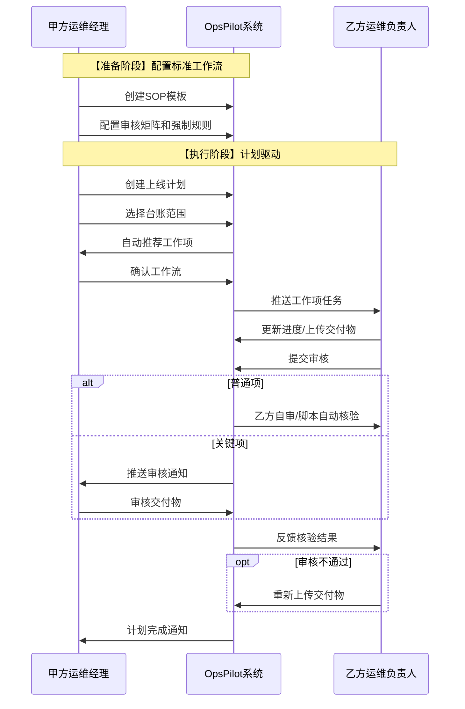

## 版本记录

| 版本       | 日期         | 作者  | 变更说明                                                                                                                                                                                                                                                                                                                   |
| -------- | ---------- | --- | ---------------------------------------------------------------------------------------------------------------------------------------------------------------------------------------------------------------------------------------------------------------------------------------------------------------------- |
| **v3.2** | 2026-03-26 | CRT | **产品定位强化（验收与审计视角）**：• **核心理念**：明确"子工作项 = 验收标准项"的本质——既是甲方的【验收标准配置】，也是乙方的【执行检查项】• **用户故事**：重构VEN-01\~04，明确"乙方按甲方验收标准执行并提交证据"的角色定位；强化MGR-08/09的"对标核验"审计视角• **三层业务模型**：重写第二层"工作项层"描述，突出【甲方标准制定者→乙方执行者→甲方审核方】的闭环• **全文档审计线索**：添加"审计追踪要求"章节——所有核验结论必须关联知识库条款，所有交付物必须关联验收标准• **乙方角色修正**：从"被服务方"修正为"被验收对象"，所有功能服务于甲方的验收权和审计追溯权 |
| **v3.1** | 2026-03-26 | CRT | **全局架构一致性修正**：• **用户故事**：重新编号MGR-01~~10，理顺逻辑顺序；拆分MGR-01为三步；新增MGR-07；调整优先级•~~ **~~权限矩阵~~**~~：修正角色权限描述，添加知识库管理行，标注对应用户故事•~~ **~~三层业务模型~~**~~：更新各层描述，明确与用户故事的映射关系•~~ **~~目标用户表~~**~~：更新角色职责描述，添加用户故事列•~~ **~~模块实体定义~~**~~：为Module\_01~~08添加用户故事对应关系注释，明确实体与故事的映射                                                          |
| v3.0     | 2026-03-26 | CRT | **重构模块划分**：• 扩展为8个模块（原4个）• 新增Module\_05 Knowledge Base• 新增Module\_06 Verification Engine• 拆分Module\_07 File & Deliverable• 拆分Module\_08 Notification Center• 补充完整的实体定义和模块交互图                                                                                                                                           |

***

## 1. 产品定位

**OpsPilot**是面向甲方运维经理的**准入验收与审计管理系统**，核心目标是：

1. **准入验收**：帮助甲方运维经理制定标准化验收标准，系统性核验乙方交付物，确保上线/变更质量
2. **审计留痕**：完整记录验收过程（标准制定→交付物提交→审核结论），为未来审计提供可追溯的证据链

> **核心原则**：子工作项 = 验收项 = 甲方制定的检查标准，乙方按标准执行任务并提交证明，甲方按标准核验并留痕

### 1.1 核心业务流程

```
【准备阶段】                    【执行阶段】                      【验收阶段】
接收工作需求 → 制定验收标准 → 乙方按标准执行 → 提交交付物 → 甲方按标准核验 → 审计留痕
                ↑_____________↓
                  知识库支撑
```

**关键控制点**：

- **验收标准制定**：甲方基于知识库制定可量化的验收项（子工作项）
- **按标执行**：乙方严格按照验收项要求执行任务
- **对标审核**：甲方逐条对照验收项核验交付物，结论永久留痕

### 1.2 目标用户

| 角色          | 职责                                                                                                                                       | 核心操作                               | 用户故事       |
| ----------- | ---------------------------------------------------------------------------------------------------------------------------------------- | ---------------------------------- | ---------- |
| **甲方运维经理**  | **多重身份**：• **需求方**：创建计划、选择台账范围（MGR-01/02/03）• **标准制定者**：配置SOP模板、管理知识库（MGR-04/05/06/07）• **审核方**：审核交付物（MGR-08/09）• **管理者**：查看进度统计（MGR-10） | 创建计划、选择台账、配置SOP模板、管理知识库、审核交付物、查看统计 | MGR-01\~10 |
| **乙方运维负责人** | **任务执行者**（VEN-01\~04）：• 查看工作项要求• 更新执行进度• 上传交付物• 处理审核反馈                                                                                   | 查看任务、更新进度、上传交付物、处理反馈               | VEN-01\~04 |
| **监理方**（预留） | **未来扩展角色**：• 标准制定与审核（现阶段由甲方运维经理兼任）                                                                                                       | 预留，当前不实现                           | SUP-01\~02 |

***

## 2. 三层业务模型

### 2.1 核心对象关系

```
┌─────────────────────────────────────────────────────────────┐
│ 第一层：计划层 (Plan) - 甲方运维经理（需求方）视角                   │
│  ├─ 计划创建（MGR-01）：创建上线/变更计划                          │
│  ├─ 台账范围选择（MGR-02）：4种分类对应不同操作                      │
│  │   • 新系统上线 → 新增应用系统台账                              │
│  │   • 新功能发布 → 查询+编辑应用系统台账                          │
│  │   • 业务变更   → 查询+勾选应用系统台账                          │
│  │   • 数据库变更 → 查询+勾选应用系统台账（不涉及云服务）             │
│  └─ 工作项自动生成（MGR-03）：根据分类自动推荐初始工作项               │
└─────────────────────────────────────────────────────────────┘
                              ↓
┌─────────────────────────────────────────────────────────────┐
│ 第二层：工作项层 (Work Item) - 甲乙双方交互核心                    │
│  ├─ 【甲方配置】SOP模板与验收标准（MGR-04/06/07）：                  │
│  │   • 父工作项模板（五大类）：台账补充/基础资源/安全基线/权限移交/监控告警 │
│  │   • 子工作项模板 = 验收项/检查项：甲方制定的具体验收标准（MGR-06）   │
│  │   • 审核矩阵：普通项/关键项的风险分级（MGR-07）                   │
│  │   • 强制管控规则：确保关键验收项不遗漏（MGR-07）                  │
│  │                                                               │
│  ├─ 【乙方执行】任务执行与交付物提交（VEN-01~04）：                   │
│  │   • 接收任务：查看父工作项下的所有验收项（子工作项）               │
│  │   • 按验收标准执行：逐项完成验收项要求（VEN-01）                  │
│  │   • 提交交付物：针对每个验收项上传证明材料（VEN-03）               │
│  │   • 更新进度：报告任务执行状态（VEN-02）                         │
│  │                                                               │
│  ├─ 【甲方核验】验收审核与审计留痕（MGR-08/09）：                    │
│  │   • 按验收标准核验：对照子工作项（验收项）逐一检查交付物           │
│  │   • 核验方式：人工核验 / 脚本自动 / AI智能分析                  │
│  │   • 核验结论：通过 / 不通过 / 待改进（MGR-08）                   │
│  │   • 审核依据：对照知识库条款和基线要求（MGR-09）                  │
│  │   • 审计留痕：所有审核记录永久保存，支持未来审计                   │
│  │                                                               │
│  └─ 交付物 (Deliverable)：关联到具体验收项，版本控制、归档管理        │
└─────────────────────────────────────────────────────────────┘
                              ↓
┌─────────────────────────────────────────────────────────────┐
│ 第三层：台账层 (Inventory) - 基础数据                            │
│  ├─ 应用系统台账：应用名称/功能模块/主机名/URL/负责人              │
│  ├─ 云服务台账：IAAS资源/PAAS软件/关联应用系统                    │
│  └─ 账号台账：系统账户/软件账户/权限级别/有效期                   │
└─────────────────────────────────────────────────────────────┘

┌─────────────────────────────────────────────────────────────┐
│ 支撑层：知识库 (Knowledge Base) - 甲方运维经理（知识库管理者）维护     │
│  ├─ 知识资产管理（MGR-05）：导入和维护企业知识资产                   │
│  │   • 运维管理规范：企业级运维管理制度、标准规范                    │
│  │   • 制度文件：安全制度、变更管理制度、发布规范等                   │
│  │   • 操作手册：系统运维手册、应急处理手册、配置指南                 │
│  │   • 基线要求：安全基线、配置基线、性能基线                        │
│  │   • 最佳实践：历史项目经验、典型案例、常见问题库                   │
│  │                                                               │
│  ├─ 知识应用场景：                                               │
│  │   • MGR-06：制定验收标准时 → 从知识库提取/自动推荐检查项          │
│  │   • MGR-09：审核交付物时 → 对照知识库条款进行核验判定             │
│  │   • VEN-01：乙方执行任务时 → 查看知识库参考执行                   │
│  │                                                               │
│  └─ 知识引用关系：知识文档 ↔ 验收标准 ↔ 工作项模板 ↔ 核验任务        │
└─────────────────────────────────────────────────────────────┘
```

<br />

## 3. 用户故事与角色场景

> **AI理解要点**：以下用户故事描述了不同角色在系统中的核心诉求。开发时需确保每个功能都能追溯到对应的故事，验证是否满足角色需求。

### 3.1 甲方运维经理（需求方 + 审核方）

**角色职责说明**：甲方运维经理是需求的提出者和最终审核者，同时负责制定标准工作流模板。甲方运维经理拥有企业积累的知识资产（运维管理规范、制度、操作手册、基线要求等），这些是制定验收标准的重要依据。

| 编号     | 用户故事                                                                                 | 业务价值               | 关联模块          |
| ------ | ------------------------------------------------------------------------------------ | ------------------ | ------------- |
| MGR-01 | **作为**甲方运维经理（需求方），**我需要**创建上线/变更计划，**以便**发起准入管理流程                                    | 确保所有上线活动被纳入管理，可追溯  | 计划管理          |
| MGR-02 | **作为**甲方运维经理（需求方），**我需要**根据计划分类（新系统上线/新功能发布/业务变更/数据库变更）选择不同的台账操作方式，**以便**准确关联涉及的系统范围 | 支持4种不同的台账操作场景      | 计划管理、台账管理     |
| MGR-03 | **作为**甲方运维经理（需求方），**我需要**系统自动根据计划分类和台账范围生成初始工作项，**以便**快速搭建工作流框架                      | 减少人工拆解工作，提高效率      | 计划管理、SOP模板引擎  |
| MGR-04 | **作为**甲方运维经理（标准制定者），**我需要**创建和维护SOP标准模板，**以便**固化运维最佳实践                               | 标准化流程，减少重复配置       | SOP模板引擎       |
| MGR-05 | **作为**甲方运维经理（知识库管理者），**我需要**导入和管理企业的运维管理规范、制度文件、操作手册、基线要求等知识资产，**以便**建立统一的知识库供后续使用   | 沉淀企业知识资产，避免知识流失    | 知识库管理         |
| MGR-06 | **作为**甲方运维经理（标准制定者），**我需要**从知识库中引用或自动提取相关的规范条款、检查项作为工作项的验收标准，**以便**快速制定符合企业要求的验收标准   | 提高验收标准制定效率，确保标准一致性 | 知识库管理、SOP模板引擎 |
| MGR-07 | **作为**甲方运维经理（标准制定者），**我需要**配置工作项的审核矩阵和强制管控规则，**以便**区分风险等级并确保关键步骤不被跳过                 | 风险分级管控，强制合规        | SOP模板引擎       |
| MGR-08 | **作为**甲方运维经理（审核方），**我需要**审核关键工作项的交付物，**以便**确保交付质量符合准入要求                              | 把控交付质量，拒绝不合格交付物    | 核验执行、工作流执行    |
| MGR-09 | **作为**甲方运维经理（审核方），**我需要**在审核交付物时查看关联的知识库条款和基线要求，**以便**对照标准进行准确的核验判定                  | 提供审核依据，减少主观判断偏差    | 知识库管理、核验执行    |
| MGR-10 | **作为**甲方运维经理，**我需要**查看计划的执行进度和乙方交付质量统计，**以便**及时发现风险并评估团队绩效                           | 主动管控风险，量化外包表现      | 计划管理、数据统计     |

<br />

**知识库应用场景**：

| 场景     | 知识库输入     | 系统输出    |
| ------ | --------- | ------- |
| 制定验收标准 | 运维规范、基线要求 | 自动推荐检查项 |
| 审核交付物  | 制度条款、操作手册 | 审核参考依据  |
| 培训乙方团队 | 最佳实践、案例库  | 执行指导文档  |

> **注**：标准制定工作现阶段由甲方运维经理兼任，未来可扩展由独立的"监理方"角色承担。

### 3.2 监理方（预留角色）

> **角色状态**：预留扩展角色，**现阶段不实现**

**未来职责定位**：

- 独立的标准制定者，与甲方运维经理分离
- 负责SOP模板设计、审核矩阵配置
- 承担交付物的独立审核工作

**当前实现**：上述职责由**甲方运维经理**（MGR-02故事）兼任

| 预留编号       | 未来用户故事                     | 当前替代方案    |
| ---------- | -------------------------- | --------- |
| SUP-01（预留） | **作为**监理方，**我需要**制定SOP标准模板 | 由MGR-02覆盖 |
| SUP-02（预留） | **作为**监理方，**我需要**独立审核交付物   | 由MGR-03覆盖 |

> **扩展提示**：当系统需要引入第三方监理时，可将MGR-02、MGR-03中的部分权限拆分给新角色 `supervisor`。

### 3.3 乙方运维负责人（任务执行者）

**角色职责说明**：乙方运维负责人是任务的执行者，按照甲方制定的验收标准（子工作项）完成具体任务，并提交交付物供甲方核验。

| 编号     | 用户故事                                                                  | 业务价值        | 关联模块        |
| ------ | --------------------------------------------------------------------- | ----------- | ----------- |
| VEN-01 | **作为**乙方运维负责人，**我需要**查看父工作项及下属的所有验收项（子工作项）清单，**以便**清楚了解需要完成的具体任务和验收标准 | 明确验收要求，按标执行 | 工作流执行       |
| VEN-02 | **作为**乙方运维负责人，**我需要**更新任务执行进度和预计完成时间，**以便**甲方及时了解项目状态                 | 信息透明，建立信任   | 工作流执行       |
| VEN-03 | **作为**乙方运维负责人，**我需要**针对每个验收项上传对应的交付物证明并提交审核，**以便**证明任务已完成并申请验收        | 交付成果，推进流程   | 工作流执行、交付物管理 |
| VEN-04 | **作为**乙方运维负责人，**我需要**查看甲方审核反馈并针对不通过的验收项重新提交交付物，**以便**修正问题并完成验收        | 快速迭代，提高通过率  | 核验执行、交付物管理  |

**核心场景**：

```
接收任务通知 → 查看父工作项及验收项清单 → 按验收标准执行各项任务 → 
逐项上传交付物证明 → 提交验收申请 → 处理审核反馈 → 完成全部验收项
```

> **关键理解**：
>
> - 父工作项 = 任务分组（如"安全基线检查"）
> - 子工作项 = 验收项/检查项 = 甲方制定的具体验收标准（如"防火墙规则已配置"）
> - 交付物 = 乙方提交的验收证明材料（如"防火墙配置截图"）
> - 乙方按验收项逐一执行并提交证明，甲方按验收项逐一核验

### 3.4 跨角色协作流程



### 3.5 故事优先级矩阵

| 优先级          | 用户故事                                                   | 说明                                |
| ------------ | ------------------------------------------------------ | --------------------------------- |
| **P0 - 必须有** | MGR-01, MGR-02, MGR-03, VEN-01, VEN-03                 | 核心业务流程：创建计划、选择台账、生成工作项、执行任务、上传交付物 |
| **P1 - 应该有** | MGR-04, MGR-07, MGR-08, MGR-05, MGR-06, VEN-02, VEN-04 | 重要功能：SOP模板、知识库管理、审核、进度更新          |
| **P2 - 可以有** | MGR-09, MGR-10                                         | 增强功能：知识库辅助审核、数据统计分析               |
| **预留**       | SUP-01, SUP-02                                         | 监理方角色，未来版本实现                      |

**优先级说明**：

- **MGR-01\~03（P0）**：计划管理的核心三部曲，缺失则无法完成准入流程
- **MGR-04\~08（P1）**：标准化和审核能力，确保流程质量和效率
- **MGR-09\~10（P2）**：AI辅助和数据分析，提升体验和决策质量

**知识库相关故事说明**：

- **MGR-05（P1）**：知识库是基础能力，支持MGR-06的验收标准制定
- **MGR-06（P1）**：核心增值功能，体现AI辅助制定验收标准的价值
- **MGR-09（P2）**：审核辅助功能，提升审核效率和准确性

***

***

## 4. 权限模型

### 4.1 角色定义

| 角色编码          | 角色名称    | 数据范围         | 核心权限                                                   | 对应用户故事     |
| ------------- | ------- | ------------ | ------------------------------------------------------ | ---------- |
| `ops_manager` | 甲方运维经理  | all/assigned | **需求方**：计划CRUD、范围选择**标准制定者**：SOP模板配置、知识库管理**审核方**：核验审批 | MGR-01\~10 |
| `vendor_ops`  | 乙方运维负责人 | assigned     | 任务执行、进度更新、交付物上传                                        | VEN-01\~04 |
| `supervisor`  | 监理方     | -            | **预留角色，暂不实现**                                          | SUP-01\~02 |

### 4.2 权限矩阵

| 功能模块  | 甲方运维经理                    | 乙方运维负责人                   | 监理方（预留）     |
| ----- | ------------------------- | ------------------------- | ----------- |
| 计划管理  | 创建/编辑/删除/查看（MGR-01/02/03） | 查看(分配的)（VEN-01）           | -           |
| 台账管理  | 全部操作（MGR-02）              | 无权限                       | -           |
| SOP模板 | 创建/编辑/发布/使用（MGR-04/07）    | 查看                        | 未来：创建/编辑/审核 |
| 知识库管理 | 导入/管理/提取/引用（MGR-05/06/09） | 查看(执行参考)                  | 未来：独立管理     |
| 工作项执行 | 查看/审核（MGR-08/09）          | 执行/更新进度/上传交付物（VEN-01\~04） | 未来：独立审核     |
| 核验执行  | 审核/审批/配置规则（MGR-08/09）     | 查看结果                      | 未来：独立审核     |
| 数据统计  | 查看全部（MGR-10）              | 查看个人                      | -           |

### 4.3 核心数据表

**users** - 用户表

```sql
id(PK), user_id(UNIQUE), username(UNIQUE), email, phone, real_name
organization, status(active/inactive/locked), last_login_at, created_at, updated_at
```

**roles** - 角色表

```sql
id(PK), role_code(UNIQUE: ops_manager/vendor_ops/supervisor)
role_name, description, data_scope(all/assigned/own), status, created_at, updated_at
```

> **说明**：`supervisor`（监理方）为预留角色编码，当前版本不创建该角色数据

**user\_roles** - 用户角色关联

```sql
id(PK), user_id(FK), role_id(FK), assigned_by, assigned_at, created_at
```

***

## 5. 状态流转规则

### 5.1 计划状态流转

```
[草稿 DRAFT] ──提交/定时触发──→ [待执行 PENDING] ──手动启动──→ [执行中 IN_PROGRESS] ──核验完成──→ [已完成 COMPLETED]
     │                              │
     └──────────取消───────────────┘
```

| 状态           | 说明            | 可执行操作      |
| ------------ | ------------- | ---------- |
| DRAFT        | 创建中，可编辑所有字段   | 编辑、删除、提交启动 |
| PENDING      | 等待执行，不可修改基本信息 | 手动启动、取消    |
| IN\_PROGRESS | 工作流实例执行中      | 查看进度、审核    |
| COMPLETED    | 所有工作项核验完成     | 查看报告、归档    |
| CANCELLED    | 计划被取消         | 仅查看历史      |

### 5.2 工作项状态流转

```
[待处理 PENDING] ──开始执行──→ [进行中 IN_PROGRESS] ──核验通过──→ [已完成 COMPLETED]
                                        │
                                        └─核验不通过─┐
                                                   ↓
                                              [已拒绝 REJECTED] ──重新提交──→ [进行中]
```

### 5.3 交付物状态流转

```
[待上传 PENDING] ──上传──→ [已上传 UPLOADED] ──触发核验──→ [核验中 VERIFYING]
                                                              │
                    ┌────────重新上传────────┬────不通过────┤
                    ↓                        ↓              │
              [已上传]                  [待改进 IMPROVEMENT]  │
                    │                        │              │
                    └────────通过────────────┘        [通过 PASSED]
                                                        │
                                                    [不通过 FAILED]
```

**交付物规则**:

- 同一工作项可上传多个版本，旧版本自动归档
- 核验结论只针对最新版本
- "不通过"必须重新上传才能再次核验
- "待改进"可选择通过，但需记录改进要求

***

## 6. 审计追踪要求

> **核心定位**：OpsPilot的核心价值是**帮助甲方运维经理验收项目并准备审计证据**。所有功能设计必须服务于甲方的验收权和审计追溯权。

### 6.1 审计线索设计原则

**三级可追溯链**

```
审计报告 → 核验结论 → 验收标准（子工作项） → 知识库条款
    ↑         ↑           ↑                ↑
  最终输出  判定结果   甲方制定的标准    企业制度依据
```

**关键追溯要求**：

| 追溯维度       | 审计问题            | 系统记录                         |
| ---------- | --------------- | ---------------------------- |
| **验收标准来源** | "这个验收项的依据是什么？"  | 子工作项 ↔ 知识库条款（条款编号、文档名称、章节位置） |
| **标准制定者**  | "谁配置的这项验收标准？"   | 模板配置者、配置时间、配置依据              |
| **执行过程**   | "乙方是否按标准执行？"    | 乙方执行记录、交付物提交时间、执行人           |
| **核验过程**   | "甲方如何判定通过/不通过？" | 核验方式、核验人、核验时间、判定依据           |
| **结论依据**   | "这个结论有什么依据？"    | 关联的知识库条款、交付物版本、核验记录          |

### 6.2 强制关联规则

**Rule 1: 验收标准必须关联知识库**

- 创建子工作项模板时，必须从知识库选择支撑条款（MGR-06）
- 系统记录关联关系：`sub_work_item_template.knowledge_refs` → `knowledge_documents`
- 未关联知识库的验收标准标记为"无依据"，审核时提示风险

**Rule 2: 核验结论必须关联验收标准**

- 甲方审核时必须明确每个验收项的核验结论（MGR-08）
- 核验任务记录：`verification_tasks.sub_work_item_id` → `sub_work_items`
- 结论类型：通过/不通过/待改进，必须逐条记录

**Rule 3: 交付物必须关联验收项**

- 乙方提交的每个交付物必须对应具体验收项（VEN-03）
- 文件记录：`deliverables.sub_work_item_id` → `sub_work_items`
- 支持多版本管理，旧版本自动归档保留

**Rule 4: 进度更新必须留痕**

- 乙方的每次进度更新（VEN-02）创建不可修改的历史记录
- 记录内容：更新人、更新时间、进度百分比、预计完成时间、备注说明
- 支持审计时查看完整的进度变更历史

### 6.3 审计证据导出

**可导出审计包**

| 审计包类型       | 包含内容                                       | 使用场景       |
| ----------- | ------------------------------------------ | ---------- |
| **计划审计包**   | 计划基本信息 + 台账范围 + 工作项清单 + 最终状态               | 单个计划的完整审计  |
| **验收项审计包**  | 验收标准配置 + 知识库条款依据 + 乙方执行记录 + 甲方核验结论 + 交付物清单 | 特定验收项的深度审计 |
| **知识库引用报告** | 知识文档被哪些验收标准引用 + 被哪些核验任务参考                  | 知识库有效性审计   |
| **乙方履约报告**  | 乙方负责的所有任务 + 交付物提交情况 + 核验通过率                | 乙方绩效评估     |

**导出格式**：PDF报告 + 原始数据(JSON) + 文件归档(ZIP)

### 6.4 防篡改机制

| 数据类型      | 防篡改措施                       |
| --------- | --------------------------- |
| **核验结论**  | 一旦记录不可修改，如需更正需新增"更正记录"并说明原因 |
| **交付物文件** | 文件Hash值存储，下载时校验完整性          |
| **知识库文档** | 版本控制，历史版本保留，更新需审批           |
| **验收标准**  | 已生效模板的验收项不可删除，只能"停用"并说明原因   |

***

## 7. 核验结论判定

### 7.1 结论类型

| 结论  | 编码          | 说明         | 颜色         | 后续操作            |
| --- | ----------- | ---------- | ---------- | --------------- |
| 通过  | passed      | 完全符合验收标准   | 🟢 #52c41a | 标记完成，进入下一工作项    |
| 不通过 | failed      | 不符合验收标准    | 🔴 #ff4d4f | 退回，要求重新准备       |
| 待改进 | improvement | 基本符合，有优化空间 | 🟠 #faad14 | 记录问题，允许通过但需后续改进 |

### 7.2 判定标准

**人工核验**

- 通过：所有必填检查项符合要求
- 不通过：存在不符合要求的检查项
- 待改进：基本符合，存在可优化项

**脚本验证**

- 通过：脚本执行成功，所有检查项返回"passed"
- 不通过：脚本执行失败，或存在检查项返回"failed"
- 待改进：脚本执行成功，但存在警告信息

**AI分析**

- 通过：AI结论为"通过"，置信度≥0.85
- 不通过：AI结论为"不通过"，置信度≥0.85
- 待改进：AI结论为"待改进"，或置信度<0.85

***

## 8. 核心术语表

| 术语       | 英文                        | 定义                                                     |
| -------- | ------------------------- | ------------------------------------------------------ |
| 计划       | Plan                      | 运维工作的顶层管理单元，包含目标、范围、时间                                 |
| 工作项      | Work Item                 | 计划拆解后的可执行单元，包含验收标准和交付物要求                               |
| 父工作项     | Parent Work Item          | 五大类：台账补充/基础资源/安全基线/权限移交/监控告警                           |
| 子工作项     | Child Work Item           | **验收标准项（核心）**：甲方制定的具体验收检查标准，也是乙方执行的检查项。关联验收标准/交付物/核验结论 |
| 交付物      | Deliverable               | 工作项执行后需要提交的成果物                                         |
| 验收标准     | Acceptance Criteria       | 核验交付物的标准，支持人工/脚本/AI三种方式，可从知识库提取                        |
| 核验结论     | Verification Result       | 交付物核验结果：通过/不通过/待改进                                     |
| 台账       | Inventory                 | 应用系统/云服务/账号等基础数据                                       |
| SOP模板    | SOP Template              | 标准操作流程模板，用于自动生成工作项                                     |
| **知识库**  | **Knowledge Base**        | **企业运维知识资产库，包含规范/制度/手册/基线/最佳实践**                       |
| **运维规范** | **Operation Standards**   | **企业级运维管理制度、技术标准、安全规范等文件**                             |
| **基线要求** | **Baseline Requirements** | **系统配置基线、安全基线、性能基线等最低标准要求**                            |
| **操作手册** | **Operation Manual**      | **系统运维操作指南、应急处理手册、配置说明文档**                             |

***

## 9. 模块划分

> **AI开发指导**：本节定义系统的限界上下文（Bounded Context）。每个模块应独立开发，通过定义好的接口交互，避免直接操作其他模块的数据表。

### 9.1 模块清单与职责定义

| 模块编号           | 模块名称                      | 核心职责（1句话）                         | 优先级 |
| -------------- | ------------------------- | --------------------------------- | --- |
| **Module\_01** | Plan Management           | 管理运维计划的完整生命周期（创建、范围选择、状态流转）       | P0  |
| **Module\_02** | Inventory Management      | 管理应用系统、云服务、账号三类台账的CRUD及关联查询       | P0  |
| **Module\_03** | SOP Template Engine       | 管理SOP模板、审核矩阵、强制规则，驱动工作项自动生成       | P1  |
| **Module\_04** | Workflow Execution        | 执行已实例化的工作流，管理任务状态流转、进度跟踪、交付物收集    | P1  |
| **Module\_05** | **Knowledge Base** ⭐      | 管理企业运维知识资产（规范/制度/手册/基线），支持智能检索与引用 | P1  |
| **Module\_06** | **Verification Engine** ⭐ | 执行核验逻辑（人工/脚本/AI），管理核验结论与审核流程      | P1  |
| **Module\_07** | **File & Deliverable**    | 管理交付物文件的上传、存储、版本控制及访问权限           | P0  |
| **Module\_08** | **Notification Center**   | 跨模块消息推送（任务分配、审核提醒、进度通知）           | P2  |

> ⭐ 表示与用户故事 MGR-05/MGR-06/MGR-07 直接相关的新增模块

### 9.2 所属核心实体

#### Module\_01 - Plan Management（计划管理）

**对应用户故事**：MGR-01（创建计划）、MGR-02（选择台账范围）、MGR-03（生成工作项）、MGR-10（查看进度）

```yaml
核心实体:
  - Plan:              # 计划 - MGR-01
      - plan_id (PK), name, 
        category: enum   # 计划分类 [new_system/new_feature/business_change/db_change] - MGR-02
        priority: enum   # 优先级 [P0/P1/P2/P3]
        status: enum     # 状态 [draft/pending/in_progress/completed/cancelled]
      - scope_type,      # 范围类型 - MGR-02
        scope_description, 
        related_inventory_ids (JSON)  # 关联台账ID列表 - MGR-02
      - planned_start_time, planned_end_time, 
        approval_files (JSON)         # 审批材料 - MGR-01
      - created_by, created_at, updated_at
      
  - PlanProgress:      # 计划进度统计 - MGR-10
      - progress_id (PK), plan_id (FK)
      - total_work_items, completed_count, in_progress_count
      - risk_level: enum, estimated_completion_date
```

#### Module\_02 - Inventory Management（台账管理）

**对应用户故事**：MGR-02

```yaml
核心实体:
  - Application:       # 应用系统台账
      - id (PK), app_name, app_description, function_modules (JSON)
      - hostname, app_url, business_owner, project_owner, launch_time
      # 操作类型取决于Plan.category:
      # - new_system: 创建新记录
      # - new_feature: 编辑功能模块
      # - business_change/db_change: 查询并勾选
      
  - CloudResource:     # 云服务资源台账
      - id (PK), app_id (FK), resource_type, resource_name, configuration (JSON)
      # db_change类型计划不关联云服务台账
      
  - Account:           # 账号台账
      - id (PK), app_id (FK), account_type, account_name, permission_level
      - holder_name, valid_from, valid_until, password_change_cycle, status
```

#### Module\_03 - SOP Template Engine（SOP模板引擎）

**对应用户故事**：MGR-04（创建SOP模板）、MGR-06（从知识库提取验收标准）、MGR-07（配置审核矩阵和强制规则）、MGR-03（自动生成工作项）

```yaml
核心实体:
  - SOPTemplate:       # SOP模板 - MGR-04
      - template_id (PK), template_name, category, version, status
      - audit_matrix_config_id (FK)  # 关联审核矩阵 - MGR-07
      
  - WorkflowNode:      # 流程节点
      - node_id (PK), sop_template_id (FK), node_name, sequence
      - entry_conditions (JSON), exit_conditions (JSON)
      - mandatory_rules (JSON)  # 强制管控规则 - MGR-07
      
  - WorkItemTemplate:  # 工作项模板 - 区分父工作项（任务分组）和子工作项（验收项）
      - template_id (PK), sop_template_id (FK), workflow_node_id (FK)
      - parent_template_id (FK, 自关联):
          # null = 父工作项模板（任务分组/大项，如"安全基线检查"）- MGR-04
          # 非null = 子工作项模板（验收项/检查项，如"防火墙规则已配置"）- MGR-06
      - template_name, category
      - audit_level: enum  # 审核等级 [normal/critical] - MGR-07
      - deliverables_config (JSON)  # 该验收项要求的交付物类型和格式
      - acceptance_criteria_config (JSON)  # 验收标准详细定义（通过/不通过判定条件）- MGR-06
      
  - AuditMatrixConfig: # 审核矩阵配置 - MGR-07
      - config_id (PK), config_name
      
  - AuditRule:         # 审核规则 - MGR-07
      - rule_id (PK), config_id (FK)
      - audit_level: enum  # [normal/critical]
      - primary_audit_method: enum  # [self_review/script_auto/expert_manual]
```

#### Module\_04 - Workflow Execution（工作流执行）

**对应用户故事**：VEN-01\~04（任务执行全流程）

```yaml
核心实体:
  - WorkflowInstance:      # 工作流实例
      - instance_id (PK), plan_id (FK), template_id (FK), status
      
  - WorkItemInstance:      # 工作项实例（运行时）- VEN-01
      - work_item_id (PK), instance_id (FK)
      - parent_id (FK):     # 父工作项实例ID
          # null = 父工作项实例（任务分组实例，乙方可见）
          # 非null = 子工作项实例（验收项实例，也是乙方的任务项，需逐项完成）
      - template_id (FK)    # 关联的工作项模板
      - assignee_id (FK)   # 分配给乙方负责人
      - status: enum       # [pending/in_progress/completed/rejected]
      - deliverable_ids (JSON)  # 该验收项关联的交付物列表 - VEN-03
      - verification_result_id (FK)  # 核验结论关联 - MGR-08
      
  - TaskProgress:          # 任务进度 - VEN-02
      - progress_id (PK), work_item_id (FK), update_by (FK)
      - progress_desc, estimated_hours, actual_hours
```

#### Module\_05 - Knowledge Base（知识库管理）

**对应用户故事**：MGR-05（管理知识库）、MGR-06（提取验收标准）、MGR-09（审核时查看知识库）

```yaml
核心实体:
  - KnowledgeDocument:      # 知识文档 - MGR-05
      - doc_id (PK), 
        doc_type: enum      # [规范/制度/手册/基线/最佳实践]
      - category, content, 
        extract_rules (JSON)  # AI提取规则 - MGR-06
      - version, status
      
  - KnowledgeReference:     # 知识引用关系 - MGR-06/MGR-09
      - ref_id (PK), doc_id (FK)
      - target_type: enum    # [验收标准/工作项模板/核验任务]
      - target_id (FK)
      - relevance_score: float  # 关联度评分
      
  - BaselineItem:          # 基线检查项 - MGR-05/MGR-09
      - baseline_id (PK)
      - baseline_type: enum  # [安全/配置/性能]
      - check_item, standard_value  # 审核依据 - MGR-09
```

#### Module\_06 - Verification Engine（核验执行）

**对应用户故事**：MGR-08（审核交付物）、MGR-09（对照知识库审核）

```yaml
核心实体:
  - VerificationTask:       # 核验任务 - MGR-08
      - task_id (PK), work_item_id (FK), deliverable_id (FK)
      - method: enum        # [manual/script/ai] - MGR-08
      - status: enum        # [pending/verifying/completed]
      
  - VerificationResult:     # 核验结论 - MGR-08
      - result_id (PK), task_id (FK)
      - conclusion: enum     # [passed/failed/improvement]
      - verified_by (FK)    # 审核人（甲方运维经理）
      - criteria_results (JSON)
      - ai_confidence: float  # AI置信度（AI核验时）
      
  - ScriptVerification:     # 脚本核验记录
      - script_exec_id (PK), task_id (FK), script_id (FK)
      - execution_log, output_result (JSON)
      
  - ManualReview:           # 人工审核记录 - MGR-08/MGR-09
      - review_id (PK), task_id (FK), reviewer_id (FK)
      - review_comments
      - knowledge_refs (JSON)  # 引用的知识库条款ID - MGR-09
```

#### Module\_07 - File & Deliverable（交付物管理）

**对应用户故事**：VEN-03（上传交付物）、VEN-04（重新上传修正版）

```yaml
核心实体:
  - Deliverable:            # 交付物 - VEN-03/VEN-04
      - deliverable_id (PK), work_item_id (FK)
      - uploader_id (FK)    # 上传人（乙方运维负责人）
      - file_name, file_path, file_size
      - file_hash           # 文件指纹（去重+防篡改）
      - version: int        # 版本号（支持多次上传）- VEN-04
      - status: enum        # [uploaded/under_review/passed/rejected]
      
  - FileStorage:            # 文件存储（物理层）
      - storage_id (PK), file_hash (UK)
      - storage_path, mime_type
      - virus_scan_status: enum [pending/clean/infected]
```

#### Module\_08 - Notification Center（通知中心）

**对应用户故事**：VEN-01（接收任务通知）、MGR-08（接收审核通知）、VEN-04（接收审核反馈）

```yaml
核心实体:
  - Notification:           # 通知消息
      - notification_id (PK), recipient_id (FK)
      - notification_type: enum
        # [task_assigned] - VEN-01: 任务分配通知
        # [audit_request] - MGR-08: 审核请求通知
        # [audit_feedback] - VEN-04: 审核结果反馈
        # [deadline_alert] - 截止日期提醒
      - title, content
      - related_entity_type, related_entity_id  # 关联业务实体
      - read_status, channel: enum [in_app/email/sms]
```

### 9.3 模块间交互逻辑

```
┌─────────────────────────────────────────────────────────────────────────────┐
│                           跨模块核心交互关系                                  │
└─────────────────────────────────────────────────────────────────────────────┘

【计划创建流程】
Module_01(Plan) ──创建计划──→ Module_02(Inventory) 查询台账
     │
     └──实例化工作流──→ Module_03(SOP) 获取模板结构
              │
              └──创建实例──→ Module_04(Workflow) 生成工作项实例
                       │
                       └──推送任务──→ Module_08(Notification) 通知乙方

【验收标准制定】（MGR-06故事）
Module_03(SOP) ──制定验收标准──→ Module_05(Knowledge) 检索相关知识
     │                                    │
     │◄────────返回推荐检查项─────────────┘
     │
     └──保存验收标准──→ 关联KnowledgeReference记录

【交付物上传与核验】（VEN-03/MGR-03故事）
Module_04(Workflow) ──上传交付物──→ Module_07(File) 存储文件
     │                                    │
     │◄────────返回deliverable_id─────────┘
     │
     └──触发核验────→ Module_06(Verification) 创建核验任务
              │
              ├─人工核验──→ Module_05(Knowledge) 获取审核依据（MGR-07）
              ├─脚本核验──→ 调用脚本执行服务
              └─AI核验────→ 调用AI分析服务
                       │
                       └──通知结果──→ Module_08(Notification) 通知双方

【审核结果反馈】
Module_06(Verification) ──审核完成──→ Module_04(Workflow) 更新工作项状态
     │                                    │
     ├──通过──→ 解锁下一个工作项 ────→ Module_08 通知乙方
     │
     └──不通过──→ Module_08 通知乙方重新上传 ──→ Module_07 等待新版本

【知识库驱动全流程】
Module_05(Knowledge) ◄────────────────────────────────────────┐
     ▲                                                        │
     │                                                        │
     ├──MGR-06: 被Module_03调用（制定验收标准时检索知识）      │
     ├──MGR-07: 被Module_06调用（审核时展示依据）              │
     └──被Module_03调用（模板设计时推荐最佳实践）               │
```

### 9.4 模块与User Story映射

| User Story              | 主负责模块      | 协作模块                   |
| ----------------------- | ---------- | ---------------------- |
| **MGR-01** 创建计划         | Module\_01 | -                      |
| **MGR-02** 选择台账范围（4种分类） | Module\_01 | Module\_02             |
| **MGR-03** 自动生成工作项      | Module\_01 | Module\_03             |
| **MGR-04** 创建SOP模板      | Module\_03 | -                      |
| **MGR-05** 管理知识库        | Module\_05 | -                      |
| **MGR-06** 从知识库提取验收标准   | Module\_05 | Module\_03             |
| **MGR-07** 配置审核矩阵和强制规则  | Module\_03 | -                      |
| **MGR-08** 审核交付物        | Module\_06 | Module\_04             |
| **MGR-09** 对照知识库审核      | Module\_06 | Module\_05             |
| **MGR-10** 查看进度统计       | Module\_01 | Module\_04, Module\_06 |
| **VEN-01** 查看工作项        | Module\_04 | -                      |
| **VEN-02** 更新进度         | Module\_04 | Module\_08             |
| **VEN-03** 上传交付物        | Module\_04 | Module\_07, Module\_08 |
| **VEN-04** 处理审核反馈       | Module\_04 | Module\_06, Module\_07 |

### 9.5 潜在技术难点/风险模块

| 模块                                 | 风险等级     | 风险类型     | 技术挑战                 | 建议方案                                                       |
| ---------------------------------- | -------- | -------- | -------------------- | ---------------------------------------------------------- |
| **Module\_05 Knowledge Base**      | 🔴 **高** | AI集成复杂度  | 知识文档的智能解析、向量化存储、语义检索 | • 使用Embedding模型进行向量化• 向量数据库（如Pinecone/Milvus）• RAG架构实现智能问答 |
| **Module\_06 Verification Engine** | 🔴 **高** | 异步执行与一致性 | 脚本核验的长耗时、异步结果回调、状态同步 | • Celery异步任务队列• WebSocket推送结果• 状态机幂等设计                     |
| **Module\_07 File & Deliverable**  | 🟡 **中** | 存储与并发    | 大文件上传、病毒扫描、版本控制      | • 分片上传+断点续传• ClamAV病毒扫描异步化• 文件去重（Hash存储）                   |
| **Module\_04 Workflow Execution**  | 🟡 **中** | 状态一致性    | 工作流状态流转的并发控制、分布式锁    | • 数据库乐观锁• 状态机校验（非法状态转换拦截）• 事件驱动架构                          |
| **Module\_08 Notification Center** | 🟢 **低** | 可靠性      | 消息必达性、去重、限流          | • 消息表持久化+定时重试• 幂等Key去重                                     |

### 9.6 模块依赖关系图

```
┌─────────────────────────────────────────────────────────────────┐
│                         模块依赖关系                             │
├─────────────────────────────────────────────────────────────────┤
│                                                                 │
│  Module_01(Plan) ─────┬─────→ Module_02(Inventory)              │
│       │               │                                        │
│       │               └─────→ Module_03(SOP Template) ◄───────┐│
│       │                      │                                ││
│       │                      ▼                                ││
│       └──────────────→ Module_04(Workflow Execution)          ││
│                              │                                ││
│                              ▼                                ││
│                        Module_06(Verification) ───────────────┘│
│                              │                                 │
│                              ▼                                 │
│                        Module_07(File)                         │
│                              │                                 │
│                              ▼                                 │
│  Module_05(Knowledge) ←──── Module_08(Notification)            │
│       ▲                                                        │
│       └───────────────────────────────────────────────────────┘│
│                                                                 │
│  说明：                                                         │
│  • 实线箭头：直接依赖（调用服务/查询数据）                        │
│  • 虚线关系：Module_05 被 Module_03/06 依赖（知识库被调用）       │
│  • Module_08 被所有模块依赖（通知中心）                          │
└─────────────────────────────────────────────────────────────────┘
```

### 9.7 建议开发顺序

| 阶段          | 模块                  | 说明                   |
| ----------- | ------------------- | -------------------- |
| **Phase 1** | Module\_01/02/07/08 | 基础能力：计划、台账、文件、通知     |
| **Phase 2** | Module\_03/04       | 核心流程：模板引擎、工作流执行      |
| **Phase 3** | Module\_05/06       | AI增值：知识库、核验引擎（含AI功能） |

***

*文档版本: v3.1 | 最后更新: 2026-03-26*
