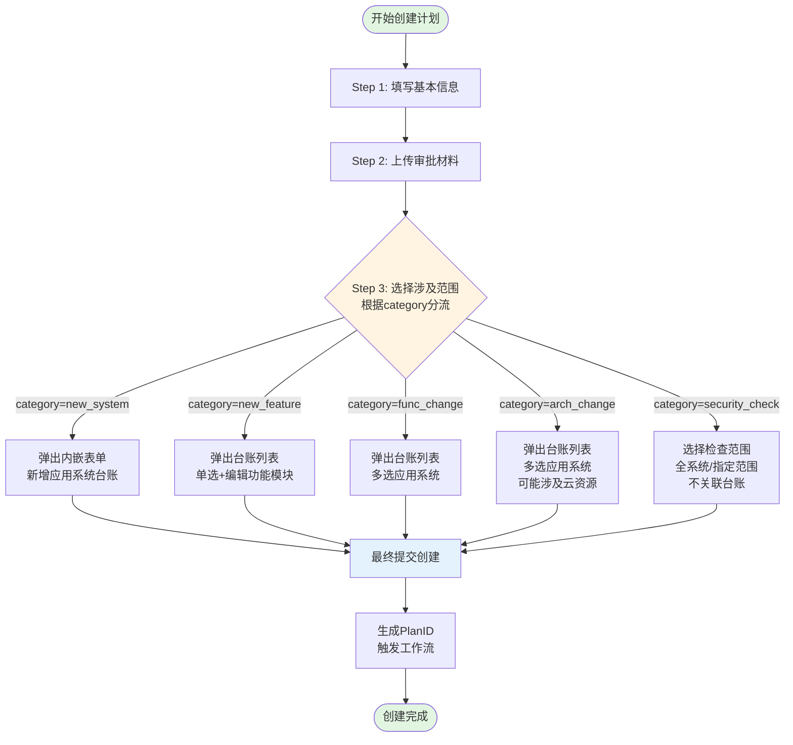

# Module 01: 计划管理模块 (Plan Management)

> **模块类型**: 核心业务模块  
> **依赖文档**: [00_Global_Architecture.md](../00_Global_Architecture.md)  
> **目标用户**: 甲方运维经理

---

## 1. 模块目标 (Context)

本模块是 OpsPilot 平台的核心入口，供【甲方运维经理】使用。主要用于接收线下审批后的需求，在系统中创建"计划（Plan）"，并根据计划分类选择涉及的"台账范围"，最终生成唯一的 PlanID 并触发工作流的生成。

---

## 2. 角色与权限 (Roles)

| 项目 | 说明 |
|-----|------|
| **可操作角色** | 甲方运维经理 (`ops_manager`) |
| **视图权限** | 仅甲方运维经理可见"创建计划"入口 |

---

## 3. 数据模型 (Data Model)

本模块主要涉及 `plans` 表的 CRUD 操作。

### 3.1 计划表字段

| 字段名 | 类型 | 约束 | 说明 |
|-------|------|-----|------|
| id | VARCHAR(36) | PK | 主键 |
| plan_id | VARCHAR(50) | UNIQUE | 业务主键，格式：PLAN-YYYYMMDD-XXX |
| name | VARCHAR(200) | NOT NULL | 计划名称 |
| category | ENUM | NOT NULL | new_system/new_feature/func_change/arch_change/security_check |
| priority | ENUM | NOT NULL | P0/P1/P2/P3 |
| status | ENUM | NOT NULL | DRAFT/PENDING/IN_PROGRESS/COMPLETED/CANCELLED |
| approval_files | JSON | NOT NULL | 存储上传成功的审批材料 URL 和文件名 |
| template_type | ENUM | NOT NULL | 工作流模板类型 [new_system/new_feature/func_change/arch_change/security] |
| related_inventory_ids | JSON | 条件必填 | 关联的台账ID列表（security_check类型可为空） |
| tag | VARCHAR(100) | | 数据标签 |
| planned_start_time | DATETIME | NOT NULL | 计划执行时间 |
| planned_end_time | DATETIME | | 计划结束时间（可选） |
| created_by | VARCHAR(36) | NOT NULL | 创建人ID |
| created_at | DATETIME | NOT NULL | 创建时间 |
| updated_at | DATETIME | NOT NULL | 更新时间 |

---

## 4. 页面布局与业务流 (UI & Flow)

此模块主要为"创建计划"表单页，采用**向导式（Wizard）分步提交**设计：

### 创建计划流程图



### Step 1: 填写基本信息

| 字段 | 组件类型 | 必填 | 说明 |
|-----|---------|------|------|
| 计划名称 | 输入框 | 是 | 计划标题，如"订单系统v2.0上线" |
| 计划分类 | 下拉单选 | 是 | 决定 Step 3 的范围选择界面 |
| 优先级 | 下拉单选 | 是 | P0/P1/P2/P3 |
| 执行时间 | 时间选择器 | 是 | 计划开始执行的时间 |
| 计划结束时间 | 时间选择器 | 否 | 预估完成时间 |
| 计划说明 | 富文本 | 否 | 补充说明 |

**【核心交互】**: 用户必须选择"计划分类(category)"，此选择将直接影响 Step 3 的范围选择界面。

### Step 2: 上传审批材料

| 项目 | 说明 |
|-----|------|
| 支持类型 | 会议纪要、审批邮件等 |
| 交互方式 | 拖拽上传组件 |
| 支持格式 | 图片、PDF |
| 文件限制 | 单个文件 ≤ 20MB |

**数据存储格式**:
```json
[
  {
    "file_name": "会议纪要.pdf",
    "file_url": "https://storage.example.com/files/xxx.pdf",
    "file_size": 1024576,
    "uploaded_at": "2024-03-26T10:30:00Z"
  }
]
```

### Step 3: 选择涉及范围（核心动态交互）

前端根据 Step 1 中选择的 `category`，展示不同的组件交互：

| 计划分类 | 交互方式 | 台账操作 |
|---------|---------|---------|
| `new_system` (新系统上线) | 弹出内嵌表单，调用`新增应用系统台账`接口 | 创建新台账 |
| `new_feature` (新功能上线) | 弹出台账列表，单选已有台账，允许编辑"功能模块" | 查询+编辑 |
| `func_change` (功能变更) | 弹出台账列表，支持【多选】应用系统 | 查询+多选 |
| `arch_change` (架构变更) | 弹出台账列表，支持【多选】应用系统（可能涉及云资源/数据库变更） | 查询+多选 |
| `security_check` (安全检查) | 选择检查范围（全系统/指定范围），无需选择台账 | 不关联台账 |

---

## 5. 业务规则与强校验 (Business Rules)

### [Rule 1] PlanID 生成规则

系统在成功提交表单后，自动生成 `plan_id`。

- **格式**: `PLAN-{YYYYMMDD}-{当日三位流水号}`
- **示例**: `PLAN-20240322-001`
- **实现要求**: 后端需加锁或使用 Redis 原子递增，防止高并发下产生重复 PlanID

### [Rule 2] 数据标签生成规则

自动生成 `tag` 字段。

- **格式**: `{PLAN-ID}-{分类简码}-{Unix时间戳}`
- **分类简码映射**:
  - `new_system` → `NEW`
  - `new_feature` → `FTR`
  - `func_change` → `FUN`
  - `arch_change` → `ARC`
  - `security_check` → `SEC`
- **示例**: `PLAN-20240322-001-NEW-1711171200`

### [Rule 3] 时间强校验

- `planned_start_time` 必须严格大于服务器当前时间
- 前端实时校验，不满足条件时"下一步"按钮置灰
- 后端二次校验，防止绕过前端

### [Rule 4] 审批材料必传

- 至少需要成功上传一个审批材料
- 文件大小 ≤ 20MB
- 未完成上传前，"下一步"按钮置灰不可点击

### [Rule 5] 优先级联动规则

| 优先级 | 创建后状态 | 说明 |
|-------|-----------|------|
| P0 | 需二次确认 | 触发额外审批流程 |
| P1/P2/P3 | DRAFT | 直接进入草稿状态 |

### [Rule 6] 事务处理边界

**针对 `new_system` (新系统上线) 分类的特殊事务处理**:

- **前端行为**: 在 Step 3 中，用户填写新增应用系统台账表单时，前端**仅暂存表单数据**在内存或本地存储，不触发实际的台账创建接口调用

- **后端行为**: 用户点击【最终提交创建】按钮后，后端必须执行以下原子操作：
  1. 开启数据库事务 (DB Transaction)
  2. 执行 `INSERT INTO inventory_applications` 创建台账记录
  3. 获取新创建台账的 `app_id`
  4. 执行 `INSERT INTO plans` 创建计划记录，将获取的 `app_id` 写入 `related_inventory_ids` 字段
  5. **调用 Module_03**: 根据 `template_type` 自动生成标准化父工作项（检查项）
  6. 提交事务 (COMMIT)

- **异常处理**: 
  - 若步骤 2-5 中任何一步失败，必须回滚事务 (ROLLBACK)
  - 确保不会产生"孤儿台账"（即已创建台账但没有关联计划，或计划创建失败但台账残留）
  - 返回 500 错误，提示"计划创建失败，请重试"，前端保留表单数据允许用户重新提交

- **幂等性保证**: 接口需支持幂等，通过前端生成的 `idempotency_key` 防止重复提交导致重复创建

**工作流模板自动匹配规则**:

| 计划分类(category) | 自动匹配模板类型(template_type) | 生成检查项 |
|------------------|-----------------------------|----------|
| `new_system` | `new_system` | 基础资源/台账/安全/监控 |
| `new_feature` | `new_feature` | 台账(功能模块)/监控 |
| `func_change` | `func_change` | 台账/监控 |
| `arch_change` | `arch_change` | 基础资源/台账/安全/监控 |
| `security_check` | `security` | 漏洞/基线/渗透/文件安全 |

---

## 6. 异常处理 (Edge Cases)

| 异常场景 | 处理方案 |
|---------|---------|
| **并发流水号冲突** | 后端使用数据库唯一索引或 Redis 分布式锁，确保 PlanID 全局唯一 |
| **网络中断处理** | Step 3 接口超时，前端保留已填写的 Step 1 和 Step 2 数据，提示"加载台账失败，请重试" |
| **台账选择后失效** | 用户选择台账后，该台账被其他用户删除，提交时后端校验并提示"所选台账已失效，请重新选择" |
| **时间冲突检测** | 同一应用系统在同一时间段内存在多个执行中计划时，给予警告提示 |
| **事务回滚场景** | new_system 分类创建过程中任一步骤失败，回滚所有数据变更，避免孤儿台账 |

---

## 7. 接口定义

### 7.1 计划CRUD接口

| 方法 | 路径 | 说明 |
|-----|------|------|
| POST | `/api/plans` | 创建计划 |
| GET | `/api/plans` | 查询计划列表（支持分页、筛选） |
| GET | `/api/plans/:id` | 获取计划详情 |
| PUT | `/api/plans/:id` | 更新计划（仅 DRAFT 状态） |
| DELETE | `/api/plans/:id` | 删除计划（仅 DRAFT 状态） |

#### POST /api/plans 请求体示例

```json
{
  "basic_info": {
    "name": "订单系统v2.0上线",
    "category": "new_system",
    "priority": "P1",
    "planned_start_time": "2024-04-15T09:00:00Z",
    "planned_end_time": "2024-04-15T18:00:00Z",
    "description": "订单系统全新版本上线，包含支付模块重构"
  },
  "approval_files": [
    {
      "file_name": "上线审批会议纪要.pdf",
      "file_url": "https://storage.example.com/files/meeting_20240326.pdf",
      "file_size": 2048000,
      "uploaded_at": "2024-03-26T10:30:00Z"
    },
    {
      "file_name": "架构评审通过邮件截图.png",
      "file_url": "https://storage.example.com/files/arch_review.png",
      "file_size": 512000,
      "uploaded_at": "2024-03-26T10:32:00Z"
    }
  ],
  "inventory_payload": {
    "action_type": "create_new",
    "app_data": {
      "app_name": "订单管理系统v2.0",
      "app_description": "核心业务订单管理系统全新版本",
      "function_modules": [
        {
          "module_name": "订单中心",
          "launch_time": "2024-04-15"
        },
        {
          "module_name": "支付网关",
          "launch_time": "2024-04-15"
        }
      ],
      "hostname": "order-v2-prod-01",
      "app_url": "https://order-v2.example.com",
      "business_owner": "张三",
      "project_owner": "李四",
      "launch_time": "2024-04-15T09:00:00Z"
    }
  },
  "idempotency_key": "550e8400-e29b-41d4-a716-446655440000"
}
```

**inventory_payload 对象结构说明**:

| 字段 | 类型 | 必填 | 说明 |
|-----|------|------|------|
| action_type | String | 是 | 操作类型：`create_new`(新建)/`select_existing`(选择已有)/`select_and_edit`(选择并编辑)/`security_scan`(安全检查) |
| app_data | Object | 条件必填 | 当action_type=create_new时必填，包含应用系统完整字段 |
| selected_app_ids | Array | 条件必填 | 当action_type=select_existing/select_and_edit时必填，已选择的台账ID列表 |
| edit_data | Object | 条件必填 | 当action_type=select_and_edit时必填，包含需要编辑的字段 |

**不同分类的 payload 示例**:

- **new_feature (新功能发布)**:
```json
{
  "action_type": "select_and_edit",
  "selected_app_ids": ["app-001"],
  "edit_data": {
    "function_modules": [
      {"module_name": "原有模块", "launch_time": "2024-01-01"},
      {"module_name": "新增支付模块", "launch_time": "2024-04-15"}
    ]
  }
}
```

- **func_change/arch_change (多选场景)**:
```json
{
  "action_type": "select_existing",
  "selected_app_ids": ["app-001", "app-002", "app-003"]
}
```

- **security_check (安全检查场景)**:
```json
{
  "action_type": "security_scan",
  "scan_scope": "global",
  "target_systems": [],
  "check_items": ["vulnerability", "baseline", "penetration", "file_security"]
}
```

### 7.2 计划状态接口

| 方法 | 路径 | 说明 |
|-----|------|------|
| POST | `/api/plans/:id/start` | 启动计划（DRAFT → PENDING/IN_PROGRESS） |
| POST | `/api/plans/:id/cancel` | 取消计划 |

### 7.3 辅助接口

| 方法 | 路径 | 说明 |
|-----|------|------|
| GET | `/api/plans/:id/progress` | 获取计划进度 |
| GET | `/api/plans/generate-id` | 预生成 PlanID（用于前端展示） |

---

## 8. 页面原型

### 8.1 计划列表页

- 表格展示：计划ID、名称、分类、优先级、状态、执行时间、进度
- 操作按钮：查看、编辑（仅草稿）、删除（仅草稿）、启动（仅草稿）
- 筛选区域：分类、优先级、状态、时间范围

### 8.2 计划创建向导

**Step 1 - 基本信息**:
```
┌─────────────────────────────────────────┐
│  创建计划 - 步骤 1/3                     │
├─────────────────────────────────────────┤
│  计划名称 *  [____________________]     │
│  计划分类 *  [请选择 ▼]                 │
│  优先级 *    [P1 ▼]                     │
│  执行时间 *  [日期时间选择器]            │
│  结束时间    [日期时间选择器]            │
│  计划说明    [富文本编辑器]              │
│                                         │
│  [取消]              [下一步 >]         │
└─────────────────────────────────────────┘
```

**Step 2 - 审批材料**:
```
┌─────────────────────────────────────────┐
│  创建计划 - 步骤 2/3                     │
├─────────────────────────────────────────┤
│  审批材料上传 *                          │
│  ┌─────────────────────────────────┐   │
│  │      [拖拽上传区域]              │   │
│  │   支持 PDF、图片格式，≤20MB      │   │
│  └─────────────────────────────────┘   │
│  [已上传: 会议纪要.pdf] [删除]          │
│                                         │
│  [< 上一步]          [下一步 >]         │
└─────────────────────────────────────────┘
```

**Step 3 - 选择范围**（根据分类动态变化）:

- **new_system/new_feature/func_change/arch_change 类型**:
```
┌─────────────────────────────────────────┐
│  创建计划 - 步骤 3/3                     │
├─────────────────────────────────────────┤
│  涉及台账范围 *                          │
│  ┌─────────────────────────────────┐   │
│  │  [选择应用系统]  [+ 新增台账]    │   │
│  │                                  │   │
│  │  已选择:                         │   │
│  │  • 订单系统 (APP-001)  [移除]    │   │
│  │  • 支付系统 (APP-002)  [移除]    │   │
│  └─────────────────────────────────┘   │
│                                         │
│  [< 上一步]          [提交创建]         │
└─────────────────────────────────────────┘
```

- **security_check 类型**（安全检查）:
```
┌─────────────────────────────────────────┐
│  创建计划 - 步骤 3/3                     │
├─────────────────────────────────────────┤
│  检查范围配置 *                          │
│  ┌─────────────────────────────────┐   │
│  │  ○ 全系统安全扫描               │   │
│  │  ○ 指定范围检查                 │   │
│  │                                 │   │
│  │  [选择目标系统(可选)]            │   │
│  │  • 订单系统 (APP-001)  [移除]   │   │
│  └─────────────────────────────────┘   │
│                                         │
│  预生成检查项:                          │
│  ☑ 系统漏洞修复                        │
│  ☑ 基线加固                            │
│  ☑ 渗透测试                            │
│  ☑ 文件安全                            │
│                                         │
│  [< 上一步]          [提交创建]         │
└─────────────────────────────────────────┘
```

### 8.3 计划详情页

标签页结构：
1. **概览**：基本信息卡片、进度环形图、状态时间轴
2. **工作项**：工作项列表、执行状态、审核进度
3. **台账范围**：关联的台账资源卡片列表
4. **执行记录**：操作日志时间线
5. **报告**：核验报告预览、导出按钮

---

## 9. 工作流模板集成

### 9.1 模板自动匹配机制

创建计划时，系统根据 `category` 自动匹配对应的 `template_type`，并预加载标准化的父工作项（检查项）配置：

```
┌─────────────────────────────────────────────────────────────┐
│                    计划创建工作流                           │
├─────────────────────────────────────────────────────────────┤
│  1. 用户选择计划分类(category)                               │
│           ↓                                                 │
│  2. 系统自动匹配 template_type                              │
│           ↓                                                 │
│  3. 从 Module_03 获取对应模板类型的标准检查项配置             │
│           ↓                                                 │
│  4. 创建 Plan 记录（包含 template_type）                    │
│           ↓                                                 │
│  5. 触发 Module_03 生成父工作项实例（检查项）               │
│           ↓                                                 │
│  6. 通知 Module_04 初始化工作流执行实例                      │
└─────────────────────────────────────────────────────────────┘
```

### 9.2 检查项生成时序

| 阶段 | 操作 | 涉及模块 |
|-----|------|---------|
| 计划创建 | 用户填写表单，选择分类 | Module_01 |
| 模板匹配 | 根据category自动匹配template_type | Module_01 |
| 检查项生成 | 基于模板类型生成父工作项（检查项） | Module_03 |
| 工作流初始化 | 创建工作项实例，等待乙方执行 | Module_04 |

### 9.3 安全检查特殊处理

`security_check` 类型计划具有以下特殊规则：

1. **台账关联**: `related_inventory_ids` 可为空，或选择性地指定检查范围
2. **检查范围**: 
   - `global`: 全系统安全扫描
   - `targeted`: 指定范围扫描（需提供目标系统清单）
3. **生成的检查项**: 固定为4项安全检查项（系统漏洞修复、基线加固、渗透测试、文件安全）

## 10. 待确认事项

- [ ] P0 级别计划的二次确认流程具体设计
- [ ] 计划延期处理机制（是否允许修改时间、是否需要审批）
- [ ] 计划模板的定义和管理（是否支持保存为模板）
- [ ] 批量创建计划的需求场景
- [ ] 计划与其他系统的集成（如工单系统、CMDB）
- [ ] new_system 分类事务超时的补偿机制（如定时清理孤儿台账）
- [ ] security_check 类型的检查范围选择交互设计
