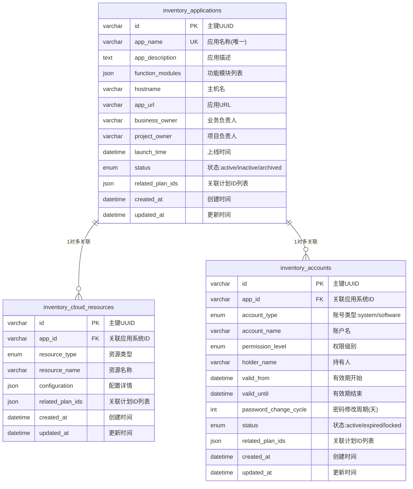
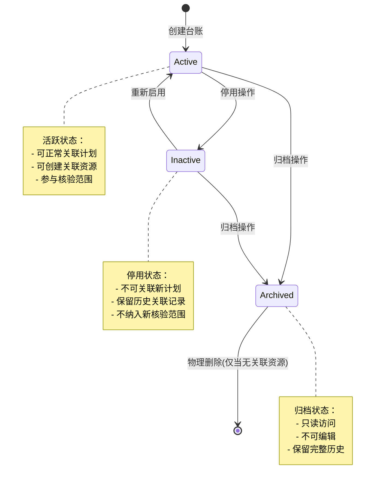

# Module 02: 台账管理模块 (Inventory Management)

> **模块类型**: 基础数据模块  
> **目标用户**: 甲方运维经理、甲方运维专家  
> **版本**: v2.0  
> **更新日期**: 2026-03-26

---

## 1. 模块概述

台账管理模块是OpsPilot平台的**基础数据层**，管理应用系统、云服务资源、账号等核心资产信息。台账数据与计划深度关联，为计划的范围选择和工作项生成提供数据支撑。

### 1.1 核心职责

- 管理应用系统台账
- 管理云服务资源台账（IAAS+PAAS）
- 管理系统及软件账号台账
- 支持计划标签关联
- 提供台账查询和统计

### 1.2 台账类型

```
台账管理
├── 应用系统台账 (Application)
├── 云服务资源台账 (Cloud Resources)
│   ├── IAAS层（计算/网络/存储/备份）
│   └── PAAS层（中间件/数据库/缓存/消息队列）
└── 系统及软件账号台账 (Account)
```

---

## 2. 功能需求

### 2.1 应用系统台账

#### 2.1.1 字段定义

| 字段 | 类型 | 必填 | 说明 |
|-----|------|------|------|
| 应用名称 | String | 是 | 应用系统名称 |
| 应用描述 | Text | 否 | 应用情况说明 |
| 功能模块 | JSON | 否 | 功能模块列表（含module_name, launch_time）|
| 主机名 | String | 否 | 主机名 |
| 应用URL | String | 否 | 应用地址URL |
| 业务负责人 | String | 是 | 业务负责人姓名 |
| 项目负责人 | String | 是 | 项目负责人姓名 |
| 上线时间 | DateTime | 否 | 系统上线时间 |
| 状态 | Enum | 是 | active/inactive/archived |

#### 2.1.2 功能列表

- 新增应用系统
- 编辑应用信息
- 查询应用列表
- 查看应用详情
- 功能模块管理
- 关联计划查看

### 2.2 云服务资源台账

#### 2.2.1 IAAS层资源

| 资源类型 | 说明 |
|---------|------|
| 计算服务 | ECS/VM/容器实例 |
| 网络服务 | VPC/SLB/安全组 |
| 存储服务 | 对象存储/块存储/NAS |
| 备份服务 | 快照/备份策略 |

#### 2.2.2 PAAS层资源

| 资源类型 | 说明 |
|---------|------|
| 数据库 | MySQL/Redis/MongoDB等 |
| 消息队列 | Kafka/RabbitMQ等 |
| 缓存服务 | Redis/Memcached等 |
| 中间件 | Nginx/Tomcat等 |

#### 2.2.3 功能列表

- 资源登记
- 资源配置管理
- 资源关联应用系统
- 资源查询和筛选

### 2.3 系统及软件账号台账

#### 2.3.1 字段定义

| 字段 | 类型 | 必填 | 说明 |
|-----|------|------|------|
| 账号类型 | Enum | 是 | system/software |
| 账号名称 | String | 是 | 账户名 |
| 权限级别 | Enum | 是 | admin/read/write/execute |
| 持有人 | String | 是 | 持有人姓名 |
| 有效期开始 | DateTime | 是 | 有效期开始时间 |
| 有效期结束 | DateTime | 是 | 有效期结束时间 |
| 密码修改周期 | Integer | 否 | 密码修改周期(天) |
| 状态 | Enum | 是 | active/expired/locked |

#### 2.3.2 功能列表

- 账号登记
- 账号权限管理
- 有效期管理
- 密码周期提醒
- 账号状态管理

### 2.4 计划标签管理

#### 2.4.1 自动标签

- 创建计划时自动为关联台账打标签
- 标签格式：`{PLAN-ID}-{CATEGORY-CODE}-{TIMESTAMP}`

#### 2.4.2 手动标签

- 在台账管理中手动关联计划
- 在计划详情中管理关联台账

#### 2.4.3 标签应用

- 台账筛选：按标签筛选要收集台账的系统
- 核验范围：只检查带标签的资源

---

## 3. 数据模型

### 3.1 应用系统台账表 (inventory_applications)

| 字段名 | 数据类型 | 约束 | 必填 | 说明 |
|-------|---------|------|-----|------|
| id | VARCHAR(36) | PRIMARY KEY | 是 | 主键，UUID格式 |
| app_name | VARCHAR(100) | NOT NULL, UNIQUE | 是 | 应用名称，全局唯一 |
| app_description | TEXT | - | 否 | 应用情况说明 |
| function_modules | JSON | - | 否 | 功能模块列表，格式：[{"module_name": "xxx", "launch_time": "2024-01-01"}] |
| hostname | VARCHAR(100) | - | 否 | 主机名 |
| app_url | VARCHAR(500) | - | 否 | 应用地址URL |
| business_owner | VARCHAR(50) | NOT NULL | 是 | 业务负责人姓名 |
| project_owner | VARCHAR(50) | NOT NULL | 是 | 项目负责人姓名 |
| launch_time | DATETIME | - | 否 | 系统上线时间 |
| status | ENUM('active','inactive','archived') | NOT NULL, DEFAULT 'active' | 是 | 台账状态：活跃/停用/归档 |
| related_plan_ids | JSON | - | 否 | 关联的计划ID列表，格式：["PLAN-20240323-001", "PLAN-20240324-002"] |
| created_at | DATETIME | NOT NULL | 是 | 创建时间 |
| updated_at | DATETIME | NOT NULL | 是 | 更新时间 |

### 3.2 云服务资源台账表 (inventory_cloud_resources)

| 字段名 | 数据类型 | 约束 | 必填 | 说明 |
|-------|---------|------|-----|------|
| id | VARCHAR(36) | PRIMARY KEY | 是 | 主键，UUID格式 |
| app_id | VARCHAR(36) | FOREIGN KEY → inventory_applications.id | 是 | 关联应用系统ID |
| resource_type | ENUM('compute','network','storage','backup','middleware','database','cache','message_queue') | NOT NULL | 是 | 资源类型：计算/网络/存储/备份/中间件/数据库/缓存/消息队列 |
| resource_name | VARCHAR(100) | NOT NULL | 是 | 资源名称 |
| configuration | JSON | - | 否 | 资源配置详情，格式因类型而异 |
| related_plan_ids | JSON | - | 否 | 关联的计划ID列表 |
| created_at | DATETIME | NOT NULL | 是 | 创建时间 |
| updated_at | DATETIME | NOT NULL | 是 | 更新时间 |

**索引设计**:
- `idx_app_id`: 普通索引，加速按应用查询资源
- `idx_resource_type`: 普通索引，加速按类型筛选

### 3.3 系统及软件账号台账表 (inventory_accounts)

| 字段名 | 数据类型 | 约束 | 必填 | 说明 |
|-------|---------|------|-----|------|
| id | VARCHAR(36) | PRIMARY KEY | 是 | 主键，UUID格式 |
| app_id | VARCHAR(36) | FOREIGN KEY → inventory_applications.id | 是 | 关联应用系统ID |
| account_type | ENUM('system','software') | NOT NULL | 是 | 账号类型：系统账号/软件账号 |
| account_name | VARCHAR(100) | NOT NULL | 是 | 账户名 |
| permission_level | ENUM('admin','read','write','execute') | NOT NULL | 是 | 权限级别：管理员/只读/读写/执行 |
| holder_name | VARCHAR(50) | NOT NULL | 是 | 持有人姓名 |
| valid_from | DATETIME | NOT NULL | 是 | 有效期开始时间 |
| valid_until | DATETIME | NOT NULL | 是 | 有效期结束时间 |
| password_change_cycle | INT | - | 否 | 密码修改周期(天)，默认90天 |
| status | ENUM('active','expired','locked') | NOT NULL, DEFAULT 'active' | 是 | 账号状态：活跃/过期/锁定 |
| related_plan_ids | JSON | - | 否 | 关联的计划ID列表 |
| created_at | DATETIME | NOT NULL | 是 | 创建时间 |
| updated_at | DATETIME | NOT NULL | 是 | 更新时间 |

**索引设计**:
- `idx_app_id`: 普通索引，加速按应用查询账号
- `idx_account_type`: 普通索引，加速按类型筛选
- `idx_status`: 普通索引，加速按状态筛选

### 3.4 实体关系图 (ER Diagram)



---

## 4. 业务规则

### 4.1 台账范围选择逻辑

| 计划分类 | 台账操作 | 自动生成工作项 |
|---------|---------|---------------|
| 新系统上线 | 新增应用系统台账 | 补充应用系统台账 |
| 新功能发布 | 查询+编辑应用系统台账 | 补充新增的功能模块 |
| 业务功能变更 | 查询+勾选应用系统台账 | 更新应用系统台账 |
| 数据库变更 | 查询+勾选应用系统台账 | 更新数据库相关台账 |

### 4.2 数据关联规则

- 云服务资源必须关联应用系统
- 账号台账必须关联应用系统
- 所有台账记录可关联多个计划ID

### 4.3 标签规则

- 标签是核验范围的界定依据
- 无标签资源不纳入核验范围
- 支持标签继承（子系统继承父系统标签）

### 4.4 台账生命周期状态流转



### 4.5 CRUD 强校验规则 (表单与接口防呆)

#### 4.5.1 唯一性校验

| 校验对象 | 校验规则 | 前端校验 | 后端校验 |
|---------|---------|---------|---------|
| 应用名称(app_name) | 全局唯一，不区分大小写 | 失焦(blur)时异步校验，显示"该应用名称已存在" | 落库前加唯一索引锁，捕获DuplicateKeyException返回409冲突状态码 |
| 账号名称(app_id + account_name) | 同一应用下账号名唯一 | 失焦时校验，显示"该账号名称在当前应用下已存在" | 复合唯一索引(app_id, account_name)，防止并发重复创建 |
| 资源名称(app_id + resource_name) | 同一应用下资源名唯一 | 失焦时校验，显示"该资源名称在当前应用下已存在" | 复合唯一索引(app_id, resource_name) |

**并发控制**: 后端使用数据库唯一索引作为最终防线，前端校验仅提升用户体验。

#### 4.5.2 逻辑强校验

| 校验场景 | 校验规则 | 错误提示 |
|---------|---------|---------|
| 账号有效期 | valid_until 必须严格大于 valid_from | "有效期结束时间必须晚于开始时间" |
| 时间范围 | 有效期跨度不得超过10年 | "有效期跨度不能超过10年" |
| URL格式 | app_url 必须符合标准URL格式 | "请输入有效的URL地址(以http://或https://开头)" |
| 必填依赖 | 当status为archived时，必须填写archived_reason | "归档操作必须填写归档原因" |
| JSON格式 | function_modules 必须是合法JSON数组 | "功能模块格式错误，必须是JSON数组" |

#### 4.5.3 防误删拦截

**删除应用系统(Application)时的级联检查**:

```
删除请求 → 检查是否存在关联资源
    ├── 存在关联云资源(cloud_resources) → 拦截，返回错误码 409 CONFLICT
    │   └── 错误消息: "存在关联资源，请先解绑或删除子资源。关联云资源: {count}条"
    ├── 存在关联账号(accounts) → 拦截，返回错误码 409 CONFLICT
    │   └── 错误消息: "存在关联资源，请先解绑或删除子资源。关联账号: {count}条"
    └── 无关联资源 → 允许删除，执行软删除(updated_at记录，保留数据)
```

**前端交互设计**:
- 点击删除按钮时，先调用 `GET /api/inventory/applications/:id/dependencies` 获取关联资源统计
- 若存在关联资源，弹窗提示:"该应用系统下存在 {云资源数} 个云资源、{账号数} 个账号，请先删除或转移这些资源"
- 删除确认使用二次确认弹窗，要求用户输入"确认删除"文字

**删除云资源/账号时的检查**:
- 检查是否有关联的活跃计划(计划状态为 PENDING/IN_PROGRESS)
- 若存在，禁止删除并提示:"该资源已被计划 {plan_name} 引用，请先解除关联"

#### 4.5.4 JSON字段处理规范

**功能模块(function_modules)处理**:

前端实现:
```
功能模块编辑区
├── 【动态列表】每行包含:
│   ├── module_name: 输入框，必填，最大长度50字符
│   ├── launch_time: 日期选择器，可选
│   └── 删除按钮: 点击移除当前行
├── 【添加行按钮】: 点击新增一行空数据
└── 数据格式: [{"module_name": "订单模块", "launch_time": "2024-03-01"}, ...]
```

后端处理:
```python
# 接收前端JSON数组，直接序列化存储
# 校验规则:
# 1. 必须是数组类型
# 2. 每个元素必须包含 module_name 字段
# 3. launch_time 若存在，必须是合法日期格式
# 4. 数组长度不超过100条
```

**资源配置(configuration)处理**:
- 根据 resource_type 动态渲染不同表单
- compute类型: 包含cpu、memory、os等字段
- database类型: 包含engine、version、port等字段
- 后端接收后原样存储JSON，不做强Schema校验(保留扩展性)

---

## 5. 接口定义

### 5.1 应用系统台账接口

#### 5.1.1 创建应用系统
```
POST /api/v1/inventory/applications
Content-Type: application/json

Request Body:
{
    "app_name": "订单管理系统",
    "app_description": "核心业务订单管理系统",
    "function_modules": [
        {"module_name": "订单模块", "launch_time": "2024-01-15"},
        {"module_name": "支付模块", "launch_time": "2024-02-01"}
    ],
    "hostname": "order-prod-01",
    "app_url": "https://order.example.com",
    "business_owner": "张三",
    "project_owner": "李四",
    "launch_time": "2024-01-15T00:00:00Z"
}

Response: 201 Created
{
    "id": "550e8400-e29b-41d4-a716-446655440000",
    "app_name": "订单管理系统",
    "status": "active",
    "created_at": "2024-03-26T09:30:00Z"
}
```

#### 5.1.2 查询应用系统列表
```
GET /api/v1/inventory/applications?page=1&size=20&keyword=订单&status=active

Response: 200 OK
{
    "data": [...],
    "pagination": {
        "page": 1,
        "size": 20,
        "total": 156,
        "total_pages": 8
    }
}
```

#### 5.1.3 获取应用系统详情
```
GET /api/v1/inventory/applications/:id

Response: 200 OK
{
    "id": "550e8400-e29b-41d4-a716-446655440000",
    "app_name": "订单管理系统",
    ...
}
```

#### 5.1.4 更新应用系统
```
PUT /api/v1/inventory/applications/:id
Content-Type: application/json

Request Body:
{
    "app_description": "更新后的描述",
    "business_owner": "王五"
}

Response: 200 OK
```

#### 5.1.5 删除应用系统
```
DELETE /api/v1/inventory/applications/:id

Response: 204 No Content
或 409 Conflict (存在关联资源时)
{
    "error": "RESOURCE_HAS_DEPENDENCIES",
    "message": "存在关联资源，请先解绑或删除子资源",
    "details": {
        "cloud_resources": 5,
        "accounts": 3
    }
}
```

#### 5.1.6 获取应用关联资源统计
```
GET /api/v1/inventory/applications/:id/dependencies

Response: 200 OK
{
    "cloud_resources": 5,
    "accounts": 3,
    "active_plans": 2
}
```

### 5.2 云服务资源台账接口

#### 5.2.1 创建资源
```
POST /api/v1/inventory/cloud-resources
Content-Type: application/json

Request Body:
{
    "app_id": "550e8400-e29b-41d4-a716-446655440000",
    "resource_type": "database",
    "resource_name": "order-db-prod",
    "configuration": {
        "engine": "MySQL",
        "version": "8.0",
        "instance_type": "rds.mysql.c1.large",
        "port": 3306
    }
}

Response: 201 Created
```

#### 5.2.2 查询资源列表
```
GET /api/v1/inventory/cloud-resources?app_id=xxx&resource_type=database&page=1&size=20

Response: 200 OK
```

#### 5.2.3 更新资源
```
PUT /api/v1/inventory/cloud-resources/:id
Content-Type: application/json

Request Body:
{
    "resource_name": "新名称",
    "configuration": {...}
}

Response: 200 OK
```

#### 5.2.4 删除资源
```
DELETE /api/v1/inventory/cloud-resources/:id

Response: 204 No Content
或 409 Conflict (存在活跃计划关联时)
```

### 5.3 账号台账接口

#### 5.3.1 创建账号
```
POST /api/v1/inventory/accounts
Content-Type: application/json

Request Body:
{
    "app_id": "550e8400-e29b-41d4-a716-446655440000",
    "account_type": "system",
    "account_name": "order-service",
    "permission_level": "execute",
    "holder_name": "运维组",
    "valid_from": "2024-01-01T00:00:00Z",
    "valid_until": "2025-01-01T00:00:00Z",
    "password_change_cycle": 90
}

Response: 201 Created
```

#### 5.3.2 查询账号列表
```
GET /api/v1/inventory/accounts?app_id=xxx&account_type=system&status=active&page=1&size=20

Response: 200 OK
```

#### 5.3.3 更新账号
```
PUT /api/v1/inventory/accounts/:id
Content-Type: application/json

Request Body:
{
    "permission_level": "admin",
    "valid_until": "2025-06-01T00:00:00Z"
}

Response: 200 OK
```

#### 5.3.4 删除账号
```
DELETE /api/v1/inventory/accounts/:id

Response: 204 No Content
或 409 Conflict
```

#### 5.3.5 校验账号有效期
```
GET /api/v1/inventory/accounts/expiring?days=30

Response: 200 OK
{
    "data": [
        {
            "id": "xxx",
            "account_name": "order-service",
            "valid_until": "2024-04-25T00:00:00Z",
            "days_remaining": 30
        }
    ]
}
```

### 5.4 通用接口规范

#### 5.4.1 错误响应格式
```json
{
    "error": "ERROR_CODE",
    "message": "人类可读的错误描述",
    "details": {
        "field": "具体字段错误信息"
    },
    "timestamp": "2024-03-26T09:30:00Z",
    "path": "/api/v1/inventory/applications"
}
```

#### 5.4.2 分页参数
| 参数 | 类型 | 默认值 | 说明 |
|-----|------|-------|------|
| page | Integer | 1 | 页码，从1开始 |
| size | Integer | 20 | 每页条数，最大100 |
| sort | String | created_at | 排序字段 |
| order | String | desc | 排序方向：asc/desc |

#### 5.4.3 批量操作限制
- 单次批量创建/更新/删除最多支持100条记录
- 超出限制返回 400 Bad Request

---

## 6. 页面结构与交互 (UI & Interaction)

### 6.1 台账总览页

#### 6.1.1 【顶部区 - 全局统计卡片】

横向排列4个统计卡片，实时展示台账数据概况：
| 卡片 | 显示内容 | 交互 |
|-----|---------|------|
| 应用系统 | 总数量 + 本月新增数 | 点击进入应用系统管理页 |
| 云资源 | 总数量 + 按类型分布(小饼图) | 点击进入资源管理页 |
| 系统账号 | 总数量 + 即将过期数(7天内) | 点击进入账号管理页 |
| 软件账号 | 总数量 + 已过期数 | 点击进入账号管理页(自动筛选过期状态) |

#### 6.1.2 【中部区 - 快捷操作】

- 快速新增按钮组：【+ 应用系统】 【+ 云资源】 【+ 账号】
- 最近访问：显示最近查看的5个台账记录，支持快速跳转

#### 6.1.3 【底部区 - 待处理提醒】

- 即将过期账号列表：显示30天内过期的账号，带【延期】快捷操作
- 无关联资源的应用：显示未配置云资源和账号的应用，提示补充

### 6.2 应用系统管理页

#### 6.2.1 【顶部区 - 搜索与筛选】

搜索条件行(支持回车触发搜索)：
| 字段 | 组件类型 | 占位符/选项 |
|-----|---------|-----------|
| 应用名称 | Input输入框 | "请输入应用名称，支持模糊搜索" |
| 业务负责人 | Input输入框 | "请输入负责人姓名" |
| 状态 | Select下拉框 | 全部/活跃/停用/归档 |
| 创建时间 | DateRange日期范围 | - |

操作按钮组(右对齐)：
- 【重置】按钮：灰色次要按钮，清空所有筛选条件
- 【查询】按钮：蓝色主按钮，触发搜索
- 【+ 新增应用】按钮：蓝色主按钮(带图标)，点击打开新增抽屉

#### 6.2.2 【数据表格区 - 应用列表】

表格列定义：
| 列名 | 宽度 | 内容说明 |
|-----|------|---------|
| 应用名称 | 200px | 蓝色可点击文字，点击进入详情Modal |
| 业务负责人 | 120px | 纯文本显示 |
| 项目负责人 | 120px | 纯文本显示 |
| 主机名 | 150px | 纯文本显示，空值显示"-" |
| 功能模块数 | 100px | 显示模块数量，如"3个" |
| 关联资源 | 150px | 格式:"云资源5/账号3"，数字带蓝色链接 |
| 状态 | 100px | Tag标签显示：绿色(Active)/橙色(Inactive)/灰色(Archived) |
| 创建时间 | 150px | YYYY-MM-DD HH:mm格式 |
| 操作 | 150px | 【编辑】 【停用/启用】 【归档】 【删除】 |

分页控件(表格底部)：
- 默认20条/页，可选：10/20/50/100条
- 显示"共 {total} 条"统计
- 页码导航：【上一页】 1 2 3 ... 10 【下一页】

行操作逻辑：
- 【编辑】：打开右侧抽屉(Drawer)，带表单校验
- 【停用/启用】：二次确认弹窗，切换status字段
- 【归档】：强确认弹窗(需输入"确认归档")，status变为archived
- 【删除】：先调用dependencies接口检查，有依赖则提示，无依赖则二次确认后删除

#### 6.2.3 【交互弹窗区】

**新增/编辑抽屉 (Drawer - 右侧滑出)**：
```
抽屉标题: 新增应用系统 / 编辑应用系统
├── 【基础信息】分组
│   ├── 应用名称*：Input，失焦校验唯一性，显示校验状态图标
│   ├── 应用描述：TextArea，最大500字符
│   ├── 业务负责人*：Input
│   └── 项目负责人*：Input
├── 【部署信息】分组
│   ├── 主机名：Input
│   └── 应用URL：Input，带URL格式校验
├── 【功能模块】分组
│   ├── 动态列表：每行(module_name输入框 + launch_time日期选择器 + 删除按钮)
│   └── 【+ 添加模块】按钮：点击新增一行
├── 【时间信息】分组
│   └── 上线时间：DatePicker
└── 底部操作栏(固定)：
    ├── 【取消】按钮：关闭抽屉
    └── 【保存】按钮：主按钮，loading状态防重复提交
```

**详情查看弹窗 (Modal - 居中)**：
```
弹窗标题: 应用系统详情 - 订单管理系统
├── Tabs切换栏：
│   ├── 【基本信息】Tab
│   │   ├── 只读展示所有字段
│   │   └── 关联计划列表(带跳转链接)
│   ├── 【云资源】Tab
│   │   ├── 小表格展示关联云资源(资源名称、类型、创建时间)
│   │   └── 【查看全部】链接跳转资源管理页(自动筛选当前app)
│   └── 【账号】Tab
│       ├── 小表格展示关联账号(账号名、类型、有效期、状态)
│       └── 【查看全部】链接跳转账号管理页(自动筛选当前app)
└── 底部：【关闭】按钮
```

### 6.3 云资源管理页

#### 6.3.1 【顶部区 - 搜索与筛选】

搜索条件行：
| 字段 | 组件类型 | 说明 |
|-----|---------|------|
| 所属应用 | Select下拉框 | 可搜索，显示所有应用系统列表 |
| 资源名称 | Input输入框 | 支持模糊搜索 |
| 资源类型 | Select多选框 | compute/network/storage/backup/middleware/database/cache/message_queue |
| 创建时间 | DateRange日期范围 | - |

操作按钮组：
- 【重置】【查询】
- 【+ 新增资源】按钮

#### 6.3.2 【数据表格区 - 资源列表】

表格列定义：
| 列名 | 宽度 | 内容说明 |
|-----|------|---------|
| 资源名称 | 200px | 蓝色可点击文字 |
| 所属应用 | 200px | 显示应用名称，带跳转链接 |
| 资源类型 | 150px | Tag标签显示，不同类型不同颜色 |
| 配置摘要 | 250px | JSON字段的关键信息摘要(如：MySQL 8.0) |
| 关联计划数 | 100px | 数字显示 |
| 创建时间 | 150px | 日期时间格式 |
| 操作 | 120px | 【编辑】【删除】 |

#### 6.3.3 【交互弹窗区】

**新增/编辑抽屉**：
```
抽屉标题: 新增云资源 / 编辑云资源
├── 所属应用*：Select下拉框，必选
├── 资源类型*：Select下拉框，选项带图标
├── 资源名称*：Input，失焦校验(app_id+name)唯一性
└── 【配置信息】动态表单区：
    ├── 根据resource_type动态渲染不同表单字段
    ├── compute类型：CPU/内存/操作系统/实例规格
    ├── database类型：引擎/版本/端口/规格
    └── 其他类型：对应配置字段
```

### 6.4 账号管理页

#### 6.4.1 【顶部区 - 搜索与筛选】

搜索条件行：
| 字段 | 组件类型 | 说明 |
|-----|---------|------|
| 所属应用 | Select下拉框 | 可搜索 |
| 账号名称 | Input输入框 | 支持模糊搜索 |
| 账号类型 | Select下拉框 | 全部/system/software |
| 权限级别 | Select多选框 | admin/read/write/execute |
| 状态 | Select多选框 | active/expired/locked |
| 有效期 | Select下拉框 | 全部/7天内过期/30天内过期/已过期 |

操作按钮组：
- 【重置】【查询】
- 【+ 新增账号】按钮
- 【批量延期】按钮(选中行时启用)

#### 6.4.2 【数据表格区 - 账号列表】

表格列定义：
| 列名 | 宽度 | 内容说明 |
|-----|------|---------|
| 选择框 | 50px | Checkbox，支持全选 |
| 账号名称 | 180px | 蓝色可点击文字 |
| 所属应用 | 180px | 应用名称，带跳转 |
| 账号类型 | 100px | Tag显示：蓝色(system)/绿色(software) |
| 权限级别 | 100px | Tag显示：红色(admin)/其他颜色 |
| 持有人 | 100px | 纯文本 |
| 有效期 | 200px | 格式：2024-01-01 至 2025-01-01，近7天过期标红 |
| 状态 | 100px | Tag显示 |
| 操作 | 150px | 【编辑】【延期】【删除】 |

**行内快捷操作**：
- 【延期】：Popover弹窗，快速选择延期时长(3个月/6个月/1年/自定义)

#### 6.4.3 【交互弹窗区】

**新增/编辑抽屉**：
```
抽屉标题: 新增账号 / 编辑账号
├── 所属应用*：Select下拉框
├── 账号类型*：Radio单选：系统账号 / 软件账号
├── 账号名称*：Input，失焦校验(app_id+name)唯一性
├── 权限级别*：Select下拉框
├── 持有人*：Input
├── 有效期*：
│   ├── valid_from：DatePicker，默认今天
│   └── valid_until：DatePicker，必须大于valid_from
├── 密码修改周期：InputNumber，默认90，单位"天"
└── 底部操作栏
```

**有效期校验交互**：
- valid_until选择时，若早于valid_from，DatePicker边框变红，提示"结束时间必须晚于开始时间"
- 选择后自动计算并显示"有效期共 XXX 天"

---

## 7. 待确认事项

- [ ] 台账数据导入/导出需求(Excel模板格式)
- [ ] 台账与CMDB的集成方式(同步频率、字段映射)
- [ ] 台账变更历史记录需求(是否记录字段级变更日志)
- [ ] 台账数据同步机制(多环境部署时的数据同步)
- [ ] 账号密码安全存储方案(是否接入密码保险箱)
- [ ] 台账归档后的数据保留期限策略
