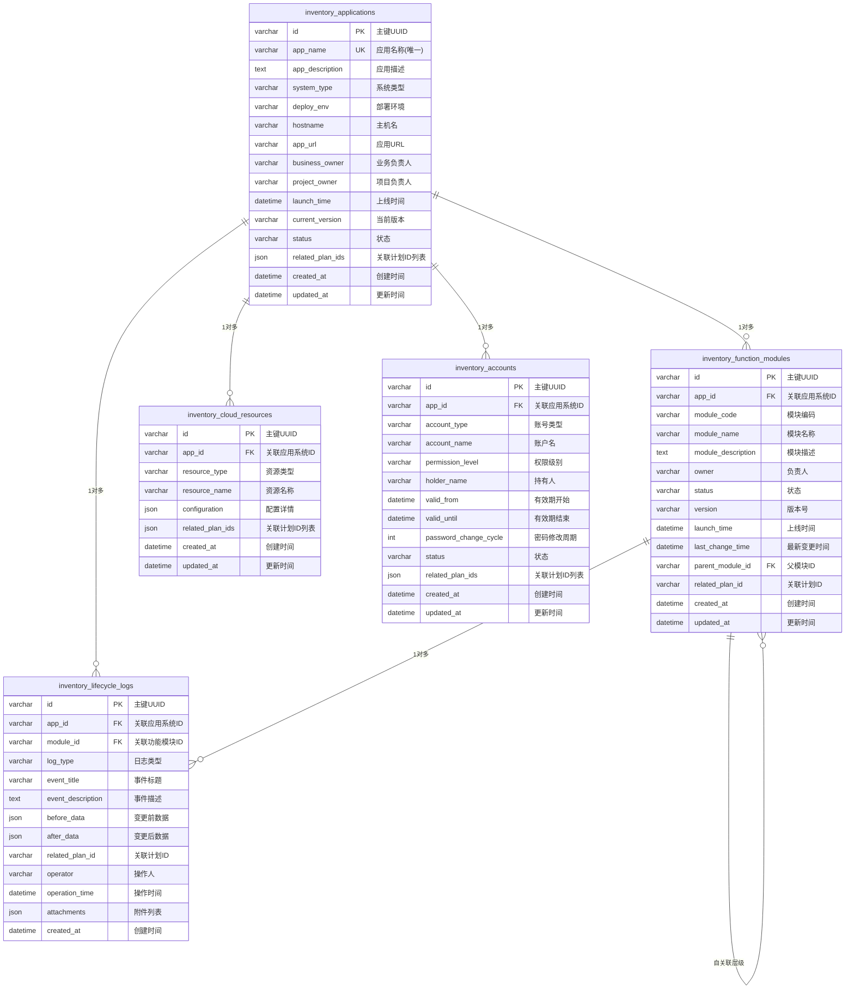
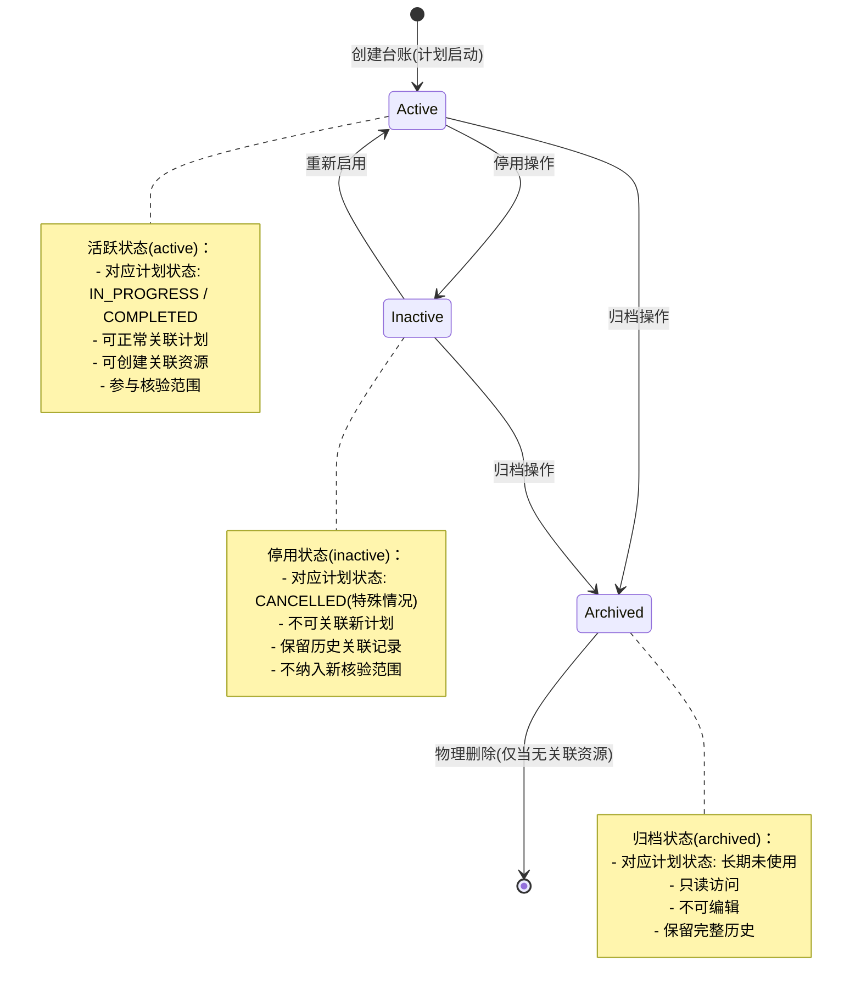

# Module 02: 台账管理模块 (Inventory Management) - 优化版

> **模块类型**: 基础数据模块  
> **目标用户**: 甲方运维经理、甲方运维专家  
> **依赖文档**: [00_Global_Architecture.md](../00_Global_Architecture.md)  
> **版本**: v3.0 (优化版)  
> **更新日期**: 2026-03-30
> 
> **变更说明**: 
> - 重构功能模块为独立实体，支持版本管理和变更追溯
> - 新增应用系统生命周期日志表，记录上线、变更、下线等关键事件
> - 强化台账与计划的关联关系，支持双向追溯
> - 优化前台界面，增加计划关联展示和变更时间线
> - **v3.1更新**: 应用系统状态与计划管理状态生命周期保持一致，完善接口供计划管理调用

---

## 1. 模块概述

台账管理模块是OpsPilot平台的**基础数据层**，管理应用系统、云服务资源、账号等核心资产信息。台账数据与计划深度关联，为计划的范围选择和工作项生成提供数据支撑。

### 1.1 核心职责

- 管理应用系统台账（含功能模块全生命周期）
- 管理云服务资源台账（IAAS+PAAS）
- 管理系统及软件账号台账
- **记录应用系统生命周期事件（新增）**
- **管理功能模块版本与变更（新增）**
- 支持计划标签关联
- 提供台账查询和统计

### 1.2 台账类型

```
台账管理
├── 应用系统台账 (Application)
│   └── 功能模块台账 (Function Module) ← 独立为子实体
├── 云服务资源台账 (Cloud Resources)
│   ├── IAAS层（计算/网络/存储/备份）
│   └── PAAS层（中间件/数据库/缓存/消息队列）
├── 系统及软件账号台账 (Account)
└── 生命周期日志 (Lifecycle Log) ← 新增
```

---

## 2. 功能需求

### 2.1 应用系统台账

#### 2.1.1 字段定义

| 字段 | 类型 | 必填 | 说明 |
|-----|------|------|------|
| 应用名称 | String | 是 | 应用系统名称 |
| 应用描述 | Text | 否 | 应用情况说明 |
| 系统类型 | Enum | 是 | web/app/api/microservice/other |
| 部署环境 | Enum | 是 | production/staging/development |
| 主机名 | String | 否 | 主机名 |
| 应用URL | String | 否 | 应用地址URL |
| 业务负责人 | String | 是 | 业务负责人姓名 |
| 项目负责人 | String | 是 | 项目负责人姓名 |
| 上线时间 | DateTime | 否 | 系统上线时间 |
| 状态 | Enum | 是 | active/inactive/archived<br>（与计划管理状态生命周期保持一致） |
| 当前版本 | String | 否 | 当前运行版本号 |

#### 2.1.2 功能列表

- 新增应用系统
- 编辑应用信息
- 查询应用列表
- 查看应用详情
- **功能模块管理（增强）**
- **生命周期日志查看（新增）**
- **关联计划时间线（新增）**

---

### 2.2 功能模块管理（重构）

#### 2.2.1 背景与痛点

原设计中 `function_modules` 为简单的JSON数组字段，存在以下问题：
- 无法追溯功能模块的变更历史
- 无法关联到具体的上线计划
- 不支持版本管理
- 缺乏负责人、描述等元信息

#### 2.2.2 功能模块字段定义

| 字段 | 类型 | 必填 | 说明 |
|-----|------|------|------|
| 模块名称 | String | 是 | 功能模块名称 |
| 模块编码 | String | 是 | 唯一编码，如 `order_module` |
| 模块描述 | Text | 否 | 功能说明 |
| 负责人 | String | 是 | 模块负责人 |
| 状态 | Enum | 是 | draft/developing/testing/online/offline |
| 版本号 | String | 否 | 当前版本，如 `v2.1.0` |
| 上线时间 | DateTime | 否 | 首次上线时间 |
| 最新变更时间 | DateTime | 否 | 最近一次变更时间 |
| 关联计划ID | String | 否 | 上线/变更关联的计划ID |
| 父模块ID | String | 否 | 支持模块层级结构 |

#### 2.2.3 功能模块状态流转

```
                    ┌─────────────┐
                    │   Draft     │
                    │   (草稿)    │
                    └──────┬──────┘
                           │ 开始开发
                           ▼
                    ┌─────────────┐
         ┌─────────│ Developing  │
         │         │  (开发中)   │
         │         └──────┬──────┘
         │                │ 开发完成
         │                ▼
         │         ┌─────────────┐
         │         │   Testing   │
         │         │  (测试中)   │
         │         └──────┬──────┘
         │                │ 测试通过
         │                ▼
         │         ┌─────────────┐
         └────────►│   Online    │◄────────┐
                   │  (已上线)   │         │
                   └──────┬──────┘         │
                          │ 下线           │ 重新上线
                          ▼                │
                   ┌─────────────┐         │
                   │   Offline   │─────────┘
                   │  (已下线)   │
                   └─────────────┘
```

#### 2.2.4 功能列表

- **模块树管理**：支持层级结构，父模块下可添加子模块
- **模块CRUD**：创建、编辑、删除模块
- **模块变更记录**：自动记录每次变更的内容、时间、操作人
- **计划关联**：标记模块由哪个计划创建或变更
- **版本管理**：支持模块版本号管理

---

### 2.3 生命周期日志（新增）

#### 2.3.1 日志类型定义

| 日志类型 | 触发场景 | 关联计划 |
|---------|---------|---------|
| `system_launch` | 新系统首次上线 | 必关联 |
| `system_upgrade` | 系统版本升级 | 必关联 |
| `system_rollback` | 系统版本回滚 | 必关联 |
| `system_offline` | 系统下线 | 必关联 |
| `module_launch` | 功能模块首次上线 | 必关联 |
| `module_update` | 功能模块更新 | 必关联 |
| `module_offline` | 功能模块下线 | 必关联 |
| `config_change` | 配置变更 | 可选 |
| `owner_change` | 负责人变更 | 可选 |
| `status_change` | 状态变更 | 可选 |

#### 2.3.2 日志记录内容

| 字段 | 类型 | 必填 | 说明 |
|-----|------|------|------|
| 应用系统ID | String | 是 | 关联的应用系统 |
| 功能模块ID | String | 否 | 关联的功能模块（如适用） |
| 日志类型 | Enum | 是 | 见上表 |
| 事件标题 | String | 是 | 简短描述，如"订单模块v2.0上线" |
| 事件描述 | Text | 否 | 详细描述 |
| 变更前数据 | JSON | 否 | 变更前的快照 |
| 变更后数据 | JSON | 否 | 变更后的快照 |
| 关联计划ID | String | 条件必填 | 触发此事件的计划 |
| 操作人 | String | 是 | 执行操作的用户 |
| 操作时间 | DateTime | 是 | 事件发生时间 |
| 附件 | JSON | 否 | 相关文档链接 |

#### 2.3.3 日志自动生成规则

| 触发源 | 触发动作 | 生成的日志类型 |
|-------|---------|---------------|
| 计划管理模块 | 完成"新系统上线"计划 | `system_launch` |
| 计划管理模块 | 完成"新功能上线"计划 | `module_launch` |
| 计划管理模块 | 完成"功能变更"计划 | `module_update` |
| 计划管理模块 | 完成"架构变更"计划 | `system_upgrade` |
| 台账管理模块 | 修改负责人 | `owner_change` |
| 台账管理模块 | 修改状态 | `status_change` |
| 台账管理模块 | 手动添加记录 | 用户指定类型 |

---

### 2.4 云服务资源台账

#### 2.4.1 IAAS层资源

| 资源类型 | 说明 |
|---------|------|
| 计算服务 | ECS/VM/容器实例 |
| 网络服务 | VPC/SLB/安全组 |
| 存储服务 | 对象存储/块存储/NAS |
| 备份服务 | 快照/备份策略 |

#### 2.4.2 PAAS层资源

| 资源类型 | 说明 |
|---------|------|
| 数据库 | MySQL/Redis/MongoDB等 |
| 消息队列 | Kafka/RabbitMQ等 |
| 缓存服务 | Redis/Memcached等 |
| 中间件 | Nginx/Tomcat等 |

#### 2.4.3 功能列表

- 资源登记
- 资源配置管理
- 资源关联应用系统
- 资源查询和筛选
- **资源变更日志（关联生命周期日志）**

---

### 2.5 系统及软件账号台账

#### 2.5.1 字段定义

| 字段 | 类型 | 必填 | 说明 |
|-----|------|------|------|
| 账号类型 | Enum | 是 | system/software |
| 账号名称 | String | 是 | 账户名 |
| 权限级别 | Enum | 是 | admin/read/write/execute |
| 持有人 | String | 是 | 持有人姓名 |
| 有效期开始 | DateTime | 是 | 有效期开始时间 |
| 有效期结束 | DateTime | 是 | 有效期结束时间 |
| 密码修改周期 | Integer | 否 | 密码修改周期(天) |
| 状态 | Enum | 是 | active/expired/locked |

#### 2.5.2 功能列表

- 账号登记
- 账号权限管理
- 有效期管理
- 密码周期提醒
- 账号状态管理

---

### 2.6 计划标签管理

#### 2.6.1 自动标签

- 创建计划时自动为关联台账打标签
- 标签格式：`{PLAN-ID}-{CATEGORY-CODE}-{TIMESTAMP}`
- 分类简码映射：
  - `new_system` → `NEW`
  - `new_feature` → `FTR`
  - `func_change` → `FUN`
  - `arch_change` → `ARC`
  - `security_check` → `SEC`

#### 2.6.2 手动标签

- 在台账管理中手动关联计划
- 在计划详情中管理关联台账

#### 2.6.3 标签应用

- 台账筛选：按标签筛选要收集台账的系统
- 核验范围：只检查带标签的资源

---

## 3. 数据模型

### 3.1 应用系统台账表 (inventory_applications)

| 字段名 | 数据类型 | 约束 | 必填 | 说明 |
|-------|---------|------|-----|------|
| id | VARCHAR(36) | PRIMARY KEY | 是 | 主键，UUID格式 |
| app_name | VARCHAR(100) | NOT NULL, UNIQUE | 是 | 应用名称，全局唯一 |
| app_description | TEXT | - | 否 | 应用情况说明 |
| system_type | ENUM('web','app','api','microservice','other') | NOT NULL, DEFAULT 'web' | 是 | 系统类型 |
| deploy_env | ENUM('production','staging','development') | NOT NULL, DEFAULT 'production' | 是 | 部署环境 |
| hostname | VARCHAR(100) | - | 否 | 主机名 |
| app_url | VARCHAR(500) | - | 否 | 应用地址URL |
| business_owner | VARCHAR(50) | NOT NULL | 是 | 业务负责人姓名 |
| project_owner | VARCHAR(50) | NOT NULL | 是 | 项目负责人姓名 |
| launch_time | DATETIME | - | 否 | 系统上线时间 |
| current_version | VARCHAR(50) | - | 否 | 当前运行版本号 |
| status | ENUM('active','inactive','archived') | NOT NULL, DEFAULT 'active' | 是 | 台账状态 |
| related_plan_ids | JSON | - | 否 | 关联的计划ID列表 |
| created_at | DATETIME | NOT NULL | 是 | 创建时间 |
| updated_at | DATETIME | NOT NULL | 是 | 更新时间 |

### 3.2 功能模块表 (inventory_function_modules) ← 新增独立表

| 字段名 | 数据类型 | 约束 | 必填 | 说明 |
|-------|---------|------|-----|------|
| id | VARCHAR(36) | PRIMARY KEY | 是 | 主键，UUID格式 |
| app_id | VARCHAR(36) | FOREIGN KEY → inventory_applications.id, INDEX | 是 | 关联应用系统ID |
| module_code | VARCHAR(50) | NOT NULL | 是 | 模块编码，应用内唯一 |
| module_name | VARCHAR(100) | NOT NULL | 是 | 模块名称 |
| module_description | TEXT | - | 否 | 模块描述 |
| owner | VARCHAR(50) | NOT NULL | 是 | 模块负责人 |
| status | ENUM('draft','developing','testing','online','offline') | NOT NULL, DEFAULT 'draft' | 是 | 模块状态 |
| version | VARCHAR(50) | - | 否 | 当前版本号 |
| launch_time | DATETIME | - | 否 | 首次上线时间 |
| last_change_time | DATETIME | - | 否 | 最新变更时间 |
| parent_module_id | VARCHAR(36) | FOREIGN KEY → self.id | 否 | 父模块ID，支持层级 |
| related_plan_id | VARCHAR(50) | - | 否 | 关联的计划ID |
| created_at | DATETIME | NOT NULL | 是 | 创建时间 |
| updated_at | DATETIME | NOT NULL | 是 | 更新时间 |

**索引设计**:
- `idx_app_id`: 普通索引，加速按应用查询
- `idx_app_module_code`: 复合唯一索引(app_id, module_code)，确保应用内编码唯一
- `idx_status`: 普通索引，加速按状态筛选
- `idx_parent_id`: 普通索引，加速查询子模块

### 3.3 生命周期日志表 (inventory_lifecycle_logs) ← 新增表

| 字段名 | 数据类型 | 约束 | 必填 | 说明 |
|-------|---------|------|-----|------|
| id | VARCHAR(36) | PRIMARY KEY | 是 | 主键，UUID格式 |
| app_id | VARCHAR(36) | FOREIGN KEY → inventory_applications.id, INDEX | 是 | 关联应用系统ID |
| module_id | VARCHAR(36) | FOREIGN KEY → inventory_function_modules.id, INDEX | 否 | 关联功能模块ID |
| log_type | ENUM('system_launch','system_upgrade','system_rollback','system_offline','module_launch','module_update','module_offline','config_change','owner_change','status_change','manual') | NOT NULL | 是 | 日志类型 |
| event_title | VARCHAR(200) | NOT NULL | 是 | 事件标题 |
| event_description | TEXT | - | 否 | 事件详细描述 |
| before_data | JSON | - | 否 | 变更前数据快照 |
| after_data | JSON | - | 否 | 变更后数据快照 |
| related_plan_id | VARCHAR(50) | - | 否 | 关联的计划ID |
| operator | VARCHAR(50) | NOT NULL | 是 | 操作人 |
| operation_time | DATETIME | NOT NULL | 是 | 操作时间 |
| attachments | JSON | - | 否 | 附件列表 [{name, url}] |
| created_at | DATETIME | NOT NULL | 是 | 创建时间 |

**索引设计**:
- `idx_app_id`: 普通索引，加速按应用查询日志
- `idx_module_id`: 普通索引，加速按模块查询日志
- `idx_log_type`: 普通索引，加速按类型筛选
- `idx_related_plan`: 普通索引，加速按计划查询
- `idx_operation_time`: 普通索引，加速按时间范围查询
- `idx_app_time`: 复合索引(app_id, operation_time)，优化时间线查询

### 3.4 云服务资源台账表 (inventory_cloud_resources)

| 字段名 | 数据类型 | 约束 | 必填 | 说明 |
|-------|---------|------|-----|------|
| id | VARCHAR(36) | PRIMARY KEY | 是 | 主键，UUID格式 |
| app_id | VARCHAR(36) | FOREIGN KEY → inventory_applications.id | 是 | 关联应用系统ID |
| resource_type | ENUM('compute','network','storage','backup','middleware','database','cache','message_queue') | NOT NULL | 是 | 资源类型 |
| resource_name | VARCHAR(100) | NOT NULL | 是 | 资源名称 |
| configuration | JSON | - | 否 | 资源配置详情 |
| related_plan_ids | JSON | - | 否 | 关联的计划ID列表 |
| created_at | DATETIME | NOT NULL | 是 | 创建时间 |
| updated_at | DATETIME | NOT NULL | 是 | 更新时间 |

### 3.5 系统及软件账号台账表 (inventory_accounts)

| 字段名 | 数据类型 | 约束 | 必填 | 说明 |
|-------|---------|------|-----|------|
| id | VARCHAR(36) | PRIMARY KEY | 是 | 主键，UUID格式 |
| app_id | VARCHAR(36) | FOREIGN KEY → inventory_applications.id | 是 | 关联应用系统ID |
| account_type | ENUM('system','software') | NOT NULL | 是 | 账号类型 |
| account_name | VARCHAR(100) | NOT NULL | 是 | 账户名 |
| permission_level | ENUM('admin','read','write','execute') | NOT NULL | 是 | 权限级别 |
| holder_name | VARCHAR(50) | NOT NULL | 是 | 持有人姓名 |
| valid_from | DATETIME | NOT NULL | 是 | 有效期开始时间 |
| valid_until | DATETIME | NOT NULL | 是 | 有效期结束时间 |
| password_change_cycle | INT | - | 否 | 密码修改周期(天) |
| status | ENUM('active','expired','locked') | NOT NULL, DEFAULT 'active' | 是 | 账号状态 |
| related_plan_ids | JSON | - | 否 | 关联的计划ID列表 |
| created_at | DATETIME | NOT NULL | 是 | 创建时间 |
| updated_at | DATETIME | NOT NULL | 是 | 更新时间 |

### 3.6 实体关系图 (ER Diagram)



---

## 4. 业务规则

### 4.1 台账范围选择逻辑

根据全局架构定义，5种计划类型对应不同的台账操作方式：

| 计划分类 | 台账操作 | 关联台账类型 | 日志类型 | 说明 |
|---------|---------|-------------|---------|------|
| **新系统上线** | **新增**应用系统台账 | 应用系统、云服务、账号 | `system_launch` | 创建全新的台账条目，事务级联创建 |
| **新功能上线** | **新增**功能模块台账 | 应用系统台账、功能模块 | `module_launch` | 单选台账，新增功能模块记录 |
| **功能变更** | **更新**功能模块台账 | 应用系统台账、功能模块 | `module_update` | 多选应用系统，更新功能模块 |
| **架构变更** | **更新**应用系统台账 | 应用系统、云服务 | `system_upgrade` | 多选应用系统，可能涉及云资源/数据库变更 |
| **安全检查** | **不关联台账** | 无或可选范围 | - | 全系统扫描或指定范围检查，无需选择台账 |

### 4.2 功能模块生命周期规则

#### 4.2.1 状态流转规则

| 当前状态 | 允许 transitions | 触发条件 |
|---------|-----------------|---------|
| draft | → developing | 开始开发 |
| developing | → testing / → draft | 开发完成提交测试 / 退回草稿 |
| testing | → online / → developing | 测试通过上线 / 退回开发 |
| online | → offline | 下线操作 |
| offline | → online | 重新上线 |

#### 4.2.2 变更自动记录规则

当功能模块发生以下变更时，自动生成 `module_update` 类型日志：
- 状态变更（如 developing → testing）
- 版本号变更
- 负责人变更
- 父模块变更（结构调整）

**日志内容格式**：
```json
{
  "before_data": {
    "status": "developing",
    "version": "v1.0.0",
    "owner": "张三"
  },
  "after_data": {
    "status": "online",
    "version": "v2.0.0",
    "owner": "李四"
  },
  "change_fields": ["status", "version", "owner"]
}
```

### 4.3 生命周期日志生成规则

#### 4.3.1 自动触发场景

| 触发场景 | 日志类型 | 日志标题自动生成规则 |
|---------|---------|-------------------|
| 完成"新系统上线"计划 | system_launch | "【系统上线】{app_name} 正式上线" |
| 完成"新功能上线"计划 | module_launch | "【功能上线】{module_name} 正式上线" |
| 完成功能变更计划 | module_update | "【功能变更】{module_name} 更新至 {version}" |
| 完成架构变更计划 | system_upgrade | "【系统升级】{app_name} 升级至 {current_version}" |

#### 4.3.2 手动记录场景

在以下情况，允许用户手动添加生命周期日志：
- 线下完成的系统变更
- 紧急故障处理记录
- 配置变更记录
- 负责人交接记录

### 4.4 数据关联规则

- 云服务资源必须关联应用系统
- 账号台账必须关联应用系统
- 功能模块必须关联应用系统
- 生命周期日志必须关联应用系统，可选关联功能模块
- 所有台账记录可关联多个计划ID
- **安全检查类型计划可不关联台账**（特殊情况）

### 4.5 标签规则

- 标签是核验范围的界定依据
- 无标签资源不纳入核验范围（安全检查类型除外）
- 支持标签继承（子系统继承父系统标签）

### 4.6 台账生命周期状态流转



#### 4.6.1 台账状态与计划状态对应关系

| 台账状态 | 对应计划状态 | 说明 |
|---------|-------------|------|
| `active` | `IN_PROGRESS` / `COMPLETED` | 计划执行中或已完成，台账保持活跃 |
| `inactive` | `CANCELLED` (可选) | 计划取消时，根据业务规则决定是否停用台账 |
| `archived` | - | 长期未使用的台账，手动归档 |

**重要说明**: 
- 台账管理中的应用系统状态与计划管理中的计划状态生命周期保持一致
- 当计划启动 (`IN_PROGRESS`) 时，关联台账状态应为 `active`
- 当计划完成 (`COMPLETED`) 时，关联台账保持 `active` 状态，记录生命周期日志
- 当计划取消 (`CANCELLED`) 时，根据业务规则评估是否将台账回滚或停用

---

## 5. 接口定义

### 5.1 应用系统台账接口

#### 5.1.1 创建应用系统
```
POST /api/v1/inventory/applications
Content-Type: application/json

Request Body:
{
    "app_name": "订单管理系统",
    "app_description": "核心业务订单管理系统",
    "system_type": "web",
    "deploy_env": "production",
    "hostname": "order-prod-01",
    "app_url": "https://order.example.com",
    "business_owner": "张三",
    "project_owner": "李四",
    "launch_time": "2024-01-15T00:00:00Z",
    "current_version": "v1.0.0"
}

Response: 201 Created
{
    "id": "550e8400-e29b-41d4-a716-446655440000",
    "app_name": "订单管理系统",
    "status": "active",
    "created_at": "2024-03-26T09:30:00Z"
}
```

#### 5.1.2 查询应用系统列表
```
GET /api/v1/inventory/applications?page=1&size=20&keyword=订单&status=active

Response: 200 OK
{
    "data": [...],
    "pagination": {
        "page": 1,
        "size": 20,
        "total": 156,
        "total_pages": 8
    }
}
```

#### 5.1.3 获取应用系统详情（含完整关联信息）
```
GET /api/v1/inventory/applications/:id

Response: 200 OK
{
    "id": "550e8400-e29b-41d4-a716-446655440000",
    "app_name": "订单管理系统",
    "app_description": "核心业务订单管理系统",
    "system_type": "web",
    "deploy_env": "production",
    "hostname": "order-prod-01",
    "app_url": "https://order.example.com",
    "business_owner": "张三",
    "project_owner": "李四",
    "launch_time": "2024-01-15T00:00:00Z",
    "current_version": "v2.1.0",
    "status": "active",
    "related_plan_ids": ["PLAN-20240322-001", "PLAN-20240325-002"],
    "statistics": {
        "module_count": 5,
        "cloud_resource_count": 8,
        "account_count": 3,
        "log_count": 12
    },
    "created_at": "2024-03-26T09:30:00Z",
    "updated_at": "2024-03-26T09:30:00Z"
}
```

#### 5.1.4 获取应用系统生命周期时间线
```
GET /api/v1/inventory/applications/:id/timeline

Response: 200 OK
{
    "data": [
        {
            "id": "log-001",
            "log_type": "system_launch",
            "event_title": "【系统上线】订单管理系统 正式上线",
            "related_plan_id": "PLAN-20240322-001",
            "plan_name": "订单管理系统上线计划",
            "operator": "张三",
            "operation_time": "2024-03-22T10:00:00Z",
            "icon": "rocket",
            "color": "green"
        },
        {
            "id": "log-002",
            "log_type": "module_launch",
            "event_title": "【功能上线】支付模块 正式上线",
            "related_plan_id": "PLAN-20240325-002",
            "plan_name": "支付功能上线计划",
            "operator": "李四",
            "operation_time": "2024-03-25T14:30:00Z",
            "icon": "appstore",
            "color": "blue"
        },
        {
            "id": "log-003",
            "log_type": "owner_change",
            "event_title": "【负责人变更】项目负责人由 李四 变更为 王五",
            "related_plan_id": null,
            "operator": "admin",
            "operation_time": "2024-03-28T09:00:00Z",
            "icon": "user-switch",
            "color": "orange"
        }
    ]
}
```

#### 5.1.5 更新应用系统
```
PUT /api/v1/inventory/applications/:id
Content-Type: application/json

Request Body:
{
    "app_description": "更新后的描述",
    "business_owner": "王五",
    "current_version": "v2.2.0"
}

Response: 200 OK
```

#### 5.1.6 删除应用系统
```
DELETE /api/v1/inventory/applications/:id

Response: 204 No Content
或 409 Conflict (存在关联资源时)
```

### 5.2 功能模块接口（新增）

#### 5.2.1 获取功能模块树
```
GET /api/v1/inventory/applications/:app_id/modules/tree

Response: 200 OK
{
    "data": [
        {
            "id": "mod-001",
            "module_code": "order_center",
            "module_name": "订单中心",
            "status": "online",
            "version": "v2.0.0",
            "children": [
                {
                    "id": "mod-002",
                    "module_code": "order_create",
                    "module_name": "订单创建",
                    "status": "online",
                    "version": "v1.5.0"
                },
                {
                    "id": "mod-003",
                    "module_code": "order_query",
                    "module_name": "订单查询",
                    "status": "online",
                    "version": "v1.2.0"
                }
            ]
        }
    ]
}
```

#### 5.2.2 创建功能模块
```
POST /api/v1/inventory/applications/:app_id/modules
Content-Type: application/json

Request Body:
{
    "module_code": "payment_gateway",
    "module_name": "支付网关",
    "module_description": "统一支付接入网关",
    "owner": "李四",
    "parent_module_id": null,
    "version": "v1.0.0"
}

Response: 201 Created
{
    "id": "mod-004",
    "module_code": "payment_gateway",
    "module_name": "支付网关",
    "status": "draft",
    "created_at": "2024-03-30T10:00:00Z"
}
```

#### 5.2.3 更新功能模块
```
PUT /api/v1/inventory/modules/:id
Content-Type: application/json

Request Body:
{
    "status": "online",
    "version": "v1.1.0",
    "related_plan_id": "PLAN-20240330-001"
}

Response: 200 OK
```

#### 5.2.4 删除功能模块
```
DELETE /api/v1/inventory/modules/:id

Response: 204 No Content
或 409 Conflict (存在子模块时)
```

### 5.3 生命周期日志接口（新增）

#### 5.3.1 查询生命周期日志
```
GET /api/v1/inventory/applications/:app_id/logs?page=1&size=20&log_type=module_launch

Query Parameters:
- page: 页码
- size: 每页数量
- log_type: 日志类型筛选（可选）
- start_time: 开始时间（可选）
- end_time: 结束时间（可选）

Response: 200 OK
{
    "data": [
        {
            "id": "log-001",
            "log_type": "module_launch",
            "event_title": "【功能上线】支付模块 正式上线",
            "event_description": "支付模块完成测试，正式对外提供服务",
            "module_name": "支付模块",
            "related_plan_id": "PLAN-20240325-002",
            "plan_name": "支付功能上线计划",
            "operator": "李四",
            "operation_time": "2024-03-25T14:30:00Z",
            "attachments": []
        }
    ],
    "pagination": {...}
}
```

#### 5.3.2 手动添加生命周期日志
```
POST /api/v1/inventory/applications/:app_id/logs
Content-Type: application/json

Request Body:
{
    "log_type": "manual",
    "event_title": "【紧急修复】支付接口超时问题修复",
    "event_description": "因第三方支付接口响应超时，临时调整超时时间配置",
    "module_id": "mod-004",
    "attachments": [
        {
            "name": "故障分析报告.pdf",
            "url": "https://storage.example.com/files/report.pdf"
        }
    ]
}

Response: 201 Created
```

#### 5.3.3 获取日志详情
```
GET /api/v1/inventory/logs/:id

Response: 200 OK
{
    "id": "log-001",
    "app_id": "app-001",
    "app_name": "订单管理系统",
    "module_id": "mod-004",
    "module_name": "支付网关",
    "log_type": "module_update",
    "event_title": "【功能变更】支付网关 更新至 v2.0.0",
    "event_description": "新增微信支付、支付宝支付渠道",
    "before_data": {
        "version": "v1.0.0",
        "status": "online"
    },
    "after_data": {
        "version": "v2.0.0",
        "status": "online"
    },
    "related_plan_id": "PLAN-20240330-001",
    "plan_name": "支付渠道扩展计划",
    "operator": "张三",
    "operation_time": "2024-03-30T10:00:00Z",
    "attachments": []
}
```

### 5.4 云服务资源台账接口

#### 5.4.1 创建资源
```
POST /api/v1/inventory/cloud-resources
Content-Type: application/json

Request Body:
{
    "app_id": "550e8400-e29b-41d4-a716-446655440000",
    "resource_type": "database",
    "resource_name": "order-db-prod",
    "configuration": {
        "engine": "MySQL",
        "version": "8.0",
        "instance_type": "rds.mysql.c1.large",
        "port": 3306
    }
}

Response: 201 Created
```

#### 5.4.2 查询资源列表
```
GET /api/v1/inventory/cloud-resources?app_id=xxx&resource_type=database&page=1&size=20

Response: 200 OK
```

### 5.5 账号台账接口

#### 5.5.1 创建账号
```
POST /api/v1/inventory/accounts
Content-Type: application/json

Request Body:
{
    "app_id": "550e8400-e29b-41d4-a716-446655440000",
    "account_type": "system",
    "account_name": "order-service",
    "permission_level": "execute",
    "holder_name": "运维组",
    "valid_from": "2024-01-01T00:00:00Z",
    "valid_until": "2025-01-01T00:00:00Z",
    "password_change_cycle": 90
}

Response: 201 Created
```

#### 5.5.2 查询账号列表
```
GET /api/v1/inventory/accounts?app_id=xxx&account_type=system&status=active&page=1&size=20

Response: 200 OK
```

---

## 6. 页面结构与交互 (UI & Interaction)

### 6.1 台账总览页

#### 6.1.1 【顶部区 - 全局统计卡片】

横向排列4个统计卡片：
| 卡片 | 显示内容 | 交互 |
|-----|---------|------|
| 应用系统 | 总数量 + 本月新增数 | 点击进入应用系统管理页 |
| 云资源 | 总数量 + 按类型分布 | 点击进入资源管理页 |
| 系统账号 | 总数量 + 即将过期数 | 点击进入账号管理页 |
| **近7天事件** | **事件数量 + 按类型分布** | **点击进入事件时间线页（新增）** |

#### 6.1.2 【中部区 - 快捷操作】

- 快速新增按钮组：【+ 应用系统】 【+ 云资源】 【+ 账号】
- 最近访问：显示最近查看的5个台账记录

#### 6.1.3 【底部区 - 待处理提醒】

- 即将过期账号列表
- **近期事件提醒（新增）**：显示近7天的上线、变更事件

---

### 6.2 应用系统管理页

#### 6.2.1 【顶部区 - 搜索与筛选】

搜索条件行：
| 字段 | 组件类型 | 说明 |
|-----|---------|------|
| 应用名称 | Input | 支持模糊搜索 |
| 业务负责人 | Input | - |
| 状态 | Select | 全部/活跃/停用/归档 |
| **系统类型（新增）** | Select | web/app/api/微服务 |
| 创建时间 | DateRange | - |

#### 6.2.2 【数据表格区 - 应用列表】

表格列定义：
| 列名 | 宽度 | 内容说明 |
|-----|------|---------|
| 应用名称 | 180px | 蓝色可点击文字 |
| **当前版本（新增）** | 100px | 版本号标签 |
| 业务负责人 | 100px | 纯文本 |
| 项目负责人 | 100px | 纯文本 |
| **功能模块数（调整）** | 100px | 显示模块数量，带跳转链接 |
| 关联资源 | 120px | "云资源5/账号3"格式 |
| 状态 | 80px | Tag标签 |
| **最新事件（新增）** | 150px | 显示最近事件标题缩写 |
| 创建时间 | 120px | 日期格式 |
| 操作 | 120px | 【编辑】【停用】【归档】 |

#### 6.2.3 【交互弹窗区】

**新增/编辑抽屉**：
```
抽屉标题: 新增应用系统 / 编辑应用系统
├── 【基础信息】分组
│   ├── 应用名称*：Input
│   ├── 应用描述：TextArea
│   ├── 系统类型*：Select (web/app/api/微服务/其他)
│   ├── 部署环境*：Select (生产/预发/开发)
│   ├── 业务负责人*：Input
│   └── 项目负责人*：Input
├── 【部署信息】分组
│   ├── 主机名：Input
│   └── 应用URL：Input
├── 【版本信息】分组
│   └── 当前版本：Input，如 v1.0.0
└── 底部操作栏
```

**详情查看弹窗（增强版）**：
```
弹窗标题: 应用系统详情 - 订单管理系统
├── Tabs切换栏：
│   ├── 【基本信息】Tab
│   │   ├── 只读展示所有字段
│   │   └── 基础统计卡片
│   ├── 【功能模块（重构）】Tab
│   │   ├── 模块树形展示（支持展开/折叠）
│   │   ├── 模块状态标签（draft/developing/testing/online/offline）
│   │   ├── 模块版本号展示
│   │   ├── 【+ 新增模块】按钮
│   │   └── 点击模块可查看详情
│   ├── 【云资源】Tab
│   │   └── 小表格展示关联云资源
│   ├── 【账号】Tab
│   │   └── 小表格展示关联账号
│   ├── 【计划关联（新增）】Tab
│   │   ├── 关联计划列表表格
│   │   │   ├── 计划ID（可跳转）
│   │   │   ├── 计划名称
│   │   │   ├── 计划分类
│   │   │   ├── 状态
│   │   │   └── 创建时间
│   │   └── 【查看计划详情】按钮
│   └── 【生命周期（新增）】Tab
│       └── 时间线组件展示事件历史
└── 底部：【关闭】按钮
```

---

### 6.3 功能模块管理页（新增独立页面）

#### 6.3.1 【页面结构】

```
┌─────────────────────────────────────────────────────────────┐
│  功能模块管理 - 订单管理系统                                   │
├─────────────────────────────────────────────────────────────┤
│  【面包屑】应用系统 / 订单管理系统 / 功能模块                  │
├─────────────────────────────────────────────────────────────┤
│                                                              │
│  【模块树形表格】                                            │
│  ┌───────────────────────────────────────────────────────┐  │
│  │ 展开 │ 模块名称      │ 状态    │ 版本    │ 负责人   │ 操作 │
│  ├───────────────────────────────────────────────────────┤  │
│  │  ▼   │ 订单中心      │ ● 已上线 │ v2.0.0 │ 张三    │ [编辑]│
│  │      │   ├─订单创建  │ ● 已上线 │ v1.5.0 │ 李四    │ [编辑]│
│  │      │   └─订单查询  │ ● 已上线 │ v1.2.0 │ 王五    │ [编辑]│
│  │  ▶   │ 支付网关      │ 📝 开发中│ v1.0.0 │ 赵六    │ [编辑]│
│  └───────────────────────────────────────────────────────┘  │
│                                                              │
│  【+ 新增根模块】 【批量操作】                                │
│                                                              │
└─────────────────────────────────────────────────────────────┘
```

#### 6.3.2 【模块详情抽屉】

```
抽屉标题: 功能模块详情 - 订单创建
├── 【基础信息】分组
│   ├── 模块编码：order_create（只读）
│   ├── 模块名称：订单创建
│   ├── 所属应用：订单管理系统
│   ├── 父模块：订单中心
│   └── 模块描述：用户下单流程处理
├── 【状态信息】分组
│   ├── 当前状态：online（标签展示）
│   ├── 版本号：v1.5.0
│   └── 负责人：李四
├── 【时间信息】分组
│   ├── 首次上线时间：2024-01-15
│   └── 最新变更时间：2024-03-25
├── 【关联信息】分组
│   ├── 关联计划：PLAN-20240325-002（可跳转）
│   └── 计划名称：支付功能上线计划
└── 【变更历史（新增）】分组
    └── 时间线展示该模块的变更记录
```

---

### 6.4 生命周期日志页（新增页面）

#### 6.4.1 【页面结构】

```
┌─────────────────────────────────────────────────────────────┐
│  生命周期日志                                                │
├─────────────────────────────────────────────────────────────┤
│  【筛选区】                                                  │
│  应用系统: [全部 ▼]  日志类型: [全部 ▼]  时间范围: [日期范围] │
├─────────────────────────────────────────────────────────────┤
│                                                              │
│  【时间线组件】                                              │
│                                                              │
│     ┌───── 2024年3月 ─────┐                                 │
│     │                     │                                 │
│  ───●───  03-30 14:30                                  │
│     │     🚀 【系统上线】订单管理系统 正式上线              │
│     │     关联计划: PLAN-20240330-001                      │
│     │     操作人: 张三    [查看详情]                        │
│     │                     │                                 │
│  ───●───  03-25 10:00                                  │
│     │     📦 【功能上线】支付模块 正式上线                  │
│     │     关联计划: PLAN-20240325-002                      │
│     │     操作人: 李四    [查看详情]                        │
│     │                     │                                 │
│  ───●───  03-20 09:30                                  │
│     │     🔄 【负责人变更】项目负责人由 李四 变更为 王五    │
│     │     操作人: admin                                   │
│     │                                                    │
│     └─────────────────────┘                                 │
│                                                              │
└─────────────────────────────────────────────────────────────┘
```

#### 6.4.2 【日志详情弹窗】

```
弹窗标题: 日志详情
├── 事件标题：【功能变更】支付网关 更新至 v2.0.0
├── 事件类型：module_update（标签）
├── 所属应用：订单管理系统
├── 关联模块：支付网关
├── 关联计划：PLAN-20240330-001（可跳转）
├── 操作人：张三
├── 操作时间：2024-03-30 10:00:00
├── 事件描述：新增微信支付、支付宝支付渠道
├── 【变更对比（新增）】
│   ┌─────────────┬─────────────┐
│   │   变更前    │   变更后    │
│   ├─────────────┼─────────────┤
│   │ 版本: v1.0.0│ 版本: v2.0.0│
│   │ 状态: online│ 状态: online│
│   └─────────────┴─────────────┘
└── 附件列表：[故障分析报告.pdf]
```

---

## 7. 跨模块交互设计

### 7.1 与计划管理模块的交互（增强）

#### 7.1.1 新系统上线场景（增强）

```
Module_01(计划管理)                    Module_02(台账管理)
       │                                      │
       │  Step 3: 用户填写新增台账表单         │
       │─────────────────────────────────────>│
       │  (前端暂存，不实际创建)                │
       │                                      │
       │  提交创建计划                          │
       │─────────────────────────────────────>│
       │  1. 开启事务                           │
       │  2. 调用Module_02创建应用系统台账      │
       │<─────────────────────────────────────│
       │  返回app_id                            │
       │  3. 创建云资源台账(可选)               │
       │<─────────────────────────────────────│
       │  4. 创建账号台账(可选)                 │
       │<─────────────────────────────────────│
       │  5. 自动生成生命周期日志               │
       │     - log_type: system_launch          │
       │     - event_title: "【系统上线】xxx"   │
       │     - related_plan_id: 当前计划ID      │
       │<─────────────────────────────────────│
       │  6. 提交事务                           │
```

**关键设计**：
- 台账创建、计划创建、生命周期日志在同一个事务中
- 日志自动生成，无需用户手动记录
- 支持在台账详情中追溯计划

#### 7.1.2 新功能上线场景（增强）

```
Module_01(计划管理)                    Module_02(台账管理)
       │                                      │
       │  Step 3: 用户选择已有台账+新增功能模块 │
       │─────────────────────────────────────>│
       │  1. 查询台账列表                       │
       │<─────────────────────────────────────│
       │  2. 单选台账，填写功能模块信息         │
       │     (module_code, module_name, etc)    │
       │                                      │
       │  提交创建计划                          │
       │─────────────────────────────────────>│
       │  1. 开启事务                           │
       │  2. 创建功能模块记录                   │
       │     - status: online                   │
       │     - related_plan_id: 当前计划ID      │
       │<─────────────────────────────────────│
       │  3. 自动生成生命周期日志               │
       │     - log_type: module_launch          │
       │     - module_id: 新模块ID              │
       │<─────────────────────────────────────│
       │  4. 提交事务                           │
```

**关键设计**：
- 功能模块独立管理，不再是简单的JSON字段
- 模块与计划强关联，可追溯上线来源
- 自动生成 `module_launch` 类型日志

#### 7.1.3 功能变更场景（增强）

```
Module_01(计划管理)                    Module_02(台账管理)
       │                                      │
       │  Step 3: 用户多选台账+选择变更模块     │
       │─────────────────────────────────────>│
       │  1. 查询台账列表                       │
       │<─────────────────────────────────────│
       │  2. 多选应用系统                       │
       │  3. 选择要变更的功能模块               │
       │  4. 填写变更内容（版本号、描述等）      │
       │                                      │
       │  提交创建计划                          │
       │─────────────────────────────────────>│
       │  1. 开启事务                           │
       │  2. 更新功能模块记录                   │
       │     - version: 新版本号                │
       │     - last_change_time: 当前时间       │
       │<─────────────────────────────────────│
       │  3. 自动生成生命周期日志               │
       │     - log_type: module_update          │
       │     - before_data / after_data         │
       │<─────────────────────────────────────│
       │  4. 提交事务                           │
```

**关键设计**：
- 支持批量更新多个系统的功能模块
- 自动记录变更前后数据对比
- 模块版本号自动更新

#### 7.1.4 双向追溯设计

```
┌─────────────────────────────────────────────────────────────────┐
│                      双向追溯关系                               │
├─────────────────────────────────────────────────────────────────┤
│                                                                  │
│   【计划 → 台账】                      【台账 → 计划】          │
│   ─────────────────                    ─────────────────        │
│   计划详情页展示：                      台账详情页展示：         │
│   ├── 关联应用系统列表                  ├── 关联计划列表         │
│   │   ├── 应用名称                      │   ├── 计划ID          │
│   │   ├── 系统类型                      │   ├── 计划名称        │
│   │   └── 查看详情入口                  │   ├── 计划分类        │
│   ├── 变更的功能模块                    │   ├── 计划状态        │
│   │   ├── 模块名称                      │   └── 查看计划入口    │
│   │   ├── 版本变更                      └── 生命周期时间线      │
│   │   └── 变更内容                         ├── 事件标题         │
│   └── 台账变更时间线                       ├── 关联计划         │
│       ├── 事件类型                         └── 查看详情入口     │
│       ├── 操作时间                                             │
│       └── 变更内容                                              │
│                                                                  │
└─────────────────────────────────────────────────────────────────┘
```

### 7.2 台账查询接口（供计划模块调用）

#### 7.2.1 计划管理模块专用接口

| 接口 | 用途 | 调用方 | 计划分类使用场景 |
|-----|------|-------|-----------------|
| `POST /api/v1/inventory/applications` | **创建应用系统** | Module_01 | new_system |
| `GET /api/v1/inventory/applications?status=active` | **选择应用系统** - 查询列表 | Module_01 | new_feature, func_change, arch_change, security_check |
| `GET /api/v1/inventory/applications/:id` | **选择应用系统** - 获取详情 | Module_01 | 所有分类 |
| `GET /api/v1/inventory/applications/:app_id/modules` | 获取功能模块列表 | Module_01 | new_feature, func_change, arch_change |
| `POST /api/v1/inventory/applications/:app_id/modules` | 创建功能模块 | Module_01 | new_system, new_feature |
| `PUT /api/v1/inventory/modules/:id` | 更新功能模块 | Module_01 | func_change, arch_change |
| `GET /api/v1/inventory/applications/:id/timeline` | 获取生命周期时间线 | Module_01 | 所有分类 |

#### 7.2.2 接口调用流程说明

```
┌─────────────────────────────────────────────────────────────────┐
│                     计划管理调用台账接口流程                     │
├─────────────────────────────────────────────────────────────────┤
│                                                                  │
│  new_system (新系统上线):                                        │
│  ───────────────────────                                         │
│  1. POST /api/v1/inventory/applications                          │
│     → 创建应用系统台账                                           │
│  2. POST /api/v1/inventory/applications/:app_id/modules          │
│     → 可选：创建功能模块                                         │
│                                                                  │
│  new_feature (新功能上线):                                       │
│  ────────────────────────                                        │
│  1. GET /api/v1/inventory/applications?status=active             │
│     → 选择已有应用系统（单选）                                   │
│  2. POST /api/v1/inventory/applications/:app_id/modules          │
│     → 添加新功能模块                                             │
│                                                                  │
│  func_change (功能变更):                                         │
│  ───────────────────────                                         │
│  1. GET /api/v1/inventory/applications?status=active             │
│     → 选择应用系统（可多选）                                     │
│  2. GET /api/v1/inventory/applications/:app_id/modules           │
│     → 获取功能模块列表，选择所涉及的模块                         │
│  3. PUT /api/v1/inventory/modules/:id                            │
│     → 更新功能模块信息                                           │
│                                                                  │
│  arch_change (架构变更):                                         │
│  ───────────────────────                                         │
│  1. GET /api/v1/inventory/applications?status=active             │
│     → 选择应用系统（可多选）                                     │
│  2. GET /api/v1/inventory/applications/:app_id/modules           │
│     → 获取功能模块列表，选择所涉及的模块                         │
│  3. PUT /api/v1/inventory/applications/:id                       │
│     → 更新应用系统信息                                           │
│                                                                  │
│  security_check (安全检查):                                      │
│  ─────────────────────────                                       │
│  1. GET /api/v1/inventory/applications?status=active             │
│     → 面向应用系统层级选择检查范围                               │
│                                                                  │
└─────────────────────────────────────────────────────────────────┘
```

#### 7.2.3 数据同步保证

**实时性保证**:
- 台账数据变更后立即可被计划管理模块查询到
- 支持按时间戳增量查询，用于数据同步校验

**一致性保证**:
- 台账与计划的关联关系通过 `related_plan_ids` 字段维护
- 计划状态变更时，台账管理模块接收事件通知并同步更新

```json
{
  "sync_mechanism": {
    "query_mode": "实时查询",
    "cache_strategy": "应用列表可缓存5分钟，详情实时查询",
    "event_notification": "计划状态变更时推送事件到台账管理"
  }
}
```

---

## 8. 实施建议

### 8.1 数据迁移方案

**从旧版JSON字段迁移到新版独立表**：

```python
# 伪代码示例
# 1. 创建功能模块独立表
# 2. 遍历所有应用系统
for app in inventory_applications:
    # 3. 解析旧版 function_modules JSON
    modules = json.loads(app['function_modules'])
    for module in modules:
        # 4. 插入新表
        insert_inventory_function_modules({
            'app_id': app['id'],
            'module_code': generate_code(module['module_name']),
            'module_name': module['module_name'],
            'launch_time': module.get('launch_time'),
            'status': 'online',  # 默认已上线
            'owner': app['project_owner']  # 默认继承项目负责人
        })
```

### 8.2 接口兼容性

- 保留旧版接口 `/api/v1/inventory/applications/:id` 返回 `function_modules` 字段（兼容模式）
- 新增 `/api/v1/inventory/applications/:id/v2` 接口，返回新版数据结构
- 在 `3.x` 版本中完全移除旧版兼容接口

---

## 9. 与计划管理模块的数据同步规范

### 9.1 数据同步场景

| 同步场景 | 触发条件 | 同步方向 | 处理方式 |
|---------|---------|---------|---------|
| 计划创建 | 计划管理调用台账接口 | 计划 → 台账 | 实时同步，事务保证 |
| 计划启动 | 计划状态变为 IN_PROGRESS | 计划 → 台账 | 事件通知，更新关联关系 |
| 计划完成 | 计划状态变为 COMPLETED | 计划 → 台账 | 事件通知，记录生命周期日志 |
| 计划取消 | 计划状态变为 CANCELLED | 计划 → 台账 | 事件通知，评估是否回滚 |
| 台账变更 | 台账信息被修改 | 台账 → 计划 | 实时生效，下次查询时获取最新数据 |

### 9.2 同步接口设计

#### 9.2.1 计划状态变更回调接口

```
POST /api/v1/inventory/callback/plan-status-changed
Content-Type: application/json

Request Body:
{
    "plan_id": "PLAN-20240330-001",
    "plan_name": "支付功能上线计划",
    "old_status": "DRAFT",
    "new_status": "IN_PROGRESS",
    "affected_inventories": [
        {
            "app_id": "app-001",
            "operation": "create",
            "modules": ["mod-001", "mod-002"]
        }
    ],
    "operator": "user-001",
    "timestamp": "2024-03-30T10:00:00Z"
}

Response: 200 OK
{
    "sync_result": "success",
    "updated_inventories": ["app-001"],
    "lifecycle_logs_created": ["log-001"]
}
```

#### 9.2.2 数据一致性校验接口

```
POST /api/v1/inventory/consistency-check
Content-Type: application/json

Request Body:
{
    "plan_id": "PLAN-20240330-001",
    "check_type": "plan_inventory_sync",
    "inventory_ids": ["app-001"]
}

Response: 200 OK
{
    "check_result": "consistent",
    "details": [
        {
            "app_id": "app-001",
            "status_match": true,
            "relation_exists": true,
            "last_sync_time": "2024-03-30T10:00:00Z"
        }
    ]
}
```

### 9.3 异常处理机制

| 异常场景 | 处理方式 | 补偿机制 |
|---------|---------|---------|
| 计划调用台账接口超时 | 返回错误，计划创建失败 | 计划管理重试或人工介入 |
| 计划状态变更通知丢失 | 计划管理定期同步状态 | 对账任务补偿 |
| 台账数据被删除 | 校验时返回错误 | 禁止删除有关联计划的台账 |

## 10. 待确认事项

- [ ] 功能模块层级深度限制（建议最大3层）
- [ ] 生命周期日志保留策略（建议永久保留或保留最近5年）
- [ ] 日志附件存储方案（独立存储桶 vs 统一存储）
- [ ] 批量创建功能模块的Excel导入模板格式
- [ ] 与CMDB集成的字段映射规则
- [ ] **计划取消时的台账回滚策略（是否自动回滚/人工确认）**
- [ ] **台账与计划状态同步的实时性要求（秒级/分钟级）**
- [ ] **数据一致性对账任务的执行频率**
