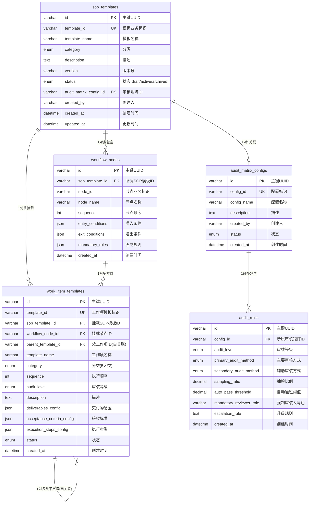
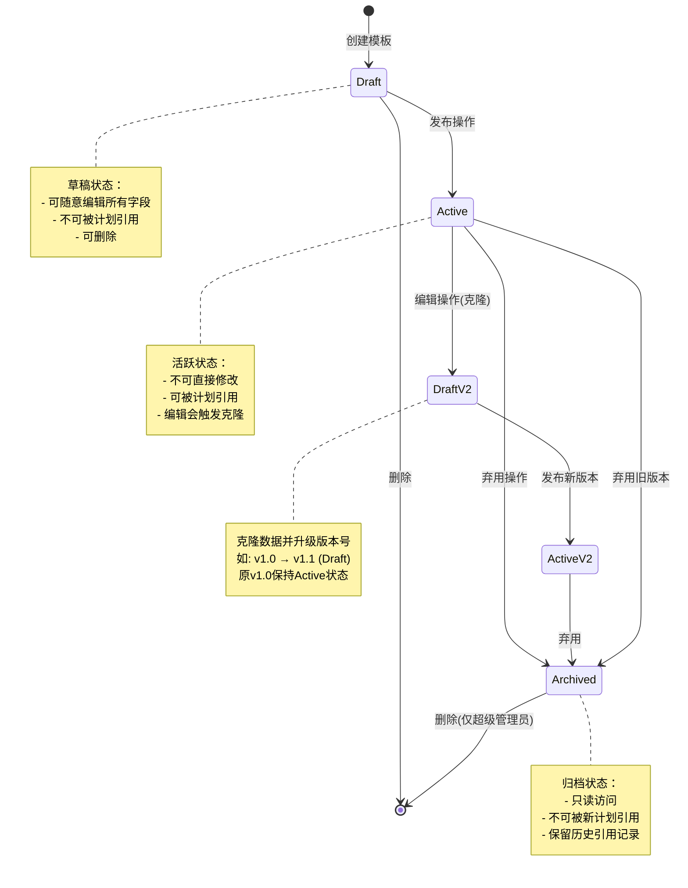

# Module 03: SOP模板引擎模块 (SOP Template Engine)

> **模块类型**: 核心引擎模块  
> **目标用户**: 甲方运维专家  
> **版本**: v2.0  
> **更新日期**: 2026-03-26

---

## 1. 模块概述

SOP模板引擎是OpsPilot平台的**核心配置层**，由甲方运维专家维护。通过定义标准化的工作流模板，实现计划的自动化拆解和工作项的动态生成。

### 1.1 核心职责

- 定义SOP标准模板
- 配置工作项模板
- 设置强制管控规则
- 管理审核矩阵
- 支持模板版本控制

### 1.2 模板层级

```
SOP模板 (SOP Template)
├── 流程节点 (Workflow Node) [1对多]
│   ├── 准入条件
│   ├── 准出条件
│   └── 关联工作项模板 [1对多]
│       ├── 父工作项模板（5大类）
│       └── 子工作项模板（具体交付单元）[通过parent_template_id自关联]
├── 审核矩阵配置 (Audit Matrix)
│   ├── 审核规则 [1对多]
│   └── 升级策略
└── 版本控制信息
```

---

## 2. 功能需求

### 2.1 SOP模板管理

#### 2.1.1 模板基础信息

| 字段 | 类型 | 必填 | 说明 |
|-----|------|------|------|
| 模板名称 | String | 是 | 模板标题 |
| 模板分类 | Enum | 是 | new_system/new_feature/business_change/db_change |
| 模板描述 | Text | 否 | 模板说明 |
| 版本 | String | 是 | 模板版本号 |
| 状态 | Enum | 是 | draft/active/archived |

#### 2.1.2 模板分类匹配

| 计划分类 | 默认模板 | 说明 |
|---------|---------|------|
| 新系统上线 | 新系统上线检查流程 | 包含完整的5大类工作项 |
| 新功能发布 | 功能发布检查流程 | 侧重功能模块相关检查 |
| 业务功能变更 | 业务变更检查流程 | 侧重业务逻辑检查 |
| 数据库变更 | 数据库变更检查流程 | 侧重数据库相关检查 |

### 2.2 工作项模板管理

#### 2.2.1 父工作项模板（5大类）

| 编码 | 名称 | 说明 |
|-----|------|------|
| inventory | 服务对象台账收集 | 应用系统、资源、账号台账 |
| base_resource | 基础资源标准化交付 | 系统基线、软件部署 |
| security | 安全基线核验 | 安全加固、漏洞检查 |
| permission | 生产环境权限移交 | 账号权限、访问控制 |
| monitoring | 监控告警配置确认 | 监控项、告警规则 |

#### 2.2.2 子工作项模板字段

| 字段 | 类型 | 说明 |
|-----|------|------|
| 工作项名称 | String | 模板名称 |
| 父工作项ID | FK | 关联的父工作项模板 (parent_template_id) |
| 挂载节点ID | FK | 关联的流程节点ID (sop_template_id -> workflow_node) |
| 工作项分类 | Enum | inventory/base_resource/security/permission/monitoring |
| 执行顺序 | Integer | 在同级别中的执行顺序 |
| 审核等级 | Enum | normal/critical |
| 交付物配置 | JSON | 交付物要求配置 |
| 验收标准配置 | JSON | 验收标准配置 |
| 执行步骤配置 | JSON | 执行步骤配置 |

### 2.3 流程节点配置

#### 2.3.1 节点字段

| 字段 | 类型 | 说明 |
|-----|------|------|
| 节点名称 | String | 节点标识名称 |
| 节点顺序 | Integer | 在流程中的顺序 |
| 准入条件 | JSON | 进入节点的条件 |
| 准出条件 | JSON | 完成节点的条件 |
| 关联工作项模板 | JSON | 节点包含的工作项模板ID列表 |
| 强制规则 | JSON | 节点的强制管控规则 |

#### 2.3.2 强制管控规则

- **节点准入规则**：前置节点必须完成
- **交付物强制校验**：必须上传指定交付物
- **审核通过强制检查**：必须通过审核才能进入下一节点
- **权限矩阵**：指定审核人角色

### 2.4 审核矩阵配置

#### 2.4.1 审核规则

| 审核等级 | 主要审核方式 | 辅助审核方式 | 抽检比例 |
|---------|------------|------------|---------|
| 普通项 | self_review | script_auto/ai_assist | 可配置（0-1） |
| 关键项 | expert_manual | script_auto/ai_assist | 100% |

#### 2.4.2 审核方式

- **self_review**: 自查
- **script_auto**: 脚本自动核验
- **ai_assist**: AI辅助核验
- **expert_manual**: 专家人工审核

### 2.5 动态生成逻辑

#### 2.5.1 生成规则

根据计划分类和台账范围，动态生成工作项：

```
新系统上线 → 生成完整5大类工作项
新功能发布 → 生成功能模块相关工作项
业务功能变更 → 生成变更影响范围相关工作项
数据库变更 → 生成数据库相关工作项
```

#### 2.5.2 变量替换

支持在模板中使用变量，生成时自动替换：

- `{app_name}` - 应用名称
- `{plan_id}` - 计划ID
- `{current_date}` - 当前日期

---

## 3. 数据模型

### 3.1 SOP模板表 (sop_templates)

| 字段名 | 数据类型 | 约束 | 必填 | 说明 |
|-------|---------|------|-----|------|
| id | VARCHAR(36) | PRIMARY KEY | 是 | 主键UUID |
| template_id | VARCHAR(50) | UNIQUE, NOT NULL | 是 | 模板业务唯一标识，如 SOP-NEW-001 |
| template_name | VARCHAR(100) | NOT NULL | 是 | 模板名称 |
| category | ENUM('new_system','new_feature','business_change','db_change') | NOT NULL | 是 | 模板分类 |
| description | TEXT | - | 否 | 模板描述 |
| version | VARCHAR(20) | NOT NULL, DEFAULT 'v1.0' | 是 | 版本号，格式 v{major}.{minor} |
| status | ENUM('draft','active','archived') | NOT NULL, DEFAULT 'draft' | 是 | 模板状态 |
| audit_matrix_config_id | VARCHAR(36) | FOREIGN KEY → audit_matrix_configs.id | 否 | 关联审核矩阵配置ID |
| created_by | VARCHAR(36) | NOT NULL | 是 | 创建人ID（甲方运维专家） |
| created_at | DATETIME | NOT NULL | 是 | 创建时间 |
| updated_at | DATETIME | NOT NULL | 是 | 更新时间 |
| published_at | DATETIME | - | 否 | 发布时间 |
| deprecated_at | DATETIME | - | 否 | 弃用时间 |

### 3.2 流程节点配置表 (workflow_nodes)

| 字段名 | 数据类型 | 约束 | 必填 | 说明 |
|-------|---------|------|-----|------|
| id | VARCHAR(36) | PRIMARY KEY | 是 | 主键UUID |
| sop_template_id | VARCHAR(36) | FOREIGN KEY → sop_templates.id, INDEX | 是 | 关联SOP模板ID |
| node_id | VARCHAR(50) | NOT NULL | 是 | 节点业务标识，如 NODE-001 |
| node_name | VARCHAR(100) | NOT NULL | 是 | 节点名称 |
| sequence | INT | NOT NULL, DEFAULT 1 | 是 | 节点顺序，从1开始 |
| entry_conditions | JSON | - | 否 | 准入条件配置 [{condition_type, condition_value}] |
| exit_conditions | JSON | - | 否 | 准出条件配置 [{condition_type, condition_value}] |
| mandatory_rules | JSON | - | 否 | 强制规则配置 {deliverable_required, audit_required, ...} |
| created_at | DATETIME | NOT NULL | 是 | 创建时间 |
| updated_at | DATETIME | NOT NULL | 是 | 更新时间 |

**索引设计**:
- `idx_sop_template_id`: 加速按模板查询节点
- `idx_sequence`: 加速按顺序排序

### 3.3 工作项模板表 (work_item_templates)

| 字段名 | 数据类型 | 约束 | 必填 | 说明 |
|-------|---------|------|-----|------|
| id | VARCHAR(36) | PRIMARY KEY | 是 | 主键UUID |
| template_id | VARCHAR(50) | UNIQUE, NOT NULL | 是 | 工作项模板业务唯一标识 |
| sop_template_id | VARCHAR(36) | FOREIGN KEY → sop_templates.id, INDEX | 是 | **挂载所属SOP模板ID** |
| workflow_node_id | VARCHAR(36) | FOREIGN KEY → workflow_nodes.id, INDEX | 否 | **挂载所属流程节点ID** |
| parent_template_id | VARCHAR(36) | FOREIGN KEY → work_item_templates.id, INDEX | 否 | **父工作项模板ID（自关联，为空表示父工作项）** |
| template_name | VARCHAR(100) | NOT NULL | 是 | 工作项模板名称 |
| category | ENUM('inventory','base_resource','security','permission','monitoring') | NOT NULL | 是 | 工作项分类（5大类） |
| sequence | INT | NOT NULL, DEFAULT 1 | 是 | 执行顺序 |
| audit_level | ENUM('normal','critical') | NOT NULL, DEFAULT 'normal' | 是 | 审核等级 |
| description | TEXT | - | 否 | 工作项描述 |
| deliverables_config | JSON | NOT NULL | 是 | 交付物要求配置 [{name, format[], required, description}] |
| acceptance_criteria_config | JSON | - | 否 | 验收标准配置 [{criterion_id, description, verification_method}] |
| execution_steps_config | JSON | - | 否 | 执行步骤配置 [{step_id, sequence, name, description, responsible_role, estimated_hours}] |
| status | ENUM('active','inactive') | NOT NULL, DEFAULT 'active' | 是 | 状态 |
| created_at | DATETIME | NOT NULL | 是 | 创建时间 |
| updated_at | DATETIME | NOT NULL | 是 | 更新时间 |

**外键关联说明**:
- `sop_template_id`: 关联到所属SOP模板，级联删除
- `workflow_node_id`: 关联到所属流程节点，节点删除时工作项需重新分配或删除
- `parent_template_id`: **自关联外键**，实现父子层级结构。为NULL表示父工作项（5大类），非NULL表示子工作项，关联到其父级

**索引设计**:
- `idx_sop_template_id`: 加速按模板查询
- `idx_workflow_node_id`: 加速按节点查询
- `idx_parent_template_id`: 加速查询子工作项
- `idx_category`: 加速按分类筛选

### 3.4 审核矩阵配置表 (audit_matrix_configs)

| 字段名 | 数据类型 | 约束 | 必填 | 说明 |
|-------|---------|------|-----|------|
| id | VARCHAR(36) | PRIMARY KEY | 是 | 主键UUID |
| config_id | VARCHAR(50) | UNIQUE, NOT NULL | 是 | 配置业务唯一标识 |
| config_name | VARCHAR(100) | NOT NULL | 是 | 配置名称 |
| description | TEXT | - | 否 | 配置描述 |
| created_by | VARCHAR(36) | NOT NULL | 是 | 创建人ID |
| status | ENUM('active','inactive') | NOT NULL, DEFAULT 'active' | 是 | 状态 |
| created_at | DATETIME | NOT NULL | 是 | 创建时间 |
| updated_at | DATETIME | NOT NULL | 是 | 更新时间 |

### 3.5 审核规则表 (audit_rules)

| 字段名 | 数据类型 | 约束 | 必填 | 说明 |
|-------|---------|------|-----|------|
| id | VARCHAR(36) | PRIMARY KEY | 是 | 主键UUID |
| config_id | VARCHAR(36) | FOREIGN KEY → audit_matrix_configs.id, INDEX | 是 | 关联审核矩阵配置ID |
| audit_level | ENUM('normal','critical') | NOT NULL | 是 | 审核等级 |
| primary_audit_method | ENUM('self_review','script_auto','expert_manual','ai_assist') | NOT NULL | 是 | 主要审核方式 |
| secondary_audit_method | ENUM('self_review','script_auto','expert_manual','ai_assist') | - | 否 | 辅助审核方式 |
| sampling_ratio | DECIMAL(3,2) | CHECK (0 <= sampling_ratio <= 1) | 否 | 抽检比例（0-1之间，普通项适用） |
| auto_pass_threshold | DECIMAL(5,2) | - | 否 | 自动通过阈值（脚本置信度，如95.00） |
| mandatory_reviewer_role | VARCHAR(50) | - | 否 | 强制审核人角色（关键项适用） |
| escalation_rule | TEXT | - | 否 | 升级规则描述 |
| created_at | DATETIME | NOT NULL | 是 | 创建时间 |
| updated_at | DATETIME | NOT NULL | 是 | 更新时间 |

### 3.6 实体关系图 (ER Diagram)



---

## 4. 业务规则

### 4.1 模板生命周期



### 4.2 版本管理规则

- 已发布的模板不可直接修改
- 修改时自动创建新版本（克隆原数据，版本号+0.1）
- 版本号格式：v{major}.{minor}，如 v1.0, v1.1, v2.0
- 新版本初始状态为 draft，需重新发布才能生效
- 同一模板同一时间只能有一个 active 版本

### 4.3 预置模板保护

- 系统预置模板不可删除
- 可基于预置模板创建副本进行自定义
- 自定义模板可继承预置标准的更新

### 4.4 发布强校验

**[Rule] 模板发布完整性校验**:

模板执行发布操作（Draft → Active）时，系统必须进行以下校验，任一条件不满足则拦截发布并返回错误：

| 校验项 | 校验规则 | 错误提示 |
|-------|---------|---------|
| 流程节点数量 | 模板下至少包含 1 个流程节点 | "模板至少包含1个流程节点" |
| 工作项数量 | 每个流程节点下至少包含 1 个父工作项 | "节点'{node_name}'下至少包含1个工作项" |
| 审核矩阵 | 若指定了审核矩阵，矩阵必须处于 active 状态 | "关联的审核矩阵未激活" |
| 版本唯一性 | 同 template_id 下不能有其他 active 版本 | "已存在活跃的同名模板版本" |

**后端实现要求**:
```python
# 伪代码示例
def publish_template(template_id):
    nodes = workflow_nodes.find_by_template(template_id)
    if len(nodes) == 0:
        raise ValidationError("模板至少包含1个流程节点")
    
    for node in nodes:
        work_items = work_item_templates.find_by_node(node.id, parent_template_id=None)
        if len(work_items) == 0:
            raise ValidationError(f"节点'{node.node_name}'下至少包含1个工作项")
    
    # 继续其他校验...
    # 更新状态为 active
```

---

## 5. 接口定义

### 5.1 SOP模板接口

| 方法 | 路径 | 说明 |
|-----|------|------|
| POST | `/api/sop-templates` | 创建模板（含嵌套结构） |
| GET | `/api/sop-templates` | 查询模板列表 |
| GET | `/api/sop-templates/:id` | 获取模板详情（含完整树状结构） |
| PUT | `/api/sop-templates/:id` | 更新模板（仅draft状态） |
| POST | `/api/sop-templates/:id/publish` | 发布模板（触发完整性校验） |
| POST | `/api/sop-templates/:id/clone` | 克隆模板（创建新版本） |
| POST | `/api/sop-templates/:id/deprecate` | 弃用模板 |
| DELETE | `/api/sop-templates/:id` | 删除模板（仅draft状态） |

#### POST /api/sop-templates 请求体示例（嵌套树状结构）

```json
{
  "basic_info": {
    "template_name": "新系统上线标准检查流程",
    "category": "new_system",
    "description": "适用于全新业务系统首次上线的标准化检查流程",
    "audit_matrix_config_id": "matrix-001"
  },
  "workflow_nodes": [
    {
      "node_id": "NODE-001",
      "node_name": "准备阶段",
      "sequence": 1,
      "entry_conditions": [],
      "exit_conditions": [
        {"type": "deliverable_uploaded", "value": "deploy_doc"}
      ],
      "mandatory_rules": {
        "deliverable_required": true,
        "audit_required": true
      },
      "work_items": [
        {
          "template_id": "WI-001",
          "template_name": "部署方案文档",
          "category": "base_resource",
          "sequence": 1,
          "audit_level": "critical",
          "description": "包含系统架构、部署步骤、回滚方案",
          "deliverables_config": [
            {
              "name": "部署方案文档",
              "format": ["PDF", "Word"],
              "required": true,
              "description": "完整的部署方案文档"
            },
            {
              "name": "风险评估报告",
              "format": ["PDF"],
              "required": true,
              "description": "识别潜在风险及应对措施"
            }
          ],
          "acceptance_criteria_config": [
            {
              "criterion_id": "AC-001",
              "description": "包含回滚方案",
              "verification_method": "manual"
            },
            {
              "criterion_id": "AC-002",
              "description": "通过架构评审",
              "verification_method": "manual"
            }
          ],
          "execution_steps_config": [
            {
              "step_id": "STEP-001",
              "sequence": 1,
              "name": "需求分析",
              "description": "理解系统架构和部署需求",
              "responsible_role": "乙方技术负责人",
              "estimated_hours": 4
            },
            {
              "step_id": "STEP-002",
              "sequence": 2,
              "name": "编写初稿",
              "description": "完成部署方案初稿编写",
              "responsible_role": "乙方技术负责人",
              "estimated_hours": 8
            }
          ],
          "children": []
        },
        {
          "template_id": "WI-002",
          "template_name": "台账收集",
          "category": "inventory",
          "sequence": 2,
          "audit_level": "normal",
          "description": "收集应用系统、资源、账号台账",
          "deliverables_config": [
            {
              "name": "应用系统台账",
              "format": ["Excel"],
              "required": true,
              "description": "完整的应用系统信息"
            }
          ],
          "acceptance_criteria_config": [],
          "execution_steps_config": [],
          "children": [
            {
              "template_id": "WI-002-1",
              "template_name": "应用系统信息收集",
              "category": "inventory",
              "sequence": 1,
              "audit_level": "normal",
              "description": "收集应用系统基础信息",
              "deliverables_config": [
                {
                  "name": "应用系统信息表",
                  "format": ["Excel"],
                  "required": true,
                  "description": "应用名称、URL、负责人等"
                }
              ],
              "acceptance_criteria_config": [],
              "execution_steps_config": [],
              "children": []
            },
            {
              "template_id": "WI-002-2",
              "template_name": "云资源信息收集",
              "category": "inventory",
              "sequence": 2,
              "audit_level": "normal",
              "description": "收集云资源开通信息",
              "deliverables_config": [
                {
                  "name": "云资源清单",
                  "format": ["Excel"],
                  "required": true,
                  "description": "ECS、RDS、SLB等资源列表"
                }
              ],
              "acceptance_criteria_config": [],
              "execution_steps_config": [],
              "children": []
            }
          ]
        }
      ]
    },
    {
      "node_id": "NODE-002",
      "node_name": "实施阶段",
      "sequence": 2,
      "entry_conditions": [
        {"type": "node_completed", "value": "NODE-001"}
      ],
      "exit_conditions": [
        {"type": "deliverable_uploaded", "value": "impl_report"}
      ],
      "mandatory_rules": {
        "deliverable_required": true,
        "audit_required": false
      },
      "work_items": [
        {
          "template_id": "WI-003",
          "template_name": "系统基线配置",
          "category": "base_resource",
          "sequence": 1,
          "audit_level": "normal",
          "description": "生产环境系统基线配置",
          "deliverables_config": [
            {
              "name": "基线检查报告",
              "format": ["PDF"],
              "required": true,
              "description": "系统基线配置检查结果"
            }
          ],
          "acceptance_criteria_config": [],
          "execution_steps_config": [],
          "children": []
        }
      ]
    }
  ]
}
```

**后端处理要求**:
1. 接收上述嵌套JSON后，需使用事务一次性解析并落库
2. 插入顺序：sop_template → workflow_nodes → work_item_templates（父级先插入，获取ID后再插入子级）
3. 子工作项的 `parent_template_id` 需正确关联到父工作项的 `id`
4. 所有 `work_items` 下的 `children` 递归解析，层级深度理论上无限制（建议前端限制最大5层）

### 5.2 工作项模板接口

| 方法 | 路径 | 说明 |
|-----|------|------|
| POST | `/api/work-item-templates` | 单独创建工作项模板 |
| GET | `/api/work-item-templates` | 查询工作项模板列表 |
| GET | `/api/work-item-templates/:id` | 获取工作项模板详情（含子工作项树） |
| PUT | `/api/work-item-templates/:id` | 更新工作项模板 |
| DELETE | `/api/work-item-templates/:id` | 删除工作项模板（级联删除子工作项） |
| GET | `/api/work-item-templates/:id/children` | 获取子工作项列表 |

### 5.3 审核矩阵接口

| 方法 | 路径 | 说明 |
|-----|------|------|
| POST | `/api/audit-matrix-configs` | 创建审核矩阵 |
| GET | `/api/audit-matrix-configs` | 查询审核矩阵列表 |
| GET | `/api/audit-matrix-configs/:id` | 获取审核矩阵详情（含规则列表） |
| PUT | `/api/audit-matrix-configs/:id` | 更新审核矩阵 |
| DELETE | `/api/audit-matrix-configs/:id` | 删除审核矩阵（检查是否被模板引用） |
| POST | `/api/audit-matrix-configs/:id/rules` | 添加审核规则 |
| PUT | `/api/audit-matrix-configs/:id/rules/:rule_id` | 更新审核规则 |
| DELETE | `/api/audit-matrix-configs/:id/rules/:rule_id` | 删除审核规则 |

### 5.4 模板实例化接口

| 方法 | 路径 | 说明 |
|-----|------|------|
| POST | `/api/sop-templates/:id/instantiate` | 将模板实例化为计划工作流 |

**请求体**:
```json
{
  "plan_id": "PLAN-20240326-001",
  "variable_mapping": {
    "{app_name}": "订单管理系统",
    "{current_date}": "2024-03-26"
  }
}
```

---

## 6. 页面原型

### 6.1 模板列表页

- 表格展示：template_id、模板名称、分类、版本、状态、创建时间
- 操作按钮：查看、编辑（仅draft）、发布（仅draft）、克隆、弃用（仅active）、删除（仅draft）
- 筛选区域：分类、状态、创建人
- 快捷操作：【基于预置模板创建】按钮

### 6.2 模板设计器（三栏式布局）

```
┌─────────────────────────────────────────────────────────────────────────────┐
│  模板设计器 - 新系统上线标准检查流程                        [保存草稿] [发布] │
├──────────────┬──────────────────────────────────────────┬───────────────────┤
│              │                                          │                   │
│ 【左栏】     │  【中栏】                                │  【右栏】         │
│  物料库      │  树状工作流画布                          │  属性配置面板     │
│              │                                          │                   │
│ ───────────  │                                          │                   │
│ 工作项分类   │  ┌────────────────────────────────────┐  │  [当前选中:       │
│ 📁 inventory │  │ 📋 准备阶段 (NODE-001)              │  │  部署方案文档]    │
│ 📁 base      │  │   ├─ 📄 部署方案文档 [Critical]    │  │                   │
│ 📁 security  │  │   │   └─ [交付物配置...]             │  │ ─────────────    │
│ 📁 perm      │  │   └─ 📄 台账收集 [Normal]          │  │ 基础信息          │
│ 📁 monitor   │  │       ├─ 📄 应用系统信息收集       │  │ • 名称: [输入框]  │
│              │  │       └─ 📄 云资源信息收集         │  │ • 分类: [下拉框]  │
│ ───────────  │  │                                    │  │ • 顺序: [数字框]  │
│ 组件         │  └────────────────────────────────────┘  │ • 审核: [单选]    │
│ ➕ 流程节点  │                                          │                   │
│ ➕ 审核节点  │  [+ 添加节点]                            │ ─────────────    │
│              │                                          │ 交付物配置        │
│ ───────────  │                                          │ ┌─────────────┐  │
│ 预置模板     │                                          │ │ 名称 格式 必填 │  │
│ 📋 标准模板A │                                          │ │ [动态表格]    │  │
│ 📋 标准模板B │                                          │ │ [+ 添加行]    │  │
│              │                                          │ └─────────────┘  │
│ (可拖拽组件  │                                          │                   │
│  到中栏)     │                                          │ ─────────────    │
│              │                                          │ 验收标准          │
│              │                                          │ ┌─────────────┐  │
│              │                                          │ │ [动态表格]    │  │
│              │                                          │ │ [+ 添加行]    │  │
│              │                                          │ └─────────────┘  │
│              │                                          │                   │
│              │                                          │ ─────────────    │
│              │                                          │ 执行步骤          │
│              │                                          │ ┌─────────────┐  │
│              │                                          │ │ [动态表格]    │  │
│              │                                          │ │ [+ 添加行]    │  │
│              │                                          │ └─────────────┘  │
│              │                                          │                   │
├──────────────┴──────────────────────────────────────────┴───────────────────┤
│ 状态: 草稿 v1.0    最后保存: 2024-03-26 14:30:00                             │
└─────────────────────────────────────────────────────────────────────────────┘
```

#### 6.2.1 左栏 - 物料库

**工作项分类区**:
- 可拖拽的5大分类卡片：inventory（台账收集）、base_resource（基础资源）、security（安全基线）、permission（权限移交）、monitoring（监控告警）
- 拖拽到中栏的某个流程节点下，自动创建父工作项

**组件区**:
- 【+ 流程节点】按钮：点击在中栏添加新节点
- 【+ 审核节点】按钮：添加审核类型的特殊节点

**预置模板区**:
- 展示系统预置的常用工作项模板
- 拖拽即可复制到当前模板中

#### 6.2.2 中栏 - 树状工作流画布

**展示结构**:
```
流程节点 (可折叠)
├── 父工作项 (5大类图标标识)
│   ├── 子工作项
│   └── 子工作项
└── 父工作项
    └── 子工作项
```

**交互功能**:
- 点击节点/工作项选中，右栏展示对应属性
- 拖拽排序：同层级间可拖拽调整顺序
- 右键菜单：编辑、删除、添加子工作项、复制
- 折叠/展开：点击节点左侧箭头

#### 6.2.3 右栏 - 动态属性配置面板

**动态表单逻辑**:

| 选中对象 | 展示配置项 |
|---------|-----------|
| 流程节点 | 节点名称、节点顺序、准入条件(JSON动态表单)、准出条件(JSON动态表单)、强制规则开关 |
| 父工作项 | 基础信息(名称/分类/顺序/审核等级)、交付物配置(动态表格)、验收标准(动态表格)、执行步骤(动态表格) |
| 子工作项 | 基础信息、交付物配置、验收标准、执行步骤（同父工作项，但分类不可修改） |

**JSON动态字段处理**:
- 交付物配置表格：每行包含 name输入框、format多选框、required开关、description文本框
- 验收标准表格：每行包含 criterion_id输入框、description文本框、verification_method下拉框
- 执行步骤表格：每行包含 step_id输入框、sequence数字框、name输入框、description文本框、responsible_role输入框、estimated_hours数字框
- 【+ 添加行】按钮：点击新增一行空数据
- 【删除】按钮：每行末尾，点击删除当前行

### 6.3 审核矩阵配置页

- 列表展示：config_id、配置名称、规则数量、状态
- 操作：编辑、删除
- 编辑页：
  - 基础信息：配置名称、描述
  - 规则列表表格：审核等级、主要审核方式、辅助审核方式、抽检比例、自动通过阈值
  - 【+ 添加规则】按钮

---

## 7. 待确认事项

- [ ] 模板可视化设计器是否支持画布自由布局（当前为树状结构）
- [ ] 模板导入/导出功能（JSON格式/Excel格式）
- [ ] 模板复制和继承机制（深拷贝/引用继承）
- [ ] 模板使用统计和效果分析（引用次数、平均完成时长）
- [ ] 工作项模板的权限控制（谁可以修改预置模板）
- [ ] 模板变更的影响分析（已引用该模板的计划如何处理）
