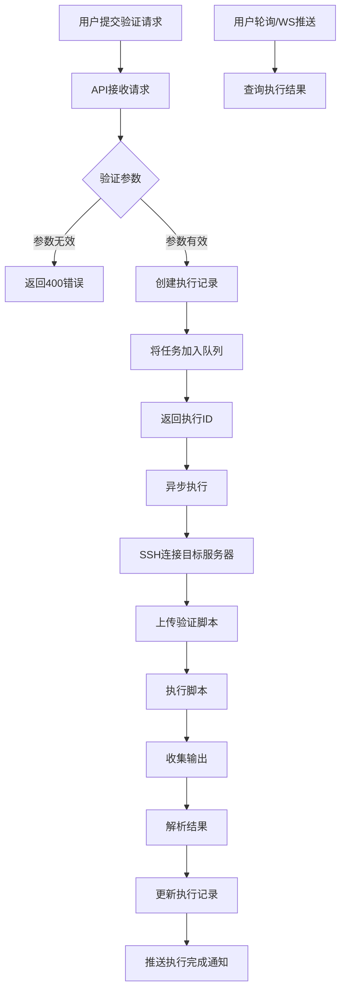
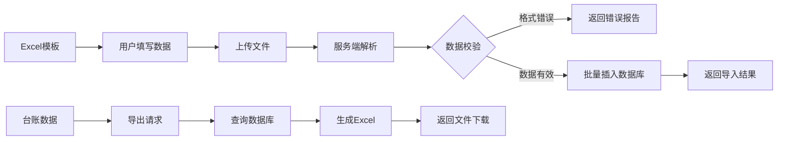
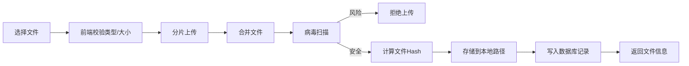
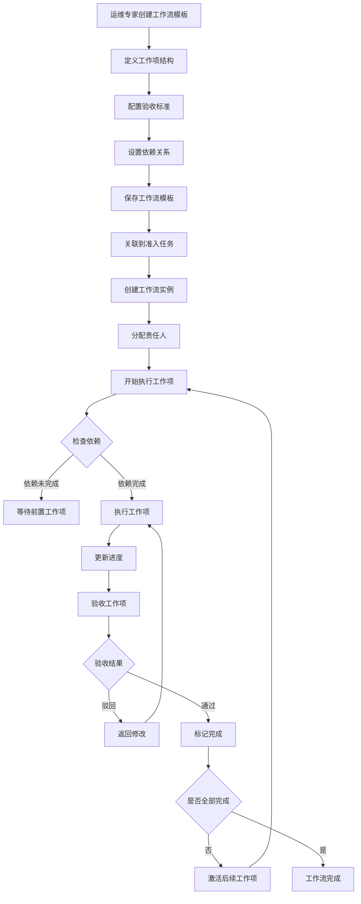

# 仿真运维经理 - 技术方案文档

| 版本 | 日期 | 作者 | 变更说明 |
|-----|------|-----|---------|
| v0.3 | 2024-03-22 | CRT | 新增工作流管理模块，包含工作流设计器、进度跟踪、验收组件 |
| v0.2 | 2024-03-22 | CRT | 更新：与前端实际路由对齐，修正页面结构 |
| v0.1 | 2024-03-20 | CRT | 初稿，技术架构和模块设计 |

## 1. 技术选型

### 1.1 技术栈

| 层级 | 技术 | 版本 | 选型理由 |
|-----|------|-----|---------|
| 前端 | React | ^18.2.0 | 生态成熟，组件化开发 |
| 前端构建 | Vite | ^5.0.0 | 快速开发体验，现代化工具链 |
| 前端路由 | React Router | ^6.20.0 | 官方推荐，支持嵌套路由 |
| 状态管理 | Zustand | ^4.4.0 | 轻量级，无需Provider包裹 |
| UI组件库 | Ant Design | ^5.12.0 | 企业级组件，文档完善 |
| 图表 | ECharts | ^5.4.0 | 功能丰富，支持各种可视化 |
| 后端 | FastAPI | ^0.105.0 | 高性能，自动生成API文档 |
| 数据库 | SQLite | - | 轻量级，适合单机部署 |
| 数据库ORM | SQLAlchemy | ^2.0.0 | Python标准ORM |
| 迁移工具 | Alembic | ^1.13.0 | SQLAlchemy官方迁移工具 |
| 任务队列 | Celery | ^5.3.0 | 异步任务，支持定时任务 |
| 缓存 | Redis | - | 会话存储，任务结果缓存 |
| 文件存储 | 本地文件系统 | - | MVP阶段简化实现 |
| 脚本执行 | Paramiko | ^3.3.0 | SSH连接执行远程脚本 |

### 1.2 部署架构

```
┌─────────────────────────────────────────────────────────┐
│                      客户端浏览器                        │
└─────────────────────┬───────────────────────────────────┘
                      │ HTTPS
                      ▼
┌─────────────────────────────────────────────────────────┐
│                    Nginx (反向代理)                      │
│              静态资源服务 / API代理 / 负载均衡            │
└─────────────────────┬───────────────────────────────────┘
                      │
        ┌─────────────┴─────────────┐
        ▼                         ▼
┌──────────────┐          ┌──────────────┐
│   Frontend   │          │   Backend    │
│   (React)    │          │  (FastAPI)   │
│   Port 5173  │          │   Port 8000  │
└──────────────┘          └──────┬───────┘
                                 │
            ┌────────────────────┼────────────────────┐
            ▼                    ▼                    ▼
    ┌──────────────┐    ┌──────────────┐    ┌──────────────┐
    │   SQLite     │    │    Redis     │    │  Local FS    │
    │  (Database)  │    │   (Cache)    │    │(File Storage)│
    └──────────────┘    └──────────────┘    └──────────────┘
```

## 2. 架构设计

### 2.1 后端架构

```
backend/
├── app/
│   ├── __init__.py
│   ├── main.py              # FastAPI应用入口
│   ├── config.py            # 配置管理
│   ├── database.py          # 数据库连接
│   ├── models/              # SQLAlchemy模型
│   │   ├── __init__.py
│   │   ├── user.py
│   │   ├── admission_task.py
│   │   ├── checklist.py
│   │   ├── inventory.py
│   │   ├── deliverable.py
│   │   ├── verification.py
│   │   ├── workflow.py      # 工作流模板
│   │   ├── work_item.py     # 工作项定义
│   │   └── workflow_instance.py  # 工作流实例
│   ├── schemas/             # Pydantic数据模型
│   │   ├── __init__.py
│   │   ├── user.py
│   │   ├── admission_task.py
│   │   └── ...
│   ├── routers/             # API路由
│   │   ├── __init__.py
│   │   ├── auth.py          # 认证相关
│   │   ├── users.py         # 用户管理
│   │   ├── admission_tasks.py
│   │   ├── checklist_items.py
│   │   ├── inventories.py
│   │   ├── deliverables.py
│   │   ├── verification_scripts.py
│   │   ├── verification_execute.py
│   │   ├── workflows.py     # 工作流管理
│   │   ├── work_items.py    # 工作项管理
│   │   ├── workflow_instances.py  # 工作流实例
│   │   ├── dashboard.py
│   │   └── templates.py
│   ├── services/            # 业务逻辑层
│   │   ├── __init__.py
│   │   ├── auth_service.py
│   │   ├── task_service.py
│   │   ├── verification_service.py
│   │   ├── file_service.py
│   │   └── notification_service.py
│   ├── core/                # 核心功能
│   │   ├── __init__.py
│   │   ├── security.py      # JWT/密码
│   │   ├── permissions.py   # 权限控制
│   │   └── exceptions.py    # 自定义异常
│   └── utils/               # 工具函数
│       ├── __init__.py
│       ├── datetime_util.py
│       └── validators.py
├── alembic/                 # 数据库迁移
│   ├── versions/
│   └── env.py
├── scripts/                 # 内置验证脚本
│   ├── system_baseline_check.sh
│   ├── deployment_check.sh
│   └── ...
├── uploads/                 # 上传文件存储
├── tests/                   # 测试代码
├── requirements.txt
└── run.py                   # 开发启动脚本
```

### 2.2 前端架构

```
frontend/
├── src/
│   ├── main.jsx             # 应用入口
│   ├── App.jsx              # 根组件 - 路由配置
│   │   ├── api/                 # API客户端
│   │   │   ├── index.js         # axios实例
│   │   │   ├── auth.js          # 认证API
│   │   │   ├── tasks.js         # 准入任务API
│   │   │   ├── checklist.js     # 检查项API
│   │   │   ├── inventory.js     # 台账API
│   │   │   ├── deliverable.js   # 交付物API
│   │   │   ├── verification.js  # 验证API
│   │   │   ├── workflow.js      # 工作流API
│   │   │   └── dashboard.js     # 仪表盘API
│   ├── stores/              # Zustand状态管理
│   │   ├── authStore.js
│   │   ├── taskStore.js
│   │   └── uiStore.js
│   ├── components/          # 公共组件
│   │   ├── Layout/          # 布局组件
│   │   │   └── MainLayout.jsx    # 主布局（含侧边栏菜单）
│   │   ├── Common/          # 通用组件
│   │   │   ├── StatusBadge.jsx
│   │   │   ├── ProgressBar.jsx
│   │   │   ├── DataTable.jsx
│   │   │   ├── FileUploader.jsx
│   │   │   └── SearchForm.jsx
│   │       ├── Business/        # 业务组件
│   │       │   ├── TaskCard.jsx
│   │       │   ├── ChecklistItemCard.jsx
│   │       │   ├── InventoryForm/
│   │       │   ├── VerificationExecutor/
│   │       │   ├── DeliverableList/
│   │       │   ├── Workflow/           # 工作流组件
│   │       │   │   ├── WorkflowDesigner.jsx    # 工作流设计器
│   │       │   │   ├── WorkflowProgress.jsx    # 工作流进度展示
│   │       │   │   ├── WorkItemCard.jsx        # 工作项卡片
│   │       │   │   ├── WorkItemList.jsx        # 工作项列表
│   │       │   │   ├── AcceptanceCriteriaForm.jsx  # 验收标准表单
│   │       │   │   └── WorkItemVerification.jsx    # 工作项验收
│   │       │   └── Progress/           # 进度组件
│   │       │       ├── ProgressRing.jsx        # 环形进度
│   │       │       ├── ProgressTimeline.jsx    # 时间线进度
│   │       │       └── CriticalPath.jsx        # 关键路径展示
│   ├── pages/               # 页面组件
│   │   ├── Login/           # 登录页
│   │   ├── Dashboard/       # 仪表盘
│   │   ├── AdmissionTasks/  # 准入任务
│   │   │   ├── List.jsx     # 任务列表
│   │   │   ├── Detail/      # 任务详情
│   │   │   │   ├── index.jsx
│   │   │   │   ├── Overview.jsx
│   │   │   │   ├── Checklist.jsx
│   │   │   │   ├── Inventories/
│   │   │   │   ├── Verification/
│   │   │   │   └── Deliverables.jsx
│   │   │   └── Create.jsx   # 创建任务
│   │   ├── Inventories/     # 台账管理
│   │   │   ├── index.jsx           # 任务内台账管理
│   │   │   ├── ServerInventoryList.jsx   # 应用系统台账列表
│   │   │   ├── CloudInventoryList.jsx    # 云服务台账列表
│   │   │   ├── AccountInventoryList.jsx  # 系统账户台账列表
│   │   │   ├── ServerInventory.jsx       # 应用系统台账编辑
│   │   │   ├── CloudInventory.jsx        # 云服务台账编辑
│   │   │   └── AccountInventory.jsx      # 系统账户台账编辑
│   │   ├── Verification/    # 验证管理（待实现）
│   │   │   ├── Scripts.jsx
│   │   │   └── Records.jsx
│   │   └── Settings/        # 系统设置（待实现）
│   ├── hooks/               # 自定义Hooks
│   │   ├── useAuth.js
│   │   ├── useTasks.js
│   │   ├── useChecklist.js
│   │   └── useVerification.js
│   ├── utils/               # 工具函数
│   │   ├── constants.js
│   │   ├── formatters.js
│   │   └── validators.js
│   └── styles/              # 样式文件
│       ├── global.css
│       └── variables.css
├── public/
└── package.json
```

### 2.3 前端路由设计

#### 2.3.1 路由配置表（与实际代码对齐）

| 路由路径 | 页面组件 | 说明 | 权限 |
|---------|---------|------|------|
| `/login` | Login | 登录页 | 公开 |
| `/` | Dashboard | 仪表盘 | 需登录 |
| `/admission-tasks` | TaskList | 准入任务列表 | 需登录 |
| `/admission-tasks/new` | CreateTask | 创建准入任务 | 需登录 |
| `/admission-tasks/:id` | TaskDetail | 任务详情（含Tab） | 需登录 |
| `/inventories/task/:taskId` | Inventories | 任务内台账管理 | 需登录 |
| `/inventories/server` | ServerInventoryList | 应用系统台账列表 | 需登录 |
| `/inventories/cloud` | CloudInventoryList | 云服务台账列表 | 需登录 |
| `/inventories/account` | AccountInventoryList | 系统账户台账列表 | 需登录 |
| `/inventories/:id` | ServerInventory | 台账详情/编辑 | 需登录 |
| `/inventories/:taskId/server/create` | ServerInventory | 创建应用系统台账 | 需登录 |
| `/inventories/:taskId/cloud_resource/create` | CloudInventory | 创建云服务台账 | 需登录 |
| `/inventories/:taskId/account/create` | AccountInventory | 创建系统账户台账 | 需登录 |
| `/workflows` | WorkflowList | 工作流模板列表 | 需登录 |
| `/workflows/new` | WorkflowCreate | 创建工作流模板 | 需登录 |
| `/workflows/:id` | WorkflowDetail | 工作流模板详情 | 需登录 |
| `/workflows/:id/edit` | WorkflowEdit | 编辑工作流模板 | 需登录 |
| `/workflows/:id/instances` | WorkflowInstanceList | 工作流实例列表 | 需登录 |
| `/workflow-instances/:id` | WorkflowInstanceDetail | 工作流实例详情 | 需登录 |
| `/workflow-instances/:id/execute` | WorkItemExecute | 执行工作项 | 需登录 |

#### 2.3.2 侧边栏菜单结构

```javascript
const menuItems = [
  { key: '/', label: '仪表盘' },
  { key: '/admission-tasks', label: '准入任务' },
  {
    key: 'workflows',
    label: '工作流管理',
    children: [
      { key: '/workflows', label: '工作流模板' },
      { key: '/workflow-instances', label: '工作流实例' },
    ]
  },
  {
    key: 'inventories',
    label: '台账管理',
    children: [
      { key: '/inventories/server', label: '应用系统台账' },
      { key: '/inventories/cloud', label: '云服务台账' },
      { key: '/inventories/account', label: '系统账户台账' },
    ]
  },
  {
    key: 'verification',
    label: '验证管理',
    children: [
      { key: '/verification/scripts', label: '验证脚本' },
      { key: '/verification/records', label: '验证记录' },
    ]
  },
  { key: '/settings', label: '系统设置' },
];
```

## 3. 核心模块设计

### 3.1 验证脚本执行模块



**关键设计决策**:
- **异步执行**: 脚本执行耗时不可控，使用Celery异步任务
- **超时控制**: 默认300秒超时，可配置
- **并发控制**: 限制同时执行的验证任务数，避免资源耗尽
- **结果缓存**: Redis缓存执行结果，支持重复查询
- **失败重试**: SSH连接失败时自动重试3次

### 3.2 台账数据导入导出



**技术实现**:
- **导入**: 使用 `pandas` + `openpyxl` 解析Excel
- **导出**: 使用 `pandas` 生成Excel，支持样式
- **模板**: 预定义Excel模板，包含数据验证规则

### 3.3 文件上传存储



**安全策略**:
- 文件类型白名单：.xlsx, .xls, .doc, .docx, .pdf, .txt, .sh, .py
- 文件大小限制：单个文件最大50MB
- 病毒扫描：使用 `clamdscan` 或云扫描API
- 存储路径：按日期分目录，避免单目录文件过多

### 3.4 工作流管理模块



**工作流组件设计**:

| 组件 | 文件路径 | 功能描述 |
|-----|---------|---------|
| WorkflowDesigner | `components/Business/Workflow/WorkflowDesigner.jsx` | 可视化工作流设计器，支持拖拽调整工作项顺序 |
| WorkflowProgress | `components/Business/Workflow/WorkflowProgress.jsx` | 工作流整体进度展示，包含环形进度条和时间线 |
| WorkItemCard | `components/Business/Workflow/WorkItemCard.jsx` | 单个工作项卡片，显示状态、进度、责任人 |
| WorkItemList | `components/Business/Workflow/WorkItemList.jsx` | 工作项列表，支持排序和筛选 |
| AcceptanceCriteriaForm | `components/Business/Workflow/AcceptanceCriteriaForm.jsx` | 验收标准表单，支持从模板导入或手动新增 |
| WorkItemVerification | `components/Business/Workflow/WorkItemVerification.jsx` | 工作项验收界面，逐项确认验收标准 |
| ProgressRing | `components/Progress/ProgressRing.jsx` | 环形进度组件，展示整体完成百分比 |
| ProgressTimeline | `components/Progress/ProgressTimeline.jsx` | 时间线进度组件，展示各工作项执行时间 |
| CriticalPath | `components/Progress/CriticalPath.jsx` | 关键路径高亮展示 |

**页面组件设计**:

| 页面 | 文件路径 | 功能描述 |
|-----|---------|---------|
| WorkflowList | `pages/Workflows/List.jsx` | 工作流模板列表页，支持搜索和筛选 |
| WorkflowCreate | `pages/Workflows/Create.jsx` | 创建工作流模板页，使用WorkflowDesigner |
| WorkflowDetail | `pages/Workflows/Detail.jsx` | 工作流模板详情页，展示工作项和验收标准 |
| WorkflowEdit | `pages/Workflows/Edit.jsx` | 编辑工作流模板页 |
| WorkflowInstanceList | `pages/WorkflowInstances/List.jsx` | 工作流实例列表页 |
| WorkflowInstanceDetail | `pages/WorkflowInstances/Detail.jsx` | 工作流实例详情页，展示实时进度 |
| WorkItemExecute | `pages/WorkflowInstances/Execute.jsx` | 工作项执行页面 |

**状态管理**:
```javascript
// stores/workflowStore.js
const useWorkflowStore = create((set, get) => ({
  workflows: [],
  currentWorkflow: null,
  instances: [],
  currentInstance: null,
  progress: null,
  
  // Actions
  fetchWorkflows: async (params) => {...},
  createWorkflow: async (data) => {...},
  updateWorkflow: async (id, data) => {...},
  deleteWorkflow: async (id) => {...},
  fetchInstances: async (workflowId) => {...},
  createInstance: async (workflowId, taskId) => {...},
  executeWorkItem: async (instanceId, workItemId) => {...},
  verifyWorkItem: async (instanceId, workItemId, data) => {...},
  fetchProgress: async (instanceId) => {...},
}));
```

### 3.5 权限控制模型

```
权限控制层次:
├── 认证层 (Authentication)
│   └── JWT Token验证
├── 角色层 (Role-Based)
│   ├── ops_manager: 全部权限
│   ├── ops_expert: 工作流模板管理
│   ├── admin: 用户/模板管理
│   ├── developer: 台账/交付物/执行工作项
│   ├── security: 安全审核
│   └── viewer: 只读
└── 数据层 (Data-Level)
    ├── 运维经理: 全部任务
    ├── 运维专家: 工作流模板管理
    ├── 开发人员: 被分配的任务和工作项
    └── 安全人员: 安全相关检查项
```

## 4. 数据库设计要点

### 4.1 索引策略

```python
# admission_tasks 表关键索引
Index('idx_task_status', 'status')
Index('idx_task_release_date', 'release_date')
Index('idx_task_creator', 'creator_id')

# checklist_items 表关键索引
Index('idx_item_task', 'task_id')
Index('idx_item_status', 'status')
Index('idx_item_assignee', 'assignee_id')
Index('idx_item_dimension', 'control_dimension')

# inventory_accounts 表关键索引
Index('idx_account_inventory', 'inventory_id')
Index('idx_account_valid', 'valid_until')  # 用于过期提醒
```

### 4.2 数据归档策略

- **任务数据**: 完成的任务保留2年，之后归档到历史表
- **验证记录**: 保留1年，长期存储可导出为文件
- **文件存储**: 任务删除时级联删除关联文件

## 5. 关键决策记录 (ADR)

### ADR-001: 数据库选型

**决策**: 使用SQLite作为MVP阶段数据库

**考虑选项**:
- SQLite: 零配置，单文件部署
- PostgreSQL: 功能丰富，生产级
- MySQL: 广泛使用，生态成熟

**决策理由**:
1. MVP阶段数据量小，SQLite性能足够
2. 简化部署，无需额外安装数据库
3. 单机部署场景，无需考虑高可用
4. 未来可平滑迁移到PostgreSQL

### ADR-002: 脚本执行架构

**决策**: 通过SSH直连目标服务器执行脚本

**考虑选项**:
- SSH直连: 简单直接，无需Agent
- Agent模式: 需要每台服务器部署Agent
- 堡垒机模式: 企业已有堡垒机时集成

**决策理由**:
1. MVP阶段简化部署，无需安装Agent
2. 运维场景通常已有SSH访问权限
3. 脚本内容可控，安全风险较低

**风险**: 
- 需要服务器SSH凭证，需安全存储
- 执行权限依赖SSH用户权限

**缓解措施**:
- 使用只读用户执行检查类脚本
- 密钥加密存储，定期轮换

### ADR-003: 前端状态管理

**决策**: 使用Zustand替代Redux

**决策理由**:
1. 代码更简洁，学习成本低
2. 无需Provider包裹，减少嵌套
3. 中间件支持持久化、异步操作
4. 团队规模小，不需要Redux的严格规范

### ADR-004: 文件存储

**决策**: MVP阶段使用本地文件系统

**决策理由**:
1. 简化部署，无需配置对象存储
2. 文件量不大，本地存储足够
3. 未来可迁移到MinIO或云存储

**存储路径设计**:
```
uploads/
├── 2024/
│   ├── 03/
│   │   ├── 20/          # 按日期分目录
│   │   │   ├── xxx.pdf  # 文件Hash命名
│   │   │   └── yyy.xlsx
```

## 6. 接口安全设计

### 6.1 JWT认证

```python
# Token结构
{
  "sub": "1",              # 用户ID
  "username": "zhangsan",
  "role": "ops_manager",
  "iat": 1700000000,       # 签发时间
  "exp": 1700003600        # 过期时间 (2小时)
}

# 刷新机制
- Access Token: 2小时有效期
- Refresh Token: 7天有效期，用于获取新的Access Token
```

### 6.2 密码安全

```python
# 使用 bcrypt 直接进行密码哈希（替代 passlib）
import bcrypt

def hash_password(password: str) -> str:
    # bcrypt 限制密码最长72字节，超长需要截断
    password_bytes = password.encode('utf-8')
    if len(password_bytes) > 72:
        password_bytes = password_bytes[:72]
    return bcrypt.hashpw(password_bytes, bcrypt.gensalt()).decode('utf-8')

def verify_password(plain_password: str, hashed_password: str) -> bool:
    password_bytes = plain_password.encode('utf-8')
    if len(password_bytes) > 72:
        password_bytes = password_bytes[:72]
    return bcrypt.checkpw(password_bytes, hashed_password.encode('utf-8'))
```

## 7. 已知问题与解决方案

### 7.1 路由冲突问题

**问题**: 动态路由 `/:id` 与静态路由 `/new` 冲突，导致访问 `/new` 时被解析为 `id="new"`

**解决方案**: 在路由配置中，将静态路由放在动态路由之前

```jsx
<Route path="/admission-tasks/new" element={<CreateTask />} />
<Route path="/admission-tasks/:id" element={<TaskDetail />} />
```

### 7.2 API 422 错误

**问题**: 访问 `/api/inventories/server` 返回 422 Unprocessable Content

**原因**: 后端路由参数定义与前端调用方式不匹配

**解决方案**: 
- 后端使用查询参数 `?inventory_type=server` 而非路径参数
- 前端 API 调用方式：`apiClient.get('/inventories', { params: { inventory_type: type } })`

### 7.3 密码长度限制

**问题**: bcrypt 限制密码最长72字节

**解决方案**: 在哈希前截断超长密码

```python
password_bytes = password.encode('utf-8')
if len(password_bytes) > 72:
    password_bytes = password_bytes[:72]
```
