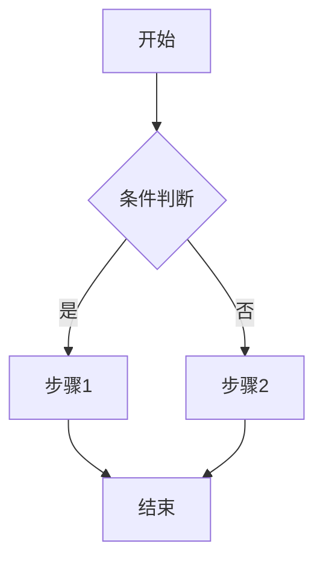
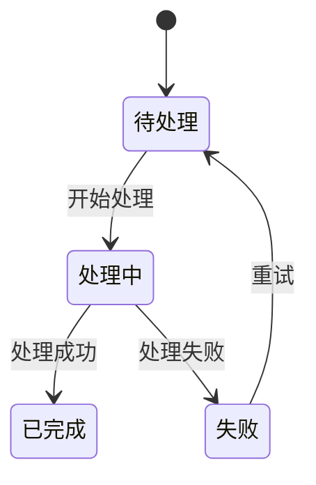
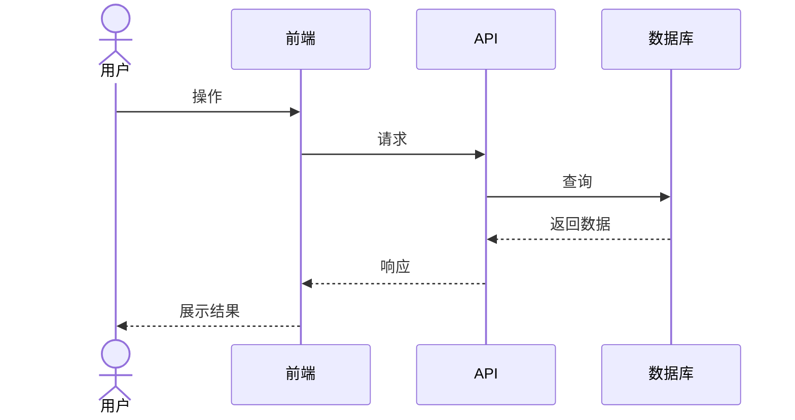
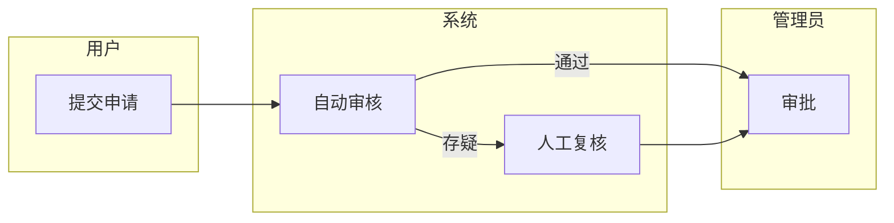
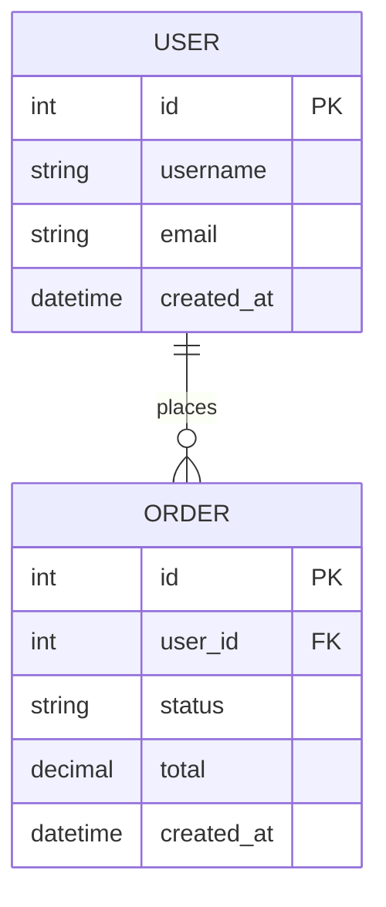

# 应用设计文档模板

## 1. PRD 模板 (PRD.md)

```markdown
# [产品名] 产品需求文档

## 1. 产品概述

### 1.1 一句话描述
[用一句话概括这个产品是什么，解决什么问题]

### 1.2 目标用户
- 主要用户：[描述]
- 次要用户：[描述]

### 1.3 核心价值主张
[为什么用户要用这个产品？比现有方案好在哪里？]

## 2. 用户故事

### 2.1 核心场景
作为 [角色]，我希望 [目标]，以便 [价值]

**场景 1**: 
- 触发条件：
- 操作步骤：
- 预期结果：

### 2.2 次要场景
[其他使用场景...]

## 3. 功能清单

### P0 - MVP 必需
| 功能模块 | 功能点 | 描述 | 验收标准 |
|---------|--------|------|---------|
| 模块A | 功能1 | 描述 | 标准 |
| 模块A | 功能2 | 描述 | 标准 |

### P1 - 高优先级
| 功能模块 | 功能点 | 描述 | 预计版本 |
|---------|--------|------|---------|
| 模块B | 功能3 | 描述 | v1.1 |

### P2 - 后续迭代
[低优先级功能...]

## 4. 非功能需求

### 4.1 性能
- 页面加载时间 < 2s
- API 响应时间 < 500ms

### 4.2 安全
- 用户认证方式
- 数据加密要求

### 4.3 兼容性
- 浏览器支持
- 移动端适配

## 5. 术语表
| 术语 | 解释 |
|-----|------|
| XX | 解释 |
```

---

## 2. 业务流模板 (business-flow.md)

```markdown
# 业务流程文档

## 1. 核心业务流程

### 1.1 [流程名称]



**步骤说明**:
1. **步骤1**: [详细说明]
2. **步骤2**: [详细说明]

### 1.2 异常处理

| 异常场景 | 触发条件 | 处理方式 | 用户提示 |
|---------|---------|---------|---------|
| 异常1 | 条件 | 处理 | 提示文案 |

## 2. 状态机

### 2.1 [实体] 状态流转



**状态说明**:
- **待处理**: [描述]
- **处理中**: [描述]
- **已完成**: [描述]

## 3. 时序图

### 3.1 [交互场景]



## 4. 泳道图


```

---

## 3. 数据模型模板 (data-model.md)

```markdown
# 数据模型设计

## 1. 实体关系图 (ERD)



## 2. 实体定义

### 2.1 [实体名] (表名: xxx)

| 字段名 | 类型 | 约束 | 说明 | 示例 |
|-------|------|-----|------|------|
| id | INTEGER | PK, AUTO | 主键 | 1 |
| name | VARCHAR(100) | NOT NULL | 名称 | "示例" |
| status | ENUM | DEFAULT 'active' | 状态 | active/inactive |
| created_at | DATETIME | DEFAULT CURRENT | 创建时间 | 2024-01-01 |

**索引**:
- PRIMARY: id
- INDEX: status, created_at

**关联**:
- belongs_to: [其他实体]
- has_many: [其他实体]

## 3. 枚举定义

| 枚举名 | 值 | 说明 |
|-------|---|------|
| StatusEnum | pending | 待处理 |
| StatusEnum | processing | 处理中 |
| StatusEnum | completed | 已完成 |

## 4. 数据字典

| 术语 | 数据库字段 | 业务含义 |
|-----|-----------|---------|
| XX | xx_field | 说明 |
```

---

## 4. API 设计模板 (api-design.md)

```markdown
# API 设计文档

## 1. 接口概览

| 方法 | 路径 | 描述 | 状态 |
|-----|------|------|-----|
| GET | /api/items | 获取列表 | 已实现 |
| POST | /api/items | 创建 | 已实现 |

## 2. 详细定义

### 2.1 [接口名]

**基本信息**:
- 方法: `GET/POST/PUT/DELETE`
- 路径: `/api/xxx`
- 描述: [一句话描述]

**请求参数**:

| 参数名 | 位置 | 类型 | 必填 | 说明 | 示例 |
|-------|-----|------|-----|------|------|
| id | path | integer | 是 | ID | 123 |
| page | query | integer | 否 | 页码 | 1 |
| keyword | query | string | 否 | 关键词 | "搜索" |

**请求体** (仅 POST/PUT):
```json
{
  "title": "string, required",
  "description": "string, optional"
}
```

**响应成功** (200):
```json
{
  "code": 0,
  "data": {
    "id": 1,
    "title": "标题",
    "created_at": "2024-01-01T00:00:00Z"
  },
  "message": "success"
}
```

**响应错误**:

| 状态码 | 错误码 | 说明 | 场景 |
|-------|-------|------|-----|
| 400 | INVALID_PARAM | 参数错误 | 缺少必填字段 |
| 404 | NOT_FOUND | 资源不存在 | ID 不存在 |
| 500 | INTERNAL_ERROR | 服务器错误 | 系统异常 |

## 3. 认证与授权

- 认证方式: [JWT/Session/API Key]
- Token 位置: [Header: Authorization / Cookie]
- 权限规则: [描述权限控制逻辑]

## 4. 分页规范

**请求**:
- page: 页码 (从1开始)
- per_page: 每页条数 (默认20, 最大100)

**响应**:
```json
{
  "data": [...],
  "pagination": {
    "page": 1,
    "per_page": 20,
    "total": 100,
    "total_pages": 5
  }
}
```

## 5. 通用响应格式

```json
{
  "code": 0,
  "data": {},
  "message": "success"
}
```

| 字段 | 类型 | 说明 |
|-----|------|------|
| code | integer | 0=成功, >0=业务错误 |
| data | any | 响应数据 |
| message | string | 提示信息 |
```

---

## 5. 原型设计模板 (wireframes.md)

```markdown
# 原型设计文档

## 1. 页面清单

| 页面 | 路径 | 描述 | 优先级 |
|-----|------|------|-------|
| 首页 | / | 主入口 | P0 |
| 列表页 | /items | 数据展示 | P0 |
| 详情页 | /items/:id | 详情展示 | P1 |

## 2. 页面详情

### 2.1 [页面名] (/path)

**功能描述**: [一句话说明]

**布局结构**:
```
+------------------+
|     Header      |
+------------------+
|  Sidebar  | Main |
|           |      |
|           |      |
+------------------+
|     Footer      |
+------------------+
```

**区域说明**:

| 区域 | 内容 | 交互 |
|-----|------|-----|
| Header | Logo + 导航 | 点击跳转 |
| Sidebar | 菜单 | 选中高亮 |
| Main | 主内容区 | - |

**交互说明**:

| 元素 | 事件 | 响应 |
|-----|------|-----|
| 按钮 | click | 打开弹窗 |
| 列表项 | hover | 显示操作按钮 |
| 输入框 | blur | 实时校验 |

**状态变化**:

| 状态 | 表现 |
|-----|------|
| 加载中 | 显示 loading 动画 |
| 空数据 | 显示空状态插图 |
| 错误 | 显示错误提示 |

## 3. 组件规范

### 3.1 按钮

| 类型 | 样式 | 使用场景 |
|-----|------|---------|
| Primary | 蓝色填充 | 主要操作 |
| Secondary | 白色边框 | 次要操作 |
| Danger | 红色填充 | 删除等危险操作 |
| Text | 文字链接 | 弱操作 |

### 3.2 表单

- 标签右对齐 / 顶对齐
- 错误提示在字段下方
- 提交按钮禁用直到表单有效

## 4. 全局交互

### 4.1 导航
- 面包屑显示当前位置
- 左侧菜单收起/展开

### 4.2 反馈
- 操作成功: Toast 提示
- 操作失败: 内联错误提示或弹窗
- 加载状态: 骨架屏或 Loading 动画

### 4.3 异常页面
- 404: 友好的找不到页面
- 500: 错误提示 + 重试按钮
```

---

## 6. 技术方案模板 (tech-spec.md)

```markdown
# 技术方案文档

## 1. 技术选型

| 层级 | 技术 | 版本 | 选型理由 |
|-----|------|-----|---------|
| 前端 | React | ^18 | 生态成熟 |
| 后端 | FastAPI | ^0.100 | 高性能, 自动生成文档 |
| 数据库 | SQLite | - | 轻量级, 适合 MVP |
| 部署 | Docker | - | 环境一致性 |

## 2. 架构设计

```
┌─────────────┐
│   Frontend  │  React + Vite
│  (Port 5173)│
└──────┬──────┘
       │ HTTP
       ▼
┌─────────────┐
│    API      │  FastAPI
│  (Port 8000)│
└──────┬──────┘
       │ SQL
       ▼
┌─────────────┐
│  Database   │  SQLite
└─────────────┘
```

## 3. 模块划分

### 3.1 后端模块

```
backend/
├── routers/      # API 路由
├── services/     # 业务逻辑
├── models/       # 数据模型
└── utils/        # 工具函数
```

### 3.2 前端模块

```
frontend/src/
├── components/   # 通用组件
├── pages/        # 页面组件
├── hooks/        # 自定义 Hooks
├── services/     # API 服务
└── utils/        # 工具函数
```

## 4. 关键决策

### 决策 1: [问题]
- **选项 A**: [描述]
- **选项 B**: [描述]
- **结论**: [选择及理由]

## 5. 风险与应对

| 风险 | 可能性 | 影响 | 应对措施 |
|-----|-------|-----|---------|
| [风险描述] | 高/中/低 | 高/中/低 | [措施] |

## 6. 开发计划

| 阶段 | 时间 | 交付物 | 关键任务 |
|-----|------|-------|---------|
| 阶段1 | Week 1 | PRD + 原型 | 需求确认 |
| 阶段2 | Week 2 | 基础架构 | 项目搭建 |
| 阶段3 | Week 3-4 | MVP | 核心功能 |
```
