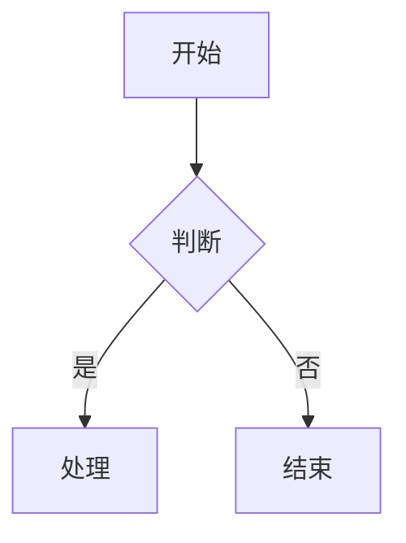

# CRTAssistant 设计文档

本文档目录用于存放应用的所有设计相关文档，采用渐进明细的方式逐步完善。

## 设计流程

### 阶段 1: 需求澄清 (Day 1)
明确产品定位、目标用户、核心功能范围。

**产出物**:
- `design/PRD.md` - 产品需求文档

### 阶段 2: 业务建模 (Day 2)
梳理业务流程、数据模型、系统交互。

**产出物**:
- `workflow/business-flow.md` - 业务流程图
- `design/data-model.md` - 数据模型设计

### 阶段 3: 接口与原型 (Day 3)
设计 API 接口、页面原型、交互细节。

**产出物**:
- `design/api-design.md` - API 设计
- `prototype/wireframes.md` - 原型设计
- `design/tech-spec.md` - 技术方案

### 阶段 4: 迭代优化 (持续)
根据开发反馈和测试结果，持续更新设计文档。

## 文档规范

### 使用 Mermaid 绘制图表
所有流程图、时序图、ER 图使用 Mermaid 语法，可在 Markdown 中直接渲染。

示例:


### 优先级标记
功能清单使用以下优先级：
- **P0**: MVP 必需，没有不能上线
- **P1**: 高优先级，上线后尽快跟进
- **P2**: 后续迭代，有价值但不是必须

### 版本记录
每个设计文档顶部应包含版本信息：

```markdown
| 版本 | 日期 | 作者 | 变更说明 |
|-----|------|-----|---------|
| v0.1 | 2024-01-01 | xxx | 初稿 |
```

## 如何开始

1. 使用自然语言描述你的业务思路
2. Kimi 会根据 `.agents/skills/app-designer/SKILL.md` 中的工作流程引导你
3. 设计文档会自动创建在对应目录下
4. 开发时所有代码依据这些设计文档展开

## 目录结构

```
docs/
├── README.md              # 本文件
├── design/                # 设计文档
│   ├── PRD.md            # 产品需求
│   ├── data-model.md     # 数据模型
│   ├── api-design.md     # API 设计
│   └── tech-spec.md      # 技术方案
├── workflow/              # 业务流程
│   └── business-flow.md  # 业务流图
├── prototype/             # 原型设计
│   └── wireframes.md     # 线框图
└── .agents/
    └── skills/
        └── app-designer/  # 设计助手 Skill
            ├── SKILL.md
            ├── references/
            └── assets/
```

## 设计原则

1. **先设计后开发**: 确保设计文档完成后再开始编码
2. **文档即代码**: 设计文档与代码同等重要，需要版本控制
3. **渐进明细**: 不必一开始就追求完美，先完成再完善
4. **可追溯**: 每个功能都能在文档中找到设计依据
