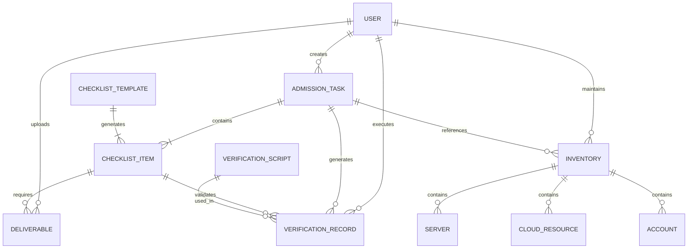

# 仿真运维经理 - 数据模型设计

| 版本 | 日期 | 作者 | 变更说明 |
|-----|------|-----|---------|
| v0.1 | 2024-03-20 | CRT | 初稿，核心实体定义 |

## 1. 实体关系图 (ERD)

## 2. 实体定义

### 2.1 用户 (users)

| 字段名 | 类型 | 约束 | 说明 | 示例 |
|-------|------|-----|------|------|
| id | INTEGER | PK, AUTO | 主键 | 1 |
| username | VARCHAR(50) | NOT NULL, UNIQUE | 用户名 | zhangsan |
| email | VARCHAR(100) | NOT NULL | 邮箱 | zhangsan@company.com |
| real_name | VARCHAR(50) | NOT NULL | 真实姓名 | 张三 |
| role | ENUM | NOT NULL | 角色 | ops_manager/admin/developer/security |
| department | VARCHAR(50) | | 部门 | 运维部 |
| phone | VARCHAR(20) | | 手机号 | 13800138000 |
| status | ENUM | DEFAULT 'active' | 状态 | active/inactive |
| created_at | DATETIME | DEFAULT CURRENT | 创建时间 | 2024-01-01 00:00:00 |
| updated_at | DATETIME | DEFAULT CURRENT | 更新时间 | 2024-01-01 00:00:00 |

**索引**:
- PRIMARY: id
- UNIQUE: username
- INDEX: role, status

### 2.2 准入检查任务 (admission_tasks)

| 字段名 | 类型 | 约束 | 说明 | 示例 |
|-------|------|-----|------|------|
| id | INTEGER | PK, AUTO | 主键 | 1 |
| task_no | VARCHAR(32) | NOT NULL, UNIQUE | 任务编号 | ADM202403200001 |
| system_name | VARCHAR(100) | NOT NULL | 系统名称 | 订单管理系统 |
| system_code | VARCHAR(50) | | 系统编码 | ORDER_SYS |
| version | VARCHAR(50) | NOT NULL | 版本号 | v2.1.0 |
| release_date | DATE | NOT NULL | 计划上线日期 | 2024-04-01 |
| creator_id | INTEGER | FK | 创建人ID | 1 |
| manager_id | INTEGER | FK | 运维经理ID | 2 |
| status | ENUM | DEFAULT 'draft' | 状态 | draft/in_progress/pending_review/approving/passed/rejected/cancelled |
| progress | INTEGER | DEFAULT 0 | 完成进度(%) | 75 |
| template_id | INTEGER | FK | 使用的模板ID | 1 |
| remark | TEXT | | 备注 | 紧急上线任务 |
| created_at | DATETIME | DEFAULT CURRENT | 创建时间 | 2024-03-20 10:00:00 |
| updated_at | DATETIME | DEFAULT CURRENT | 更新时间 | 2024-03-20 10:00:00 |
| completed_at | DATETIME | | 完成时间 | |

**索引**:
- PRIMARY: id
- UNIQUE: task_no
- INDEX: status, release_date, creator_id

**关联**:
- belongs_to: users (creator_id, manager_id)
- belongs_to: checklist_templates (template_id)
- has_many: checklist_items, inventories, verification_records

### 2.3 检查清单模板 (checklist_templates)

| 字段名 | 类型 | 约束 | 说明 | 示例 |
|-------|------|-----|------|------|
| id | INTEGER | PK, AUTO | 主键 | 1 |
| name | VARCHAR(100) | NOT NULL | 模板名称 | 标准Web应用准入模板 |
| category | ENUM | NOT NULL | 模板分类 | web_app/api_service/middleware/database |
| description | TEXT | | 模板描述 | 适用于标准Web应用的准入检查 |
| is_default | BOOLEAN | DEFAULT FALSE | 是否默认模板 | TRUE |
| status | ENUM | DEFAULT 'active' | 状态 | active/inactive |
| created_by | INTEGER | FK | 创建人ID | 1 |
| created_at | DATETIME | DEFAULT CURRENT | 创建时间 | |

**关联**:
- has_many: checklist_template_items

### 2.4 检查清单模板项 (checklist_template_items)

| 字段名 | 类型 | 约束 | 说明 | 示例 |
|-------|------|-----|------|------|
| id | INTEGER | PK, AUTO | 主键 | 1 |
| template_id | INTEGER | FK | 所属模板ID | 1 |
| control_dimension | ENUM | NOT NULL | 管控维度 | inventory/baseline/deployment/security/monitoring |
| category | VARCHAR(50) | NOT NULL | 分类 | 应用系统台账/系统基线/软件部署 |
| item_name | VARCHAR(200) | NOT NULL | 检查项名称 | 系统账户安全基线检查 |
| description | TEXT | | 详细描述 | 检查系统账户是否符合基线要求 |
| acceptance_criteria | TEXT | | 验收标准 | 1.禁用root远程登录... |
| deliverable_types | VARCHAR(200) | | 交付物类型 | manual,script,log |
| verification_method | ENUM | DEFAULT 'manual' | 验证方式 | manual/script/upload |
| script_id | INTEGER | FK | 关联验证脚本ID | 1 |
| sort_order | INTEGER | DEFAULT 0 | 排序 | 1 |
| is_required | BOOLEAN | DEFAULT TRUE | 是否必填 | TRUE |
| created_at | DATETIME | DEFAULT CURRENT | 创建时间 | |

**关联**:
- belongs_to: checklist_templates
- belongs_to: verification_scripts (可选)

### 2.5 检查清单项 (checklist_items) - 任务实例化后的检查项

| 字段名 | 类型 | 约束 | 说明 | 示例 |
|-------|------|-----|------|------|
| id | INTEGER | PK, AUTO | 主键 | 1 |
| task_id | INTEGER | FK | 所属任务ID | 1 |
| template_item_id | INTEGER | FK | 来源模板项ID | 1 |
| control_dimension | ENUM | NOT NULL | 管控维度 | inventory/baseline/deployment/security/monitoring |
| category | VARCHAR(50) | NOT NULL | 分类 | 应用系统台账 |
| item_name | VARCHAR(200) | NOT NULL | 检查项名称 | 系统账户安全基线检查 |
| description | TEXT | | 详细描述 | |
| acceptance_criteria | TEXT | | 验收标准 | |
| status | ENUM | DEFAULT 'pending' | 状态 | pending/in_progress/pending_review/passed/rejected/na |
| assignee_id | INTEGER | FK | 责任人ID | 3 |
| verifier_id | INTEGER | FK | 确认人ID | 2 |
| verified_at | DATETIME | | 确认时间 | |
| verification_remark | TEXT | | 确认备注 | 验证通过 |
| due_date | DATE | | 截止日期 | 2024-03-25 |
| sort_order | INTEGER | DEFAULT 0 | 排序 | 1 |
| created_at | DATETIME | DEFAULT CURRENT | 创建时间 | |
| updated_at | DATETIME | DEFAULT CURRENT | 更新时间 | |

**索引**:
- PRIMARY: id
- INDEX: task_id, status, assignee_id

**关联**:
- belongs_to: admission_tasks
- belongs_to: users (assignee_id, verifier_id)
- has_many: deliverables

### 2.6 台账 (inventories)

| 字段名 | 类型 | 约束 | 说明 | 示例 |
|-------|------|-----|------|------|
| id | INTEGER | PK, AUTO | 主键 | 1 |
| task_id | INTEGER | FK | 所属任务ID | 1 |
| inventory_type | ENUM | NOT NULL | 台账类型 | server/cloud_resource/account |
| status | ENUM | DEFAULT 'draft' | 状态 | draft/filling/submitted/confirmed/expired |
| submitted_by | INTEGER | FK | 提交人ID | 3 |
| submitted_at | DATETIME | | 提交时间 | |
| confirmed_by | INTEGER | FK | 确认人ID | 2 |
| confirmed_at | DATETIME | | 确认时间 | |
| remark | TEXT | | 备注 | |
| created_at | DATETIME | DEFAULT CURRENT | 创建时间 | |
| updated_at | DATETIME | DEFAULT CURRENT | 更新时间 | |

**关联**:
- belongs_to: admission_tasks
- belongs_to: users
- has_many: inventory_servers, inventory_cloud_resources, inventory_accounts

### 2.7 应用系统台账明细 (inventory_servers)

| 字段名 | 类型 | 约束 | 说明 | 示例 |
|-------|------|-----|------|------|
| id | INTEGER | PK, AUTO | 主键 | 1 |
| inventory_id | INTEGER | FK | 所属台账ID | 1 |
| ip_address | VARCHAR(50) | NOT NULL | IP地址 | 192.168.1.100 |
| hostname | VARCHAR(100) | NOT NULL | 主机名 | order-app-01 |
| os_type | VARCHAR(50) | | 操作系统 | CentOS 7.9 |
| cpu_cores | INTEGER | | CPU核数 | 8 |
| memory_gb | INTEGER | | 内存(GB) | 32 |
| disk_gb | INTEGER | | 磁盘(GB) | 500 |
| purpose | VARCHAR(200) | | 用途 | 订单服务应用服务器 |
| system_belong | VARCHAR(100) | | 所属系统 | 订单管理系统 |
| environment | ENUM | | 环境 | production/staging/test |
| responsible_person | VARCHAR(50) | | 责任人 | 李四 |
| online_date | DATE | | 上线时间 | 2024-04-01 |
| status | ENUM | DEFAULT 'active' | 状态 | active/inactive |
| created_at | DATETIME | DEFAULT CURRENT | 创建时间 | |

**索引**:
- PRIMARY: id
- INDEX: inventory_id, ip_address

### 2.8 云服务开通台账明细 (inventory_cloud_resources)

| 字段名 | 类型 | 约束 | 说明 | 示例 |
|-------|------|-----|------|------|
| id | INTEGER | PK, AUTO | 主键 | 1 |
| inventory_id | INTEGER | FK | 所属台账ID | 1 |
| resource_type | ENUM | NOT NULL | 资源类型 | compute/network/storage/backup |
| service_type | ENUM | NOT NULL | 服务类型 | iaas/paas/self_deployed |
| service_name | VARCHAR(100) | NOT NULL | 服务名称 | ECS/SLB/RDS/Redis |
| instance_id | VARCHAR(100) | | 实例ID | i-xxx123 |
| instance_name | VARCHAR(100) | | 实例名称 | order-db-primary |
| specification | VARCHAR(200) | | 规格配置 | 8C32G/500G SSD |
| region | VARCHAR(50) | | 地域 | cn-beijing |
| zone | VARCHAR(50) | | 可用区 | cn-beijing-a |
| network_config | TEXT | | 网络配置 | VPC: vpc-xxx, VSwitch: vsw-xxx |
| software_name | VARCHAR(100) | | 软件名称（PAAS/自部署） | MySQL 8.0 |
| software_version | VARCHAR(50) | | 软件版本 | 8.0.32 |
| responsible_person | VARCHAR(50) | | 责任人 | 王五 |
| created_at | DATETIME | DEFAULT CURRENT | 创建时间 | |

### 2.9 系统及软件账户台账明细 (inventory_accounts)

| 字段名 | 类型 | 约束 | 说明 | 示例 |
|-------|------|-----|------|------|
| id | INTEGER | PK, AUTO | 主键 | 1 |
| inventory_id | INTEGER | FK | 所属台账ID | 1 |
| system_name | VARCHAR(100) | NOT NULL | 系统名称 | 订单管理系统 |
| server_hostname | VARCHAR(100) | NOT NULL | 服务器名称 | order-app-01 |
| server_ip | VARCHAR(50) | NOT NULL | 服务器IP | 192.168.1.100 |
| account_type | ENUM | NOT NULL | 账户类型 | system/software |
| account_name | VARCHAR(100) | NOT NULL | 账户名 | appuser/mysql |
| permission_level | ENUM | | 权限级别 | readonly/readwrite/admin |
| permission_detail | TEXT | | 权限明细 | /opt/app读写权限 |
| holder_name | VARCHAR(50) | | 持有人 | 赵六 |
| holder_department | VARCHAR(50) | | 持有人部门 | 研发部 |
| valid_from | DATE | | 有效期开始 | 2024-04-01 |
| valid_until | DATE | | 有效期截止 | 2024-12-31 |
| password_change_cycle | INTEGER | | 密码修改周期(天) | 90 |
| last_password_change | DATE | | 上次修改日期 | 2024-03-01 |
| status | ENUM | DEFAULT 'active' | 状态 | active/expired/to_be_revoked |
| created_at | DATETIME | DEFAULT CURRENT | 创建时间 | |

**索引**:
- INDEX: inventory_id, valid_until (用于过期提醒)

### 2.10 交付物 (deliverables)

| 字段名 | 类型 | 约束 | 说明 | 示例 |
|-------|------|-----|------|------|
| id | INTEGER | PK, AUTO | 主键 | 1 |
| checklist_item_id | INTEGER | FK | 关联检查项ID | 1 |
| uploader_id | INTEGER | FK | 上传人ID | 3 |
| file_name | VARCHAR(200) | NOT NULL | 文件名 | 系统基线配置手册.pdf |
| file_type | VARCHAR(50) | NOT NULL | 文件类型 | pdf/word/excel/script/log |
| file_size | INTEGER | NOT NULL | 文件大小(字节) | 1024000 |
| file_path | VARCHAR(500) | NOT NULL | 存储路径 | /uploads/2024/03/xxx.pdf |
| file_hash | VARCHAR(64) | | 文件MD5 | d41d8cd98f00b204e9800998ecf8427e |
| description | TEXT | | 文件描述 | 系统基线配置操作手册 |
| status | ENUM | DEFAULT 'active' | 状态 | active/deleted |
| uploaded_at | DATETIME | DEFAULT CURRENT | 上传时间 | |

**关联**:
- belongs_to: checklist_items
- belongs_to: users

### 2.11 验证脚本 (verification_scripts)

| 字段名 | 类型 | 约束 | 说明 | 示例 |
|-------|------|-----|------|------|
| id | INTEGER | PK, AUTO | 主键 | 1 |
| script_name | VARCHAR(100) | NOT NULL | 脚本名称 | system_baseline_check |
| script_type | ENUM | NOT NULL | 脚本类型 | bash/python |
| description | TEXT | | 脚本描述 | 系统基线配置检查脚本 |
| content | TEXT | NOT NULL | 脚本内容 | #!/bin/bash... |
| version | VARCHAR(20) | DEFAULT '1.0' | 版本号 | 1.0 |
| applicable_os | VARCHAR(200) | | 适用系统 | CentOS 7,8/RHEL 7,8 |
| parameters | JSON | | 参数定义 | [{"name": "timeout", "type": "int"}] |
| timeout_seconds | INTEGER | DEFAULT 300 | 超时时间(秒) | 300 |
| created_by | INTEGER | FK | 创建人ID | 1 |
| status | ENUM | DEFAULT 'active' | 状态 | active/inactive |
| created_at | DATETIME | DEFAULT CURRENT | 创建时间 | |
| updated_at | DATETIME | DEFAULT CURRENT | 更新时间 | |

**关联**:
- belongs_to: users
- has_many: verification_records

### 2.12 验证记录 (verification_records)

| 字段名 | 类型 | 约束 | 说明 | 示例 |
|-------|------|-----|------|------|
| id | INTEGER | PK, AUTO | 主键 | 1 |
| task_id | INTEGER | FK | 所属任务ID | 1 |
| checklist_item_id | INTEGER | FK | 关联检查项ID | 5 |
| script_id | INTEGER | FK | 使用的脚本ID | 1 |
| executor_id | INTEGER | FK | 执行人ID | 2 |
| target_server | VARCHAR(100) | NOT NULL | 目标服务器 | 192.168.1.100 |
| status | ENUM | NOT NULL | 执行状态 | running/success/failed/timeout |
| started_at | DATETIME | | 开始时间 | |
| completed_at | DATETIME | | 完成时间 | |
| duration_seconds | INTEGER | | 执行时长(秒) | 45 |
| result_summary | JSON | | 结果摘要 | {"passed": 8, "failed": 2, "warning": 1} |
| result_detail | JSON | | 详细结果 | [{"check_item": "...", "status": "..."}] |
| output_log | TEXT | | 原始输出日志 | 脚本标准输出内容 |
| error_log | TEXT | | 错误日志 | 脚本错误输出 |
| created_at | DATETIME | DEFAULT CURRENT | 创建时间 | |

**关联**:
- belongs_to: admission_tasks, checklist_items, verification_scripts, users

## 3. 枚举定义

| 枚举名 | 值 | 说明 |
|-------|---|------|
| user_role | ops_manager | 运维经理 |
| user_role | admin | 系统管理员 |
| user_role | developer | 开发人员 |
| user_role | security | 安全人员 |
| user_role | viewer | 只读用户 |
| task_status | draft | 草稿 |
| task_status | in_progress | 进行中 |
| task_status | pending_review | 待审核 |
| task_status | approving | 审批中 |
| task_status | passed | 已通过 |
| task_status | rejected | 已驳回 |
| task_status | cancelled | 已取消 |
| control_dimension | inventory | 台账收集 |
| control_dimension | baseline | 系统基线 |
| control_dimension | deployment | 软件部署 |
| control_dimension | security | 系统安全 |
| control_dimension | monitoring | 监控告警 |
| checklist_item_status | pending | 未开始 |
| checklist_item_status | in_progress | 进行中 |
| checklist_item_status | pending_review | 待审核 |
| checklist_item_status | passed | 已通过 |
| checklist_item_status | rejected | 已驳回 |
| checklist_item_status | na | 不适用 |
| inventory_type | server | 应用系统台账 |
| inventory_type | cloud_resource | 云服务开通台账 |
| inventory_type | account | 系统账户台账 |
| verification_method | manual | 人工确认 |
| verification_method | script | 脚本验证 |
| verification_method | upload | 交付物上传 |
| environment | production | 生产环境 |
| environment | staging | 预发环境 |
| environment | test | 测试环境 |
| resource_type | compute | 计算资源 |
| resource_type | network | 网络资源 |
| resource_type | storage | 存储资源 |
| resource_type | backup | 备份服务 |
| account_type | system | 系统账户 |
| account_type | software | 软件账户 |
| permission_level | readonly | 只读权限 |
| permission_level | readwrite | 读写权限 |
| permission_level | admin | 管理员权限 |
| deliverable_type | manual | 操作手册 |
| deliverable_type | script | 脚本文件 |
| deliverable_type | log | 日志文件 |
| deliverable_type | image | 镜像说明 |
| deliverable_type | other | 其他 |

## 4. 数据字典

| 术语 | 数据库字段/表 | 业务含义 |
|-----|-------------|---------|
| 准入任务 | admission_tasks | 一次完整的准入检查流程 |
| 检查项 | checklist_items | 准入检查的具体检查点 |
| 管控维度 | control_dimension | 检查项的分类维度：台账/基线/部署/安全/监控 |
| 交付物 | deliverables | 证明检查项已完成的文档或文件 |
| 验证脚本 | verification_scripts | 自动检查基线合规性的可执行脚本 |
| 台账 | inventories | 系统资源、账户等信息的汇总 |
| 台账类型 | inventory_type | server/cloud_resource/account |
| 检查项状态 | checklist_item_status | pending/in_progress/pending_review/passed/rejected/na |
