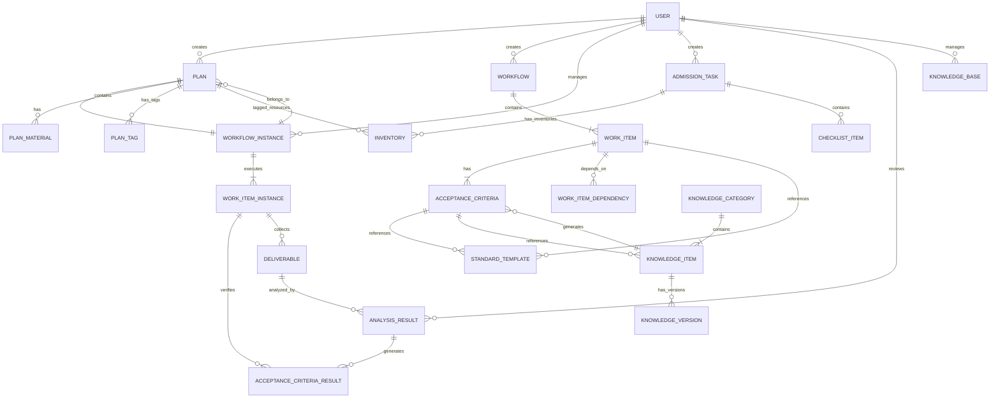

# 仿真运维经理 - 数据模型设计

| 版本 | 日期 | 作者 | 变更说明 |
|-----|------|-----|---------|
| v0.8 | 2024-03-22 | CRT | 新增：计划管理模块数据模型，支持计划创建、标签管理和仪表盘 |
| v0.7 | 2024-03-22 | CRT | 新增：知识库管理模块数据模型，支持验收标准与知识库关联 |
| v0.6 | 2024-03-22 | CRT | 完善：新增脚本验证、详细验收标准字段，支持三大核心检查项 |
| v0.5 | 2024-03-22 | CRT | 重构：完善工作流、报告分析、五大核心检查项数据模型 |
| v0.4 | 2024-03-22 | CRT | 新增工作流相关数据模型 |
| v0.3 | 2024-03-22 | CRT | 更新：与前端实际路由对齐 |
| v0.2 | 2024-03-22 | CRT | 更新：与前端页面结构对齐 |
| v0.1 | 2024-03-20 | CRT | 初稿，核心实体定义 |

---

## 1. 核心实体关系图 (ERD)



---

## 2. 计划管理模块（新增）

### 2.1 计划表 (plans)

| 字段名 | 类型 | 约束 | 说明 | 示例 |
|-------|------|-----|------|------|
| id | VARCHAR(36) | PK | 主键，UUID | "plan-001" |
| plan_id | VARCHAR(50) | NOT NULL, UNIQUE | 计划唯一标识（业务编号） | "PLAN-20240322-001" |
| name | VARCHAR(200) | NOT NULL | 计划名称 | "订单系统V2.0上线" |
| category | ENUM | NOT NULL | 分类：STANDARD/BUSINESS | "STANDARD" |
| priority | ENUM | NOT NULL, DEFAULT 'P2' | 优先级：P0/P1/P2/P3 | "P1" |
| status | ENUM | NOT NULL, DEFAULT 'DRAFT' | 状态：DRAFT/PENDING/IN_PROGRESS/COMPLETED/CANCELLED | "PENDING" |
| description | TEXT | | 计划说明 | "本次上线包含订单模块优化..." |
| planned_start_time | DATETIME | NOT NULL | 计划执行时间 | 2024-03-25 10:00:00 |
| planned_end_time | DATETIME | | 计划结束时间（预估） | 2024-03-25 18:00:00 |
| actual_start_time | DATETIME | | 实际开始时间 | 2024-03-25 10:05:00 |
| actual_end_time | DATETIME | | 实际结束时间 | 2024-03-25 17:30:00 |
| involved_systems | JSON | NOT NULL | 涉及的应用系统列表 | ["订单系统", "支付系统"] |
| workflow_instance_id | VARCHAR(36) | FK → workflow_instances.id | 关联工作流实例ID | "wfi-001" |
| tag | VARCHAR(100) | NOT NULL, UNIQUE | 数据标签 | "PLAN-20240322-001-STD-1711072800" |
| progress | INT | NOT NULL, DEFAULT 0 | 整体进度百分比 | 75 |
| created_by | VARCHAR(36) | FK → users.id | 创建人ID | "user-001" |
| created_at | DATETIME | DEFAULT CURRENT_TIMESTAMP | 创建时间 | 2024-03-22 10:00:00 |
| updated_at | DATETIME | DEFAULT CURRENT_TIMESTAMP ON UPDATE | 更新时间 | 2024-03-22 10:00:00 |

**索引**:
- PRIMARY: id
- UNIQUE: plan_id, tag
- INDEX: status, category, priority
- INDEX: planned_start_time
- INDEX: created_by
- INDEX: workflow_instance_id

---

### 2.2 计划审批材料表 (plan_materials)

| 字段名 | 类型 | 约束 | 说明 | 示例 |
|-------|------|-----|------|------|
| id | VARCHAR(36) | PK | 主键 | "pm-001" |
| plan_id | VARCHAR(36) | FK → plans.id, NOT NULL | 所属计划ID | "plan-001" |
| material_type | ENUM | NOT NULL | 材料类型：meeting_minutes/approval_email/screenshot/other | "meeting_minutes" |
| file_name | VARCHAR(255) | NOT NULL | 文件名 | "会议纪要_订单系统上线.pdf" |
| file_path | VARCHAR(500) | NOT NULL | 文件存储路径 | "/uploads/plans/plan-001/meeting.pdf" |
| file_size | BIGINT | NOT NULL | 文件大小（字节） | 2048000 |
| file_type | VARCHAR(50) | NOT NULL | 文件MIME类型 | "application/pdf" |
| description | VARCHAR(500) | | 材料说明 | "3月20日上线评审会议纪要" |
| uploaded_by | VARCHAR(36) | FK → users.id | 上传人ID | "user-001" |
| uploaded_at | DATETIME | DEFAULT CURRENT_TIMESTAMP | 上传时间 | 2024-03-22 10:00:00 |

**索引**:
- PRIMARY: id
- INDEX: plan_id
- INDEX: material_type

---

### 2.3 计划标签关联表 (plan_tags)

| 字段名 | 类型 | 约束 | 说明 | 示例 |
|-------|------|-----|------|------|
| id | VARCHAR(36) | PK | 主键 | "pt-001" |
| plan_id | VARCHAR(36) | FK → plans.id, NOT NULL | 计划ID | "plan-001" |
| resource_type | ENUM | NOT NULL | 资源类型：server/application/account/database | "server" |
| resource_id | VARCHAR(36) | NOT NULL | 资源ID | "srv-001" |
| resource_name | VARCHAR(200) | NOT NULL | 资源名称 | "order-server-01" |
| tagged_at | DATETIME | DEFAULT CURRENT_TIMESTAMP | 打标签时间 | 2024-03-22 10:00:00 |
| tagged_by | VARCHAR(36) | FK → users.id | 打标签人ID | "user-001" |

**索引**:
- PRIMARY: id
- UNIQUE: plan_id, resource_type, resource_id
- INDEX: plan_id
- INDEX: resource_type, resource_id

---

### 2.4 计划核验任务进度表 (plan_verification_progress)

| 字段名 | 类型 | 约束 | 说明 | 示例 |
|-------|------|-----|------|------|
| id | VARCHAR(36) | PK | 主键 | "pvp-001" |
| plan_id | VARCHAR(36) | FK → plans.id, NOT NULL | 计划ID | "plan-001" |
| verification_type | ENUM | NOT NULL | 核验类型：inventory/resource_delivery/permission/security/monitoring | "resource_delivery" |
| total_items | INT | NOT NULL, DEFAULT 0 | 总检查项数 | 10 |
| completed_items | INT | NOT NULL, DEFAULT 0 | 已完成项数 | 7 |
| passed_items | INT | NOT NULL, DEFAULT 0 | 通过项数 | 6 |
| failed_items | INT | NOT NULL, DEFAULT 0 | 不通过项数 | 1 |
| pending_items | INT | NOT NULL, DEFAULT 0 | 待处理项数 | 3 |
| progress | INT | NOT NULL, DEFAULT 0 | 进度百分比 | 70 |
| status | ENUM | NOT NULL, DEFAULT 'PENDING' | 状态：PENDING/IN_PROGRESS/COMPLETED | "IN_PROGRESS" |
| last_updated | DATETIME | DEFAULT CURRENT_TIMESTAMP ON UPDATE | 最后更新时间 | 2024-03-22 10:00:00 |

**索引**:
- PRIMARY: id
- UNIQUE: plan_id, verification_type
- INDEX: plan_id
- INDEX: status

---

## 3. 工作流管理模块

### 2.1 工作流模板 (workflows)

| 字段名 | 类型 | 约束 | 说明 | 示例 |
|-------|------|-----|------|------|
| id | VARCHAR(36) | PK | 主键，UUID | "wf-001" |
| name | VARCHAR(100) | NOT NULL | 工作流名称 | "标准上线检查流程" |
| description | TEXT | | 工作流描述 | "适用于一般业务系统上线前检查" |
| version | VARCHAR(10) | NOT NULL, DEFAULT 'v1.0' | 版本号 | "v1.0" |
| is_preset | BOOLEAN | NOT NULL, DEFAULT FALSE | 是否预置模板 | TRUE |
| status | ENUM | NOT NULL, DEFAULT 'draft' | 状态：draft/active/archived | "active" |
| created_by | VARCHAR(36) | FK → users.id | 创建人ID | "user-001" |
| created_at | DATETIME | DEFAULT CURRENT_TIMESTAMP | 创建时间 | 2024-03-22 10:00:00 |
| updated_at | DATETIME | DEFAULT CURRENT_TIMESTAMP ON UPDATE | 更新时间 | 2024-03-22 10:00:00 |

**索引**:
- PRIMARY: id
- INDEX: status, is_preset
- INDEX: created_by

---

### 2.2 工作项定义 (work_items)

| 字段名 | 类型 | 约束 | 说明 | 示例 |
|-------|------|-----|------|------|
| id | VARCHAR(36) | PK | 主键，UUID | "wi-001" |
| workflow_id | VARCHAR(36) | FK → workflows.id, NOT NULL | 所属工作流ID | "wf-001" |
| name | VARCHAR(100) | NOT NULL | 工作项名称 | "安全基线核验" |
| description | TEXT | | 工作项描述 | "检查系统安全配置是否符合基线要求" |
| work_item_type | ENUM | NOT NULL | 类型：resource_delivery/inventory/permission_handover/security_baseline/monitoring/custom | "security_baseline" |
| display_order | INT | NOT NULL, DEFAULT 0 | 显示顺序 | 3 |
| estimated_duration | INT | | 预估时长（分钟） | 60 |
| is_required | BOOLEAN | NOT NULL, DEFAULT TRUE | 是否必填 | TRUE |
| created_at | DATETIME | DEFAULT CURRENT_TIMESTAMP | 创建时间 | 2024-03-22 10:00:00 |
| updated_at | DATETIME | DEFAULT CURRENT_TIMESTAMP ON UPDATE | 更新时间 | 2024-03-22 10:00:00 |

**索引**:
- PRIMARY: id
- INDEX: workflow_id
- INDEX: work_item_type

---

### 2.3 工作项依赖 (work_item_dependencies)

| 字段名 | 类型 | 约束 | 说明 | 示例 |
|-------|------|-----|------|------|
| id | VARCHAR(36) | PK | 主键 | "dep-001" |
| work_item_id | VARCHAR(36) | FK → work_items.id, NOT NULL | 当前工作项ID | "wi-003" |
| depends_on_id | VARCHAR(36) | FK → work_items.id, NOT NULL | 依赖的工作项ID | "wi-002" |
| created_at | DATETIME | DEFAULT CURRENT_TIMESTAMP | 创建时间 | 2024-03-22 10:00:00 |

**索引**:
- PRIMARY: id
- UNIQUE: work_item_id, depends_on_id
- INDEX: work_item_id

---

### 2.4 验收标准定义 (acceptance_criteria)

| 字段名 | 类型 | 约束 | 说明 | 示例 |
|-------|------|-----|------|------|
| id | VARCHAR(36) | PK | 主键 | "ac-001" |
| work_item_id | VARCHAR(36) | FK → work_items.id, NOT NULL | 所属工作项ID | "wi-001" |
| content | TEXT | NOT NULL | 验收内容 | "高危漏洞数量必须为0" |
| criteria_type | ENUM | NOT NULL, DEFAULT 'manual' | 类型：manual/script/ai | "script" |
| is_required | BOOLEAN | NOT NULL, DEFAULT TRUE | 是否必填 | TRUE |
| display_order | INT | NOT NULL, DEFAULT 0 | 显示顺序 | 1 |
| standard_template_id | VARCHAR(36) | FK → standard_templates.id | 关联的标准模板ID | "st-001" |
| **verification_method** | ENUM | | 验证方式：script/ai_analysis/manual | "script" |
| **script_id** | VARCHAR(36) | FK → verification_scripts.id | 关联的验证脚本ID | "vs-001" |
| **ai_analysis_config** | JSON | | AI分析配置 | {"extract_fields": ["conclusion"]} |
| **deliverable_types** | JSON | | 支持的交付物类型 | ["pdf", "word", "excel"] |
| **deliverable_desc** | TEXT | | 交付物说明 | "安全扫描报告（PDF/Word格式）" |
| **checklist_items** | JSON | | 详细检查项列表 | [{"id": "1", "content": "..."}] |
| created_at | DATETIME | DEFAULT CURRENT_TIMESTAMP | 创建时间 | 2024-03-22 10:00:00 |
| updated_at | DATETIME | DEFAULT CURRENT_TIMESTAMP ON UPDATE | 更新时间 | 2024-03-22 10:00:00 |

**索引**:
- PRIMARY: id
- INDEX: work_item_id
- INDEX: standard_template_id
- INDEX: script_id

---

### 2.4.1 验证脚本管理 (verification_scripts)

| 字段名 | 类型 | 约束 | 说明 | 示例 |
|-------|------|-----|------|------|
| id | VARCHAR(36) | PK | 主键 | "vs-001" |
| name | VARCHAR(100) | NOT NULL | 脚本名称 | "系统基线检查脚本" |
| description | TEXT | | 脚本描述 | "验证系统账户安全、磁盘分区、网络配置等" |
| script_type | ENUM | NOT NULL | 脚本类型：system_baseline/software_deploy/custom | "system_baseline" |
| script_content | TEXT | NOT NULL | 脚本内容（Bash/Python） | "#!/bin/bash..." |
| script_language | VARCHAR(20) | DEFAULT 'bash' | 脚本语言：bash/python | "bash" |
| execution_target | ENUM | DEFAULT 'remote' | 执行目标：remote/local | "remote" |
| timeout_seconds | INT | DEFAULT 300 | 超时时间（秒） | 300 |
| output_format | ENUM | DEFAULT 'json' | 输出格式：json/text/xml | "json" |
| is_preset | BOOLEAN | NOT NULL, DEFAULT FALSE | 是否预置脚本 | TRUE |
| version | VARCHAR(10) | DEFAULT 'v1.0' | 脚本版本 | "v1.0" |
| created_by | VARCHAR(36) | FK → users.id | 创建人 | "user-001" |
| created_at | DATETIME | DEFAULT CURRENT_TIMESTAMP | 创建时间 | 2024-03-22 10:00:00 |
| updated_at | DATETIME | DEFAULT CURRENT_TIMESTAMP ON UPDATE | 更新时间 | 2024-03-22 10:00:00 |

**索引**:
- PRIMARY: id
- INDEX: script_type, is_preset
- INDEX: created_by

---

### 2.4.2 脚本执行记录 (script_executions)

| 字段名 | 类型 | 约束 | 说明 | 示例 |
|-------|------|-----|------|------|
| id | VARCHAR(36) | PK | 主键 | "se-001" |
| script_id | VARCHAR(36) | FK → verification_scripts.id, NOT NULL | 执行的脚本ID | "vs-001" |
| work_item_instance_id | VARCHAR(36) | FK → work_item_instances.id | 关联的工作项实例 | "wii-001" |
| target_host | VARCHAR(100) | NOT NULL | 目标服务器 | "192.168.1.100" |
| target_port | INT | DEFAULT 22 | SSH端口 | 22 |
| execution_status | ENUM | NOT NULL, DEFAULT 'pending' | 执行状态：pending/running/success/failed | "success" |
| exit_code | INT | | 脚本退出码 | 0 |
| stdout | TEXT | | 标准输出 | "{\"result\": \"passed\"}" |
| stderr | TEXT | | 标准错误 | "" |
| execution_duration_ms | INT | | 执行耗时（毫秒） | 5230 |
| started_at | DATETIME | | 开始时间 | 2024-03-22 10:00:00 |
| completed_at | DATETIME | | 完成时间 | 2024-03-22 10:00:05 |
| executed_by | VARCHAR(36) | FK → users.id | 执行人 | "user-001" |
| created_at | DATETIME | DEFAULT CURRENT_TIMESTAMP | 创建时间 | 2024-03-22 10:00:00 |

**索引**:
- PRIMARY: id
- INDEX: script_id
- INDEX: work_item_instance_id
- INDEX: execution_status

---

### 2.5 标准模板库 (standard_templates)

| 字段名 | 类型 | 约束 | 说明 | 示例 |
|-------|------|-----|------|------|
| id | VARCHAR(36) | PK | 主键 | "st-001" |
| name | VARCHAR(100) | NOT NULL | 模板名称 | "安全基线检查28项" |
| description | TEXT | | 模板描述 | "覆盖账户安全、网络安全、系统安全等方面" |
| template_type | ENUM | NOT NULL | 类型：work_item/criteria | "criteria" |
| work_item_type | ENUM | | 关联的工作项类型 | "security_baseline" |
| content | JSON | NOT NULL | 模板内容（标准列表） | [{"content": "...", "type": "..."}] |
| is_preset | BOOLEAN | NOT NULL, DEFAULT FALSE | 是否预置 | TRUE |
| created_by | VARCHAR(36) | FK → users.id | 创建人 | "user-001" |
| created_at | DATETIME | DEFAULT CURRENT_TIMESTAMP | 创建时间 | 2024-03-22 10:00:00 |

**索引**:
- PRIMARY: id
- INDEX: template_type, work_item_type

---

## 3. 工作流实例模块

### 3.1 工作流实例 (workflow_instances)

| 字段名 | 类型 | 约束 | 说明 | 示例 |
|-------|------|-----|------|------|
| id | VARCHAR(36) | PK | 主键 | "wfi-001" |
| workflow_id | VARCHAR(36) | FK → workflows.id, NOT NULL | 关联的工作流模板ID | "wf-001" |
| task_id | VARCHAR(36) | FK → admission_tasks.id | 关联的准入任务ID | "task-001" |
| status | ENUM | NOT NULL, DEFAULT 'pending' | 状态：pending/in_progress/completed/cancelled | "in_progress" |
| overall_progress | INT | NOT NULL, DEFAULT 0 | 整体进度（0-100） | 65 |
| started_at | DATETIME | | 开始时间 | 2024-03-22 10:00:00 |
| completed_at | DATETIME | | 完成时间 | 2024-03-22 16:00:00 |
| created_by | VARCHAR(36) | FK → users.id, NOT NULL | 创建人 | "user-001" |
| created_at | DATETIME | DEFAULT CURRENT_TIMESTAMP | 创建时间 | 2024-03-22 10:00:00 |
| updated_at | DATETIME | DEFAULT CURRENT_TIMESTAMP ON UPDATE | 更新时间 | 2024-03-22 10:00:00 |

**索引**:
- PRIMARY: id
- INDEX: workflow_id, task_id
- INDEX: status
- INDEX: created_by

---

### 3.2 工作项实例 (work_item_instances)

| 字段名 | 类型 | 约束 | 说明 | 示例 |
|-------|------|-----|------|------|
| id | VARCHAR(36) | PK | 主键 | "wii-001" |
| instance_id | VARCHAR(36) | FK → workflow_instances.id, NOT NULL | 所属工作流实例ID | "wfi-001" |
| work_item_id | VARCHAR(36) | FK → work_items.id, NOT NULL | 关联的工作项定义ID | "wi-001" |
| status | ENUM | NOT NULL, DEFAULT 'pending' | 状态：pending/in_progress/pending_review/completed/rejected | "completed" |
| progress | INT | NOT NULL, DEFAULT 0 | 进度（0-100） | 100 |
| result | ENUM | DEFAULT 'not_started' | 结果：passed/failed/pending_improvement/not_started | "passed" |
| result_source | ENUM | | 结果来源：auto/manual | "auto" |
| assignee_id | VARCHAR(36) | FK → users.id | 负责人 | "user-002" |
| started_at | DATETIME | | 开始时间 | 2024-03-22 10:00:00 |
| completed_at | DATETIME | | 完成时间 | 2024-03-22 12:00:00 |
| created_at | DATETIME | DEFAULT CURRENT_TIMESTAMP | 创建时间 | 2024-03-22 10:00:00 |
| updated_at | DATETIME | DEFAULT CURRENT_TIMESTAMP ON UPDATE | 更新时间 | 2024-03-22 12:00:00 |

**索引**:
- PRIMARY: id
- INDEX: instance_id
- INDEX: work_item_id
- INDEX: status, result

---

### 3.3 验收标准结果 (acceptance_criteria_results)

| 字段名 | 类型 | 约束 | 说明 | 示例 |
|-------|------|-----|------|------|
| id | VARCHAR(36) | PK | 主键 | "acr-001" |
| work_item_instance_id | VARCHAR(36) | FK → work_item_instances.id, NOT NULL | 所属工作项实例ID | "wii-001" |
| criteria_id | VARCHAR(36) | FK → acceptance_criteria.id, NOT NULL | 关联的验收标准ID | "ac-001" |
| result | ENUM | NOT NULL | 结果：passed/failed/pending_improvement | "passed" |
| result_source | ENUM | NOT NULL | 来源：auto/manual | "auto" |
| auto_analysis_id | VARCHAR(36) | FK → analysis_results.id | 关联的自动分析结果 | "ar-001" |
| evidence | TEXT | | 证据/说明 | "未发现高危漏洞" |
| remark | TEXT | | 备注 | "已人工复核" |
| verified_by | VARCHAR(36) | FK → users.id | 确认人 | "user-001" |
| verified_at | DATETIME | | 确认时间 | 2024-03-22 12:00:00 |
| created_at | DATETIME | DEFAULT CURRENT_TIMESTAMP | 创建时间 | 2024-03-22 10:00:00 |

**索引**:
- PRIMARY: id
- INDEX: work_item_instance_id
- INDEX: criteria_id

---

## 4. 报告生成与分析助手模块

### 4.1 交付物 (deliverables)

| 字段名 | 类型 | 约束 | 说明 | 示例 |
|-------|------|-----|------|------|
| id | VARCHAR(36) | PK | 主键 | "del-001" |
| work_item_instance_id | VARCHAR(36) | FK → work_item_instances.id | 关联的工作项实例 | "wii-001" |
| task_id | VARCHAR(36) | FK → admission_tasks.id | 关联的准入任务 | "task-001" |
| file_name | VARCHAR(255) | NOT NULL | 文件名 | "security_scan_report.pdf" |
| file_type | VARCHAR(50) | NOT NULL | 文件类型 | "application/pdf" |
| file_size | BIGINT | NOT NULL | 文件大小（字节） | 1048576 |
| file_path | VARCHAR(500) | NOT NULL | 存储路径 | "/uploads/2024/03/xxx.pdf" |
| description | TEXT | | 文件描述 | "安全扫描报告-第1轮" |
| uploaded_by | VARCHAR(36) | FK → users.id, NOT NULL | 上传人 | "user-002" |
| uploaded_at | DATETIME | DEFAULT CURRENT_TIMESTAMP | 上传时间 | 2024-03-22 10:00:00 |

**索引**:
- PRIMARY: id
- INDEX: work_item_instance_id
- INDEX: task_id

---

### 4.2 分析结果 (analysis_results)

| 字段名 | 类型 | 约束 | 说明 | 示例 |
|-------|------|-----|------|------|
| id | VARCHAR(36) | PK | 主键 | "ar-001" |
| deliverable_id | VARCHAR(36) | FK → deliverables.id, NOT NULL | 关联的交付物 | "del-001" |
| work_item_instance_id | VARCHAR(36) | FK → work_item_instances.id | 关联的工作项实例 | "wii-001" |
| analysis_status | ENUM | NOT NULL, DEFAULT 'pending' | 分析状态：pending/processing/completed/failed | "completed" |
| auto_result | ENUM | | 自动分析结果：passed/failed/pending_improvement | "failed" |
| auto_analysis_report | JSON | | 自动分析报告详情 | {"summary": {...}} |
| final_result | ENUM | | 最终结果：passed/failed/pending_improvement | "failed" |
| final_result_source | ENUM | | 结果来源：auto/manual | "manual" |
| manual_remark | TEXT | | 人工修正说明 | "经复核，漏洞已修复" |
| analyzed_by | VARCHAR(36) | FK → users.id | 分析/确认人 | "user-001" |
| analyzed_at | DATETIME | | 分析/确认时间 | 2024-03-22 12:00:00 |
| created_at | DATETIME | DEFAULT CURRENT_TIMESTAMP | 创建时间 | 2024-03-22 10:00:00 |

**索引**:
- PRIMARY: id
- INDEX: deliverable_id
- INDEX: work_item_instance_id
- INDEX: analysis_status

---

## 5. 五大核心检查项模块

### 5.1 基础资源标准化交付 (resource_deliveries)

| 字段名 | 类型 | 约束 | 说明 | 示例 |
|-------|------|-----|------|------|
| id | VARCHAR(36) | PK | 主键 | "rd-001" |
| work_item_instance_id | VARCHAR(36) | FK → work_item_instances.id | 关联的工作项实例 | "wii-001" |
| resource_type | ENUM | NOT NULL | 资源类型：server/network/storage | "server" |
| resource_name | VARCHAR(100) | NOT NULL | 资源名称 | "app-server-01" |
| resource_config | JSON | NOT NULL | 资源配置详情 | {"cpu": 8, "memory": "32G"} |
| standard_version | VARCHAR(20) | | 标准版本 | "v2.1" |
| check_result | ENUM | | 检查结果：passed/failed/pending | "passed" |
| checked_at | DATETIME | | 检查时间 | 2024-03-22 10:00:00 |
| created_at | DATETIME | DEFAULT CURRENT_TIMESTAMP | 创建时间 | 2024-03-22 10:00:00 |

---

### 5.2 服务对象台账 (service_inventories)

| 字段名 | 类型 | 约束 | 说明 | 示例 |
|-------|------|-----|------|------|
| id | VARCHAR(36) | PK | 主键 | "si-001" |
| work_item_instance_id | VARCHAR(36) | FK → work_item_instances.id | 关联的工作项实例 | "wii-002" |
| inventory_type | ENUM | NOT NULL | 台账类型：application/cloud/account | "application" |
| service_name | VARCHAR(100) | NOT NULL | 服务名称 | "订单管理系统" |
| service_code | VARCHAR(50) | | 服务编码 | "ORDER-001" |
| service_info | JSON | NOT NULL | 服务信息详情 | {"owner": "张三", "team": "订单组"} |
| dependencies | JSON | | 依赖服务列表 | ["user-service", "pay-service"] |
| created_at | DATETIME | DEFAULT CURRENT_TIMESTAMP | 创建时间 | 2024-03-22 10:00:00 |

---

### 5.3 生产环境权限移交 (permission_handovers)

| 字段名 | 类型 | 约束 | 说明 | 示例 |
|-------|------|-----|------|------|
| id | VARCHAR(36) | PK | 主键 | "ph-001" |
| work_item_instance_id | VARCHAR(36) | FK → work_item_instances.id | 关联的工作项实例 | "wii-003" |
| permission_type | ENUM | NOT NULL | 权限类型：system/database/application | "system" |
| grantee | VARCHAR(100) | NOT NULL | 被授权人 | "李四" |
| grantee_role | VARCHAR(50) | | 被授权人角色 | "运维工程师" |
| permission_scope | JSON | NOT NULL | 权限范围 | {"servers": ["prod-01"], "commands": ["docker", "systemctl"]} |
| approver | VARCHAR(100) | | 审批人 | "王五" |
| approved_at | DATETIME | | 审批时间 | 2024-03-22 10:00:00 |
| handover_status | ENUM | DEFAULT 'pending' | 移交状态：pending/completed | "completed" |
| created_at | DATETIME | DEFAULT CURRENT_TIMESTAMP | 创建时间 | 2024-03-22 10:00:00 |

---

### 5.4 安全基线核验 (security_baselines)

| 字段名 | 类型 | 约束 | 说明 | 示例 |
|-------|------|-----|------|------|
| id | VARCHAR(36) | PK | 主键 | "sb-001" |
| work_item_instance_id | VARCHAR(36) | FK → work_item_instances.id | 关联的工作项实例 | "wii-004" |
| check_category | ENUM | NOT NULL | 检查类别：account/network/system/application | "account" |
| check_item | VARCHAR(100) | NOT NULL | 检查项 | "密码复杂度检查" |
| check_standard | TEXT | NOT NULL | 检查标准 | "密码长度>=8位，包含大小写字母和数字" |
| check_result | ENUM | | 检查结果：passed/failed/na | "passed" |
| evidence | TEXT | | 检查证据 | "密码策略已配置：minlen=8" |
| scan_report_id | VARCHAR(36) | FK → deliverables.id | 关联的扫描报告 | "del-002" |
| checked_at | DATETIME | | 检查时间 | 2024-03-22 10:00:00 |
| created_at | DATETIME | DEFAULT CURRENT_TIMESTAMP | 创建时间 | 2024-03-22 10:00:00 |

---

### 5.5 监控告警配置确认 (monitoring_configs)

| 字段名 | 类型 | 约束 | 说明 | 示例 |
|-------|------|-----|------|------|
| id | VARCHAR(36) | PK | 主键 | "mc-001" |
| work_item_instance_id | VARCHAR(36) | FK → work_item_instances.id | 关联的工作项实例 | "wii-005" |
| config_type | ENUM | NOT NULL | 配置类型：metric/alert/dashboard/oncall | "alert" |
| config_name | VARCHAR(100) | NOT NULL | 配置名称 | "CPU使用率告警" |
| config_detail | JSON | NOT NULL | 配置详情 | {"threshold": 80, "duration": "5m"} |
| is_configured | BOOLEAN | DEFAULT FALSE | 是否已配置 | TRUE |
| is_tested | BOOLEAN | DEFAULT FALSE | 是否已测试 | TRUE |
| test_result | TEXT | | 测试结果 | "告警通知正常，延迟<30s" |
| confirmed_by | VARCHAR(36) | FK → users.id | 确认人 | "user-001" |
| confirmed_at | DATETIME | | 确认时间 | 2024-03-22 10:00:00 |
| created_at | DATETIME | DEFAULT CURRENT_TIMESTAMP | 创建时间 | 2024-03-22 10:00:00 |

---

## 6. 知识库管理模块

### 6.1 知识分类 (knowledge_categories)

| 字段名 | 类型 | 约束 | 说明 | 示例 |
|-------|------|-----|------|------|
| id | VARCHAR(36) | PK | 主键 | "kc-001" |
| code | VARCHAR(20) | NOT NULL, UNIQUE | 分类编码 | "RSD" |
| name | VARCHAR(100) | NOT NULL | 分类名称 | "基础资源标准化交付" |
| description | TEXT | | 分类描述 | "系统基线、软件部署相关规范" |
| parent_id | VARCHAR(36) | FK → knowledge_categories.id | 上级分类ID | NULL |
| work_item_types | JSON | | 关联的工作项类型 | ["resource_delivery"] |
| display_order | INT | DEFAULT 0 | 显示顺序 | 1 |
| is_preset | BOOLEAN | NOT NULL, DEFAULT FALSE | 是否预置分类 | TRUE |
| status | ENUM | DEFAULT 'active' | 状态：active/archived | "active" |
| created_by | VARCHAR(36) | FK → users.id | 创建人 | "user-001" |
| created_at | DATETIME | DEFAULT CURRENT_TIMESTAMP | 创建时间 | 2024-03-22 10:00:00 |
| updated_at | DATETIME | DEFAULT CURRENT_TIMESTAMP ON UPDATE | 更新时间 | 2024-03-22 10:00:00 |

**索引**:
- PRIMARY: id
- UNIQUE: code
- INDEX: parent_id
- INDEX: status, is_preset

---

### 6.2 知识条目 (knowledge_items)

| 字段名 | 类型 | 约束 | 说明 | 示例 |
|-------|------|-----|------|------|
| id | VARCHAR(36) | PK | 主键 | "ki-001" |
| category_id | VARCHAR(36) | FK → knowledge_categories.id, NOT NULL | 所属分类ID | "kc-001" |
| title | VARCHAR(200) | NOT NULL | 知识标题 | "生产环境系统基线配置要求" |
| content_type | ENUM | NOT NULL | 内容类型：requirement/baseline/manual/checklist/script | "baseline" |
| source_format | ENUM | NOT NULL | 源格式：md/word/excel/pdf/txt | "md" |
| content | LONGTEXT | NOT NULL | 知识内容（Markdown格式） | "# 系统基线配置..." |
| content_structure | JSON | | 结构化内容（解析后的检查项） | {"items": [...]} |
| source_file | JSON | | 原始文件信息 | {"name": "...", "url": "...", "size": 1024} |
| version | VARCHAR(10) | NOT NULL, DEFAULT 'v1.0' | 当前版本号 | "v1.0" |
| tags | JSON | | 标签列表 | ["系统基线", "安全配置"] |
| work_item_types | JSON | | 关联的工作项类型 | ["resource_delivery"] |
| usage_count | INT | DEFAULT 0 | 使用次数 | 15 |
| is_preset | BOOLEAN | NOT NULL, DEFAULT FALSE | 是否系统预置 | TRUE |
| status | ENUM | DEFAULT 'draft' | 状态：draft/published/archived | "published" |
| created_by | VARCHAR(36) | FK → users.id, NOT NULL | 创建人 | "user-001" |
| created_at | DATETIME | DEFAULT CURRENT_TIMESTAMP | 创建时间 | 2024-03-22 10:00:00 |
| updated_at | DATETIME | DEFAULT CURRENT_TIMESTAMP ON UPDATE | 更新时间 | 2024-03-22 10:00:00 |

**索引**:
- PRIMARY: id
- INDEX: category_id
- INDEX: content_type, status
- INDEX: is_preset, status
- FULLTEXT: title, content

---

### 6.3 知识版本历史 (knowledge_versions)

| 字段名 | 类型 | 约束 | 说明 | 示例 |
|-------|------|-----|------|------|
| id | VARCHAR(36) | PK | 主键 | "kv-001" |
| knowledge_id | VARCHAR(36) | FK → knowledge_items.id, NOT NULL | 关联的知识条目 | "ki-001" |
| version | VARCHAR(10) | NOT NULL | 版本号 | "v1.0" |
| content | LONGTEXT | NOT NULL | 版本内容 | "..." |
| change_log | TEXT | | 变更说明 | "初始版本" |
| created_by | VARCHAR(36) | FK → users.id | 创建人 | "user-001" |
| created_at | DATETIME | DEFAULT CURRENT_TIMESTAMP | 创建时间 | 2024-03-22 10:00:00 |

**索引**:
- PRIMARY: id
- UNIQUE: knowledge_id, version
- INDEX: knowledge_id

---

### 6.4 验收标准与知识关联 (criteria_knowledge_links)

| 字段名 | 类型 | 约束 | 说明 | 示例 |
|-------|------|-----|------|------|
| id | VARCHAR(36) | PK | 主键 | "ckl-001" |
| criteria_id | VARCHAR(36) | FK → acceptance_criteria.id, NOT NULL | 验收标准ID | "ac-001" |
| knowledge_id | VARCHAR(36) | FK → knowledge_items.id, NOT NULL | 知识条目ID | "ki-001" |
| knowledge_version | VARCHAR(10) | NOT NULL | 引用的知识版本 | "v1.0" |
| auto_generated | BOOLEAN | DEFAULT FALSE | 是否自动生成 | TRUE |
| generation_confidence | DECIMAL(3,2) | | 生成置信度 | 0.95 |
| created_at | DATETIME | DEFAULT CURRENT_TIMESTAMP | 创建时间 | 2024-03-22 10:00:00 |

**索引**:
- PRIMARY: id
- UNIQUE: criteria_id, knowledge_id
- INDEX: knowledge_id

---

## 7. 其他核心实体

### 7.1 用户 (users)

| 字段名 | 类型 | 约束 | 说明 | 示例 |
|-------|------|-----|------|------|
| id | VARCHAR(36) | PK | 主键 | "user-001" |
| username | VARCHAR(50) | NOT NULL, UNIQUE | 用户名 | "zhangsan" |
| email | VARCHAR(100) | NOT NULL | 邮箱 | "zhangsan@company.com" |
| real_name | VARCHAR(50) | NOT NULL | 真实姓名 | "张三" |
| role | ENUM | NOT NULL | 角色：ops_manager/admin/developer/security/ops_expert | "ops_manager" |
| department | VARCHAR(50) | | 部门 | "运维部" |
| phone | VARCHAR(20) | | 手机号 | "13800138000" |
| status | ENUM | DEFAULT 'active' | 状态：active/inactive | "active" |
| created_at | DATETIME | DEFAULT CURRENT_TIMESTAMP | 创建时间 | 2024-03-22 10:00:00 |
| updated_at | DATETIME | DEFAULT CURRENT_TIMESTAMP ON UPDATE | 更新时间 | 2024-03-22 10:00:00 |

---

### 6.2 准入任务 (admission_tasks)

| 字段名 | 类型 | 约束 | 说明 | 示例 |
|-------|------|-----|------|------|
| id | VARCHAR(36) | PK | 主键 | "task-001" |
| title | VARCHAR(200) | NOT NULL | 任务标题 | "订单管理系统上线准入检查" |
| system_name | VARCHAR(100) | NOT NULL | 系统名称 | "订单管理系统" |
| system_code | VARCHAR(50) | | 系统编码 | "ORDER-MS" |
| description | TEXT | | 任务描述 | "V2.0版本上线前检查" |
| planned_date | DATE | | 计划上线日期 | 2024-03-25 |
| priority | ENUM | DEFAULT 'medium' | 优先级：low/medium/high/urgent | "high" |
| status | ENUM | DEFAULT 'pending' | 状态：pending/in_progress/completed/cancelled | "in_progress" |
| workflow_instance_id | VARCHAR(36) | FK → workflow_instances.id | 关联的工作流实例 | "wfi-001" |
| created_by | VARCHAR(36) | FK → users.id, NOT NULL | 创建人 | "user-001" |
| created_at | DATETIME | DEFAULT CURRENT_TIMESTAMP | 创建时间 | 2024-03-22 10:00:00 |
| updated_at | DATETIME | DEFAULT CURRENT_TIMESTAMP ON UPDATE | 更新时间 | 2024-03-22 10:00:00 |

---

## 7. 枚举类型定义

### 7.1 工作项类型 (work_item_type)

```sql
ENUM('resource_delivery', 'inventory', 'permission_handover', 'security_baseline', 'monitoring', 'custom')
```

| 值 | 说明 | 对应PRD章节 |
|---|------|------------|
| resource_delivery | 基础资源标准化交付 | 3.2 基础资源标准化交付验证 |
| inventory | 服务对象台账 | 3.1 服务对象台账收集 |
| permission_handover | 生产环境权限移交 | 额外检查项 |
| security_baseline | 安全基线核验 | 3.3 安全基线核验 |
| monitoring | 监控告警配置确认 | 额外检查项 |
| custom | 自定义工作项 | 用户自定义 |

---

### 7.1.1 验收标准类型 (criteria_type)

```sql
ENUM('manual', 'script', 'ai')
```

| 值 | 说明 | 验证方式 |
|---|------|---------|
| manual | 人工核验 | 人工检查交付物 |
| script | 脚本验证 | SSH远程执行验证脚本 |
| ai | AI自动分析 | AI分析交付物内容 |

---

### 7.1.2 验证方式 (verification_method)

```sql
ENUM('manual', 'script', 'ai_analysis')
```

| 值 | 说明 | 适用场景 |
|---|------|---------|
| manual | 人工核验 | 台账收集、权限移交等 |
| script | 脚本验证 | 系统基线、软件部署、监控配置等 |
| ai_analysis | AI分析 | 安全报告、文档分析等 |

---

### 7.1.3 脚本类型 (script_type)

```sql
ENUM('system_baseline', 'software_deploy', 'monitoring_check', 'custom')
```

| 值 | 说明 | 对应检查项 |
|---|------|-----------|
| system_baseline | 系统基线检查脚本 | 2.1 生产环境上线前系统基线配置（7项） |
| software_deploy | 软件部署检查脚本 | 2.2 生产环境软件标准化部署（4项） |
| monitoring_check | 监控配置检查脚本 | 监控告警配置确认 |
| custom | 自定义验证脚本 | 用户自定义检查 |

---

### 7.1.4 交付物类型 (deliverable_type)

```sql
ENUM('excel', 'word', 'pdf', 'txt', 'json', 'xml', 'script_report')
```

| 值 | 说明 | 文件扩展名 |
|---|------|-----------|
| excel | Excel表格 | .xlsx, .xls |
| word | Word文档 | .docx, .doc |
| pdf | PDF文档 | .pdf |
| txt | 文本文件 | .txt, .log |
| json | JSON数据 | .json |
| xml | XML数据 | .xml |
| script_report | 脚本执行报告 | .json, .txt |

### 7.2 结果状态 (result_status)

```sql
ENUM('passed', 'failed', 'pending_improvement', 'not_started')
```

| 值 | 说明 |
|---|------|
| passed | 通过 |
| failed | 不通过 |
| pending_improvement | 待改进 |
| not_started | 未开始 |

### 7.3 结果来源 (result_source)

```sql
ENUM('auto', 'manual')
```

| 值 | 说明 |
|---|------|
| auto | 自动分析生成 |
| manual | 人工输入/确认 |

---

## 8. 数据关系总结

### 8.1 核心关系链

```
工作流模板 (workflows)
    ↓ 1:N
工作项定义 (work_items)
    ↓ 1:N
验收标准定义 (acceptance_criteria)

工作流模板 (workflows)
    ↓ 1:N (实例化)
工作流实例 (workflow_instances) ←→ 准入任务 (admission_tasks)
    ↓ 1:N
工作项实例 (work_item_instances)
    ↓ 1:N
验收标准结果 (acceptance_criteria_results)
    ↓ 关联
分析结果 (analysis_results) ←→ 交付物 (deliverables)
```

### 8.2 五大核心检查项关系

```
工作项实例 (work_item_instances)
    ├── 1:1 基础资源标准化交付 (resource_deliveries) - 当 work_item_type = 'resource_delivery'
    ├── 1:1 服务对象台账 (service_inventories) - 当 work_item_type = 'inventory'
    ├── 1:1 生产环境权限移交 (permission_handovers) - 当 work_item_type = 'permission_handover'
    ├── 1:1 安全基线核验 (security_baselines) - 当 work_item_type = 'security_baseline'
    └── 1:1 监控告警配置确认 (monitoring_configs) - 当 work_item_type = 'monitoring'
```

---

## 9. 相关文档

- [PRD文档](./PRD.md)
- [API设计](./api-design.md)
- [原型设计](../prototype/wireframes.md)
- [业务规则](./business-rules.md)
