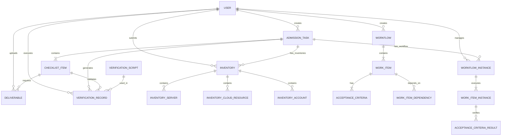

# 仿真运维经理 - 数据模型设计

| 版本 | 日期 | 作者 | 变更说明 |
|-----|------|-----|---------|
| v0.4 | 2024-03-22 | CRT | 新增工作流相关数据模型：workflows, work_items, workflow_instances, acceptance_criteria |
| v0.3 | 2024-03-22 | CRT | 更新：与前端实际路由对齐，明确页面与数据模型的对应关系 |
| v0.2 | 2024-03-22 | CRT | 更新：与前端页面结构对齐，明确页面与数据模型的对应关系 |
| v0.1 | 2024-03-20 | CRT | 初稿，核心实体定义 |

## 1. 页面结构与数据模型映射

### 1.1 前端页面清单与数据模型对应关系

| 前端页面 | 路由 | 对应数据模型 | 主要操作 | API端点 |
|---------|------|-------------|---------|---------|
| 仪表盘 | `/` | admission_tasks, verification_records | 统计查询 | GET /api/dashboard/overview |
| 准入任务列表 | `/admission-tasks` | admission_tasks | CRUD | GET/POST /api/admission-tasks |
| 创建准入任务 | `/admission-tasks/new` | admission_tasks, checklist_items | 创建任务+生成检查项 | POST /api/admission-tasks |
| 任务详情-概览 | `/admission-tasks/:id` | admission_tasks + 关联统计 | 查看进度、时间线 | GET /api/admission-tasks/:id |
| 任务详情-检查项 | `/admission-tasks/:id` (tab) | checklist_items + deliverables | 检查项管理、交付物上传 | GET /api/checklist-items?task_id=:id |
| 任务详情-台账 | `/admission-tasks/:id` (tab) | inventories + 明细表 | 台账汇总展示 | GET /api/inventories?task_id=:id |
| 任务详情-交付物 | `/admission-tasks/:id` (tab) | deliverables | 按检查项分组展示 | GET /api/deliverables?task_id=:id |
| 任务详情-验证记录 | `/admission-tasks/:id` (tab) | verification_records | 脚本执行历史 | GET /api/verification-execute?task_id=:id |
| **台账管理-应用系统** | `/inventories/server` | inventories(inventory_type='server') + inventory_servers | 列表查询 | GET /api/inventories?inventory_type=server |
| **台账管理-云服务** | `/inventories/cloud` | inventories(inventory_type='cloud_resource') + inventory_cloud_resources | 列表查询 | GET /api/inventories?inventory_type=cloud_resource |
| **台账管理-系统账户** | `/inventories/account` | inventories(inventory_type='account') + inventory_accounts | 列表查询 | GET /api/inventories?inventory_type=account |
| 台账详情(编辑) | `/inventories/:id` | inventories + 明细表 | 编辑明细、提交审核 | GET/PUT /api/inventories/:id |
| 任务内台账管理 | `/inventories/task/:taskId` | inventories(按task_id过滤) | 任务视角台账管理 | GET /api/inventories?task_id=:taskId |
| 创建应用系统台账 | `/inventories/:taskId/server/create` | inventories + inventory_servers | 创建台账 | POST /api/inventories?task_id=:taskId |
| 创建云服务台账 | `/inventories/:taskId/cloud_resource/create` | inventories + inventory_cloud_resources | 创建台账 | POST /api/inventories?task_id=:taskId |
| 创建系统账户台账 | `/inventories/:taskId/account/create` | inventories + inventory_accounts | 创建台账 | POST /api/inventories?task_id=:taskId |
| **工作流模板列表** | `/workflows` | workflows | 列表查询 | GET /api/workflows |
| **工作流模板详情** | `/workflows/:id` | workflows + work_items + acceptance_criteria | 查看详情 | GET /api/workflows/:id |
| **工作流实例列表** | `/workflow-instances` | workflow_instances | 列表查询 | GET /api/workflow-instances |
| **工作流实例详情** | `/workflow-instances/:id` | workflow_instances + work_item_instances | 查看进度 | GET /api/workflow-instances/:id |
| **工作项执行** | `/workflow-instances/:id/execute` | work_item_instances | 执行工作项 | POST /api/workflow-instances/:id/execute |

### 1.2 关键设计原则

1. **任务为中心**：所有台账、检查项、交付物都围绕 admission_task 展开
2. **台账类型分离**：三种台账独立页面，通过 inventory_type 区分
3. **检查项与交付物关联**：deliverables.checklist_item_id 关联检查项
4. **验证脚本独立**：verification_scripts 与 checklist_items 通过 script_id 关联
5. **API查询参数化**：台账列表通过查询参数 `?inventory_type=` 而非路径参数区分类型

## 2. 实体关系图 (ERD)



## 3. 实体定义

### 3.1 用户 (users)

| 字段名 | 类型 | 约束 | 说明 | 示例 |
|-------|------|-----|------|------|
| id | INTEGER | PK, AUTO | 主键 | 1 |
| username | VARCHAR(50) | NOT NULL, UNIQUE | 用户名 | zhangsan |
| email | VARCHAR(100) | NOT NULL | 邮箱 | zhangsan@company.com |
| real_name | VARCHAR(50) | NOT NULL | 真实姓名 | 张三 |
| role | ENUM | NOT NULL | 角色 | ops_manager/admin/developer/security |
| department | VARCHAR(50) | | 部门 | 运维部 |
| phone | VARCHAR(20) | | 手机号 | 13800138000 |
| status | ENUM | DEFAULT 'active' | 状态 | active/inactive |
| created_at | DATETIME | DEFAULT CURRENT | 创建时间 | 2024-01-01 00:00:00 |
| updated_at | DATETIME | DEFAULT CURRENT | 更新时间 | 2024-01-01 00:00:00 |

**索引**:
- PRIMARY: id
- UNIQUE: username
- INDEX: role, status

### 3.2 准入检查任务 (admission_tasks)

| 字段名 | 类型 | 约束 | 说明 | 示例 |
|-------|------|-----|------|------|
| id | INTEGER | PK, AUTO | 主键 | 1 |
| task_no | VARCHAR(32) | NOT NULL, UNIQUE | 任务编号 | ADM202403200001 |
| system_name | VARCHAR(100) | NOT NULL | 系统名称 | 订单管理系统 |
| system_code | VARCHAR(50) | | 系统编码 | ORDER_SYS |
| version | VARCHAR(50) | NOT NULL | 版本号 | v2.1.0 |
| release_date | DATE | NOT NULL | 计划上线日期 | 2024-04-01 |
| creator_id | INTEGER | FK | 创建人ID | 1 |
| manager_id | INTEGER | FK | 运维经理ID | 2 |
| status | ENUM | DEFAULT 'draft' | 状态 | draft/in_progress/pending_review/passed/rejected |
| progress | INTEGER | DEFAULT 0 | 完成进度(%) | 75 |
| template_id | INTEGER | FK | 使用的模板ID | 1 |
| remark | TEXT | | 备注 | 紧急上线任务 |
| created_at | DATETIME | DEFAULT CURRENT | 创建时间 | 2024-03-20 10:00:00 |
| updated_at | DATETIME | DEFAULT CURRENT | 更新时间 | 2024-03-20 10:00:00 |
| completed_at | DATETIME | | 完成时间 | |

**索引**:
- PRIMARY: id
- UNIQUE: task_no
- INDEX: status, release_date, creator_id

**关联**:
- belongs_to: users (creator_id, manager_id)
- has_many: checklist_items, inventories, verification_records

### 3.3 检查清单项 (checklist_items)

| 字段名 | 类型 | 约束 | 说明 | 示例 |
|-------|------|-----|------|------|
| id | INTEGER | PK, AUTO | 主键 | 1 |
| task_id | INTEGER | FK | 所属任务ID | 1 |
| control_dimension | ENUM | NOT NULL | 管控维度 | inventory/baseline/deployment/security/monitoring |
| category | VARCHAR(50) | NOT NULL | 分类 | 应用系统台账 |
| item_name | VARCHAR(200) | NOT NULL | 检查项名称 | 系统账户安全基线检查 |
| description | TEXT | | 详细描述 | |
| acceptance_criteria | TEXT | | 验收标准 | |
| status | ENUM | DEFAULT 'pending' | 状态 | pending/in_progress/pending_review/passed/rejected |
| assignee_id | INTEGER | FK | 责任人ID | 3 |
| verifier_id | INTEGER | FK | 确认人ID | 2 |
| verified_at | DATETIME | | 确认时间 | |
| verification_remark | TEXT | | 确认备注 | 验证通过 |
| due_date | DATE | | 截止日期 | 2024-03-25 |
| deliverable_count | INTEGER | DEFAULT 0 | 交付物数量（冗余字段） | 2 |
| verification_method | ENUM | DEFAULT 'manual' | 验证方式 | manual/script/upload |
| script_id | INTEGER | FK | 关联验证脚本ID | 1 |
| sort_order | INTEGER | DEFAULT 0 | 排序 | 1 |
| created_at | DATETIME | DEFAULT CURRENT | 创建时间 | |
| updated_at | DATETIME | DEFAULT CURRENT | 更新时间 | |

**索引**:
- PRIMARY: id
- INDEX: task_id, status, assignee_id, control_dimension

**关联**:
- belongs_to: admission_tasks
- belongs_to: users (assignee_id, verifier_id)
- has_many: deliverables

### 3.4 台账 (inventories)

| 字段名 | 类型 | 约束 | 说明 | 示例 |
|-------|------|-----|------|------|
| id | INTEGER | PK, AUTO | 主键 | 1 |
| task_id | INTEGER | FK | 所属任务ID | 1 |
| inventory_type | ENUM | NOT NULL | 台账类型 | server/cloud_resource/account |
| status | ENUM | DEFAULT 'draft' | 状态 | draft/filling/submitted/confirmed/expired |
| submitted_by | INTEGER | FK | 提交人ID | 3 |
| submitted_at | DATETIME | | 提交时间 | |
| confirmed_by | INTEGER | FK | 确认人ID | 2 |
| confirmed_at | DATETIME | | 确认时间 | |
| remark | TEXT | | 备注 | |
| created_at | DATETIME | DEFAULT CURRENT | 创建时间 | |
| updated_at | DATETIME | DEFAULT CURRENT | 更新时间 | |

**索引**:
- PRIMARY: id
- INDEX: task_id, inventory_type, status

**关联**:
- belongs_to: admission_tasks
- belongs_to: users (submitted_by, confirmed_by)
- has_many: inventory_servers, inventory_cloud_resources, inventory_accounts

### 3.5 应用系统台账明细 (inventory_servers)

| 字段名 | 类型 | 约束 | 说明 | 示例 |
|-------|------|-----|------|------|
| id | INTEGER | PK, AUTO | 主键 | 1 |
| inventory_id | INTEGER | FK | 所属台账ID | 1 |
| ip_address | VARCHAR(50) | NOT NULL | IP地址 | 192.168.1.100 |
| hostname | VARCHAR(100) | NOT NULL | 主机名 | order-app-01 |
| os_type | VARCHAR(50) | | 操作系统 | CentOS 7.9 |
| cpu_cores | INTEGER | | CPU核数 | 8 |
| memory_gb | INTEGER | | 内存(GB) | 32 |
| disk_gb | INTEGER | | 磁盘(GB) | 500 |
| purpose | VARCHAR(200) | | 用途 | 订单服务应用服务器 |
| system_belong | VARCHAR(100) | | 所属系统 | 订单管理系统 |
| environment | ENUM | | 环境 | production/staging/test |
| responsible_person | VARCHAR(50) | | 责任人 | 李四 |
| online_date | DATE | | 上线时间 | 2024-04-01 |
| status | ENUM | DEFAULT 'active' | 状态 | active/inactive |
| created_at | DATETIME | DEFAULT CURRENT | 创建时间 | |

**索引**:
- PRIMARY: id
- INDEX: inventory_id, ip_address

### 3.6 云服务开通台账明细 (inventory_cloud_resources)

| 字段名 | 类型 | 约束 | 说明 | 示例 |
|-------|------|-----|------|------|
| id | INTEGER | PK, AUTO | 主键 | 1 |
| inventory_id | INTEGER | FK | 所属台账ID | 1 |
| resource_type | ENUM | NOT NULL | 资源类型 | compute/network/storage/database/middleware/backup |
| service_name | VARCHAR(100) | NOT NULL | 服务名称 | ECS/SLB/RDS/Redis |
| instance_name | VARCHAR(100) | | 实例名称 | order-db-primary |
| specification | VARCHAR(200) | | 规格配置 | 8C32G/500G SSD |
| region | VARCHAR(50) | | 地域 | cn-beijing |
| zone | VARCHAR(50) | | 可用区 | cn-beijing-a |
| network_config | TEXT | | 网络配置 | VPC: vpc-xxx |
| responsible_person | VARCHAR(50) | | 责任人 | 王五 |
| created_at | DATETIME | DEFAULT CURRENT | 创建时间 | |

**索引**:
- PRIMARY: id
- INDEX: inventory_id, resource_type

### 3.7 系统及软件账户台账明细 (inventory_accounts)

| 字段名 | 类型 | 约束 | 说明 | 示例 |
|-------|------|-----|------|------|
| id | INTEGER | PK, AUTO | 主键 | 1 |
| inventory_id | INTEGER | FK | 所属台账ID | 1 |
| system_name | VARCHAR(100) | NOT NULL | 所属系统 | 订单管理系统 |
| server_hostname | VARCHAR(100) | | 服务器主机名 | order-app-01 |
| account_name | VARCHAR(100) | NOT NULL | 账户名 | appuser/mysql |
| account_type | ENUM | NOT NULL | 账户类型 | system/software |
| permission_level | ENUM | | 权限级别 | readonly/operator/developer/admin |
| permission_detail | TEXT | | 权限明细 | /opt/app读写权限 |
| holder_name | VARCHAR(50) | | 持有人 | 赵六 |
| holder_department | VARCHAR(50) | | 持有人部门 | 研发部 |
| valid_from | DATE | | 有效期开始 | 2024-04-01 |
| valid_until | DATE | | 有效期截止 | 2024-12-31 |
| status | ENUM | DEFAULT 'active' | 状态 | active/expired/to_be_revoked |
| created_at | DATETIME | DEFAULT CURRENT | 创建时间 | |

**索引**:
- PRIMARY: id
- INDEX: inventory_id, valid_until

### 3.8 交付物 (deliverables)

| 字段名 | 类型 | 约束 | 说明 | 示例 |
|-------|------|-----|------|------|
| id | INTEGER | PK, AUTO | 主键 | 1 |
| checklist_item_id | INTEGER | FK | 关联检查项ID | 1 |
| uploader_id | INTEGER | FK | 上传人ID | 3 |
| file_name | VARCHAR(200) | NOT NULL | 文件名 | 系统基线配置手册.pdf |
| file_type | ENUM | NOT NULL | 文件类型 | pdf/word/excel/script/log/other |
| file_size | INTEGER | NOT NULL | 文件大小(字节) | 1024000 |
| file_path | VARCHAR(500) | NOT NULL | 存储路径 | /uploads/2024/03/xxx.pdf |
| file_hash | VARCHAR(64) | | 文件MD5 | d41d8cd98f00b204e9800998ecf8427e |
| description | TEXT | | 文件描述 | 系统基线配置操作手册 |
| status | ENUM | DEFAULT 'active' | 状态 | active/deleted |
| uploaded_at | DATETIME | DEFAULT CURRENT | 上传时间 | |

**关联**:
- belongs_to: checklist_items
- belongs_to: users

### 3.9 验证脚本 (verification_scripts)

| 字段名 | 类型 | 约束 | 说明 | 示例 |
|-------|------|-----|------|------|
| id | INTEGER | PK, AUTO | 主键 | 1 |
| script_name | VARCHAR(100) | NOT NULL | 脚本名称 | system_baseline_check |
| script_type | ENUM | NOT NULL | 脚本类型 | bash/python |
| description | TEXT | | 脚本描述 | 系统基线配置检查脚本 |
| content | TEXT | NOT NULL | 脚本内容 | #!/bin/bash... |
| version | VARCHAR(20) | DEFAULT '1.0' | 版本号 | 1.0 |
| applicable_os | VARCHAR(200) | | 适用系统 | CentOS 7,8/RHEL 7,8 |
| timeout_seconds | INTEGER | DEFAULT 300 | 超时时间(秒) | 300 |
| created_by | INTEGER | FK | 创建人ID | 1 |
| status | ENUM | DEFAULT 'active' | 状态 | active/inactive |
| created_at | DATETIME | DEFAULT CURRENT | 创建时间 | |
| updated_at | DATETIME | DEFAULT CURRENT | 更新时间 | |

**关联**:
- belongs_to: users
- has_many: verification_records

### 3.10 验证记录 (verification_records)

| 字段名 | 类型 | 约束 | 说明 | 示例 |
|-------|------|-----|------|------|
| id | INTEGER | PK, AUTO | 主键 | 1 |
| task_id | INTEGER | FK | 所属任务ID | 1 |
| checklist_item_id | INTEGER | FK | 关联检查项ID | 5 |
| script_id | INTEGER | FK | 使用的脚本ID | 1 |
| executor_id | INTEGER | FK | 执行人ID | 2 |
| target_server | VARCHAR(100) | NOT NULL | 目标服务器 | 192.168.1.100 |
| status | ENUM | NOT NULL | 执行状态 | pending/running/success/failed/timeout |
| started_at | DATETIME | | 开始时间 | |
| completed_at | DATETIME | | 完成时间 | |
| duration_seconds | INTEGER | | 执行时长(秒) | 45 |
| result_summary | JSON | | 结果摘要 | {"passed": 8, "failed": 2} |
| result_detail | JSON | | 详细结果 | [...] |
| output_log | TEXT | | 原始输出日志 | |
| error_log | TEXT | | 错误日志 | |
| created_at | DATETIME | DEFAULT CURRENT | 创建时间 | |

**关联**:
- belongs_to: admission_tasks, checklist_items, verification_scripts, users

## 4. 枚举定义

| 枚举名 | 值 | 说明 |
|-------|---|------|
| user_role | ops_manager | 运维经理 |
| user_role | admin | 系统管理员 |
| user_role | developer | 开发人员 |
| user_role | security | 安全人员 |
| task_status | draft | 草稿 |
| task_status | in_progress | 进行中 |
| task_status | pending_review | 待审核 |
| task_status | passed | 已通过 |
| task_status | rejected | 已驳回 |
| control_dimension | inventory | 台账收集 |
| control_dimension | baseline | 系统基线 |
| control_dimension | deployment | 软件部署 |
| control_dimension | security | 系统安全 |
| control_dimension | monitoring | 监控告警 |
| checklist_item_status | pending | 未开始 |
| checklist_item_status | in_progress | 进行中 |
| checklist_item_status | pending_review | 待审核 |
| checklist_item_status | passed | 已通过 |
| checklist_item_status | rejected | 已驳回 |
| inventory_type | server | 应用系统台账 |
| inventory_type | cloud_resource | 云服务开通台账 |
| inventory_type | account | 系统账户台账 |
| inventory_status | draft | 草稿 |
| inventory_status | filling | 填写中 |
| inventory_status | submitted | 已提交 |
| inventory_status | confirmed | 已确认 |
| inventory_status | expired | 已过期 |
| workflow_status | draft | 草稿 |
| workflow_status | active | 启用 |
| workflow_status | archived | 已归档 |
| work_item_status | pending | 未开始 |
| work_item_status | in_progress | 进行中 |
| work_item_status | pending_review | 待验收 |
| work_item_status | completed | 已完成 |
| work_item_status | rejected | 已驳回 |
| work_item_type | resource_delivery | 基础资源标准化交付 |
| work_item_type | inventory | 服务对象台账 |
| work_item_type | permission_handover | 生产环境权限移交 |
| work_item_type | security_baseline | 安全基线核验 |
| work_item_type | monitoring | 监控告警配置确认 |
| work_item_type | custom | 自定义工作项 |
| instance_status | active | 执行中 |
| instance_status | completed | 已完成 |
| instance_status | suspended | 已暂停 |
| criteria_status | pending | 待验收 |
| criteria_status | passed | 已通过 |
| criteria_status | failed | 未通过 |

## 3.11 工作流模板 (workflows)

| 字段名 | 类型 | 约束 | 说明 | 示例 |
|-------|------|-----|------|------|
| id | INTEGER | PK, AUTO | 主键 | 1 |
| name | VARCHAR(100) | NOT NULL | 工作流名称 | 标准上线工作流 |
| description | TEXT | | 工作流描述 | 适用于一般业务系统上线 |
| is_preset | BOOLEAN | DEFAULT false | 是否预置模板 | true |
| status | ENUM | DEFAULT 'draft' | 状态 | draft/active/archived |
| created_by | INTEGER | FK | 创建人ID | 1 |
| created_at | DATETIME | DEFAULT CURRENT | 创建时间 | |
| updated_at | DATETIME | DEFAULT CURRENT | 更新时间 | |

**关联**:
- belongs_to: users
- has_many: work_items
- has_many: workflow_instances

**索引**:
- PRIMARY: id
- INDEX: is_preset, status

## 3.12 工作项定义 (work_items)

| 字段名 | 类型 | 约束 | 说明 | 示例 |
|-------|------|-----|------|------|
| id | INTEGER | PK, AUTO | 主键 | 1 |
| workflow_id | INTEGER | FK, NOT NULL | 所属工作流ID | 1 |
| name | VARCHAR(100) | NOT NULL | 工作项名称 | 基础资源标准化交付 |
| description | TEXT | | 工作项描述 | 服务器、网络、存储资源标准化配置 |
| work_item_type | ENUM | NOT NULL | 工作项类型 | resource_delivery/inventory/permission_handover/security_baseline/monitoring/custom |
| display_order | INTEGER | DEFAULT 0 | 显示顺序 | 1 |
| estimated_duration | INTEGER | | 预估时长(分钟) | 480 |
| is_required | BOOLEAN | DEFAULT true | 是否必填 | true |
| created_at | DATETIME | DEFAULT CURRENT | 创建时间 | |
| updated_at | DATETIME | DEFAULT CURRENT | 更新时间 | |

**关联**:
- belongs_to: workflows
- has_many: acceptance_criteria
- has_many: work_item_dependencies

**索引**:
- PRIMARY: id
- INDEX: workflow_id, display_order

## 3.13 工作项依赖 (work_item_dependencies)

| 字段名 | 类型 | 约束 | 说明 | 示例 |
|-------|------|-----|------|------|
| id | INTEGER | PK, AUTO | 主键 | 1 |
| work_item_id | INTEGER | FK, NOT NULL | 当前工作项ID | 2 |
| depends_on_id | INTEGER | FK, NOT NULL | 依赖的工作项ID | 1 |
| created_at | DATETIME | DEFAULT CURRENT | 创建时间 | |

**说明**: 定义工作项之间的依赖关系，当前工作项必须在依赖项完成后才能开始

**索引**:
- PRIMARY: id
- UNIQUE: work_item_id, depends_on_id

## 3.14 验收标准 (acceptance_criteria)

| 字段名 | 类型 | 约束 | 说明 | 示例 |
|-------|------|-----|------|------|
| id | INTEGER | PK, AUTO | 主键 | 1 |
| work_item_id | INTEGER | FK, NOT NULL | 所属工作项ID | 1 |
| content | TEXT | NOT NULL | 验收内容 | 服务器已按标准配置分区 |
| is_required | BOOLEAN | DEFAULT true | 是否必填 | true |
| criteria_type | ENUM | DEFAULT 'manual' | 验收类型 | manual/auto |
| auto_check_script | TEXT | | 自动检查脚本 | |
| display_order | INTEGER | DEFAULT 0 | 显示顺序 | 1 |
| created_at | DATETIME | DEFAULT CURRENT | 创建时间 | |
| updated_at | DATETIME | DEFAULT CURRENT | 更新时间 | |

**关联**:
- belongs_to: work_items
- has_many: acceptance_criteria_results

**索引**:
- PRIMARY: id
- INDEX: work_item_id, display_order

## 3.15 工作流实例 (workflow_instances)

| 字段名 | 类型 | 约束 | 说明 | 示例 |
|-------|------|-----|------|------|
| id | VARCHAR(32) | PK | 实例ID | wf_inst_202403210001 |
| workflow_id | INTEGER | FK, NOT NULL | 工作流模板ID | 1 |
| task_id | INTEGER | FK, NOT NULL | 关联准入任务ID | 1 |
| status | ENUM | DEFAULT 'active' | 实例状态 | active/completed/suspended |
| overall_progress | INTEGER | DEFAULT 0 | 整体进度(%) | 60 |
| started_at | DATETIME | | 开始时间 | |
| completed_at | DATETIME | | 完成时间 | |
| created_by | INTEGER | FK | 创建人ID | 1 |
| created_at | DATETIME | DEFAULT CURRENT | 创建时间 | |
| updated_at | DATETIME | DEFAULT CURRENT | 更新时间 | |

**关联**:
- belongs_to: workflows, admission_tasks, users
- has_many: work_item_instances

**索引**:
- PRIMARY: id
- INDEX: workflow_id, task_id, status

## 3.16 工作项实例 (work_item_instances)

| 字段名 | 类型 | 约束 | 说明 | 示例 |
|-------|------|-----|------|------|
| id | INTEGER | PK, AUTO | 主键 | 1 |
| instance_id | VARCHAR(32) | FK, NOT NULL | 工作流实例ID | wf_inst_202403210001 |
| work_item_id | INTEGER | FK, NOT NULL | 工作项定义ID | 1 |
| status | ENUM | DEFAULT 'pending' | 状态 | pending/in_progress/pending_review/completed/rejected |
| progress | INTEGER | DEFAULT 0 | 进度(%) | 50 |
| assignee_id | INTEGER | FK | 执行人ID | 3 |
| reviewer_id | INTEGER | FK | 验收人ID | 2 |
| started_at | DATETIME | | 开始时间 | |
| completed_at | DATETIME | | 完成时间 | |
| actual_duration | INTEGER | | 实际耗时(分钟) | 360 |
| remark | TEXT | | 备注 | |
| created_at | DATETIME | DEFAULT CURRENT | 创建时间 | |
| updated_at | DATETIME | DEFAULT CURRENT | 更新时间 | |

**关联**:
- belongs_to: workflow_instances, work_items, users(assignee), users(reviewer)
- has_many: acceptance_criteria_results

**索引**:
- PRIMARY: id
- INDEX: instance_id, work_item_id, status, assignee_id

## 3.17 验收结果 (acceptance_criteria_results)

| 字段名 | 类型 | 约束 | 说明 | 示例 |
|-------|------|-----|------|------|
| id | INTEGER | PK, AUTO | 主键 | 1 |
| work_item_instance_id | INTEGER | FK, NOT NULL | 工作项实例ID | 1 |
| criteria_id | INTEGER | FK, NOT NULL | 验收标准ID | 1 |
| status | ENUM | DEFAULT 'pending' | 验收状态 | pending/passed/failed |
| remark | TEXT | | 验收备注 | 符合要求 |
| verified_by | INTEGER | FK | 验收人ID | 2 |
| verified_at | DATETIME | | 验收时间 | |
| created_at | DATETIME | DEFAULT CURRENT | 创建时间 | |
| updated_at | DATETIME | DEFAULT CURRENT | 更新时间 | |

**关联**:
- belongs_to: work_item_instances, acceptance_criteria, users

**索引**:
- PRIMARY: id
- INDEX: work_item_instance_id, criteria_id

## 5. 前端页面与API对应关系

### 5.1 页面-API映射表

| 页面 | 路由 | 主要API | 说明 |
|-----|------|--------|------|
| 仪表盘 | `/` | GET /api/dashboard/overview | 统计数据 |
| 准入任务列表 | `/admission-tasks` | GET /api/admission-tasks | 任务列表（分页） |
| 创建准入任务 | `/admission-tasks/new` | POST /api/admission-tasks | 创建任务 |
| 任务详情 | `/admission-tasks/:id` | GET /api/admission-tasks/:id | 任务详情+检查项+台账汇总 |
| 检查项列表 | `/admission-tasks/:id` (tab) | GET /api/checklist-items?task_id=:id | 按任务查询检查项 |
| 检查项操作 | - | POST /api/checklist-items/:id/verify | 确认/驳回检查项 |
| **台账管理-应用系统** | `/inventories/server` | GET /api/inventories?inventory_type=server | 按类型查询 |
| **台账管理-云服务** | `/inventories/cloud` | GET /api/inventories?inventory_type=cloud_resource | 按类型查询 |
| **台账管理-系统账户** | `/inventories/account` | GET /api/inventories?inventory_type=account | 按类型查询 |
| 台账详情 | `/inventories/:id` | GET /api/inventories/:id | 台账详情+明细 |
| 任务内台账 | `/inventories/task/:taskId` | GET /api/inventories?task_id=:taskId | 按任务查询台账 |
| 创建台账 | `/inventories/:taskId/:type/create` | POST /api/inventories?task_id=:taskId | 创建台账 |
| 提交台账 | - | POST /api/inventories/:id/submit | 提交审核 |
| 确认台账 | - | POST /api/inventories/:id/confirm | 确认台账 |
| 交付物上传 | - | POST /api/deliverables | 上传文件 |
| 交付物列表 | - | GET /api/deliverables?checklist_item_id=:id | 按检查项查询 |
| 验证记录 | - | GET /api/verification-execute?task_id=:id | 按任务查询 |
| **工作流模板列表** | `/workflows` | GET /api/workflows | 工作流模板列表 |
| **工作流模板详情** | `/workflows/:id` | GET /api/workflows/:id | 工作流模板详情 |
| **创建工作流** | `/workflows/new` | POST /api/workflows | 创建工作流模板 |
| **更新工作流** | `/workflows/:id/edit` | PUT /api/workflows/:id | 更新工作流模板 |
| **删除工作流** | - | DELETE /api/workflows/:id | 删除工作流模板 |
| **工作流实例列表** | `/workflow-instances` | GET /api/workflow-instances | 工作流实例列表 |
| **工作流实例详情** | `/workflow-instances/:id` | GET /api/workflow-instances/:id | 工作流实例详情 |
| **创建工作流实例** | - | POST /api/workflows/:id/instances | 创建工作流实例 |
| **执行工作项** | `/workflow-instances/:id/execute` | POST /api/workflow-instances/:id/execute | 开始执行工作项 |
| **验收工作项** | - | POST /api/workflow-instances/:id/verify | 验收工作项 |
| **获取工作流进度** | - | GET /api/workflows/:id/progress | 获取工作流进度 |

### 5.2 API调用示例

```javascript
// 获取应用系统台账列表
inventoryApi.listByType('server')
// 实际调用: GET /api/inventories?inventory_type=server

// 获取任务内台账列表
inventoryApi.list(taskId)
// 实际调用: GET /api/inventories?task_id=1

// 创建台账（在任务内）
inventoryApi.create({ task_id: 1, inventory_type: 'server', servers: [...] })
// 实际调用: POST /api/inventories?task_id=1
```

### 5.3 关键注意事项

1. **台账类型查询参数**
   - 应用系统台账: `?inventory_type=server`
   - 云服务台账: `?inventory_type=cloud_resource`
   - 系统账户台账: `?inventory_type=account`

2. **创建台账时的 task_id**
   - 必须通过查询参数传递: `POST /api/inventories?task_id=1`
   - 不在请求体中重复传递

3. **台账列表响应字段**
   - 根据类型返回不同统计字段:
     - server: `server_count`
     - cloud_resource: `resource_count`
     - account: `account_count`
