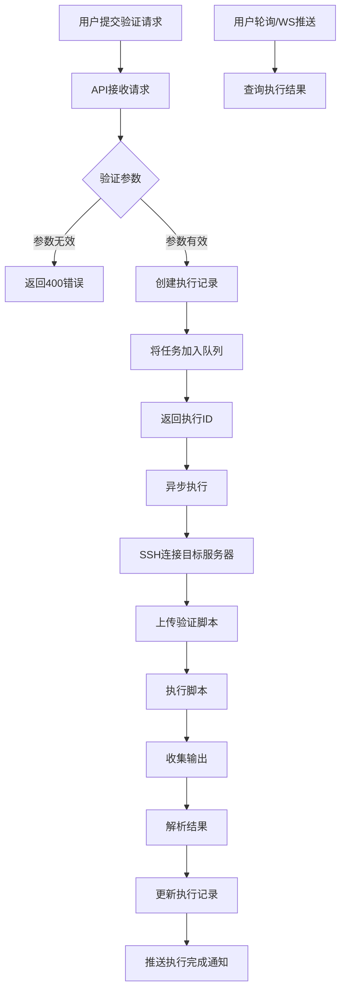
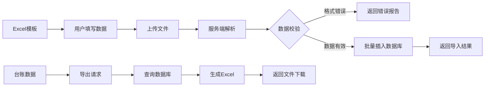
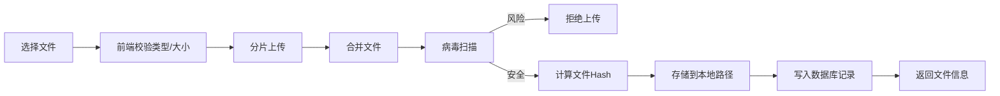

# 仿真运维经理 - 技术方案文档

| 版本 | 日期 | 作者 | 变更说明 |
|-----|------|-----|---------|
| v0.1 | 2024-03-20 | CRT | 初稿，技术架构和模块设计 |

## 1. 技术选型

### 1.1 技术栈

| 层级 | 技术 | 版本 | 选型理由 |
|-----|------|-----|---------|
| 前端 | React | ^18.2.0 | 生态成熟，组件化开发 |
| 前端构建 | Vite | ^5.0.0 | 快速开发体验，现代化工具链 |
| 前端路由 | React Router | ^6.20.0 | 官方推荐，支持嵌套路由 |
| 状态管理 | Zustand | ^4.4.0 | 轻量级，无需Provider包裹 |
| UI组件库 | Ant Design | ^5.12.0 | 企业级组件，文档完善 |
| 图表 | ECharts | ^5.4.0 | 功能丰富，支持各种可视化 |
| 后端 | FastAPI | ^0.105.0 | 高性能，自动生成API文档 |
| 数据库 | SQLite | - | 轻量级，适合单机部署 |
| 数据库ORM | SQLAlchemy | ^2.0.0 | Python标准ORM |
| 迁移工具 | Alembic | ^1.13.0 | SQLAlchemy官方迁移工具 |
| 任务队列 | Celery | ^5.3.0 | 异步任务，支持定时任务 |
| 缓存 | Redis | - | 会话存储，任务结果缓存 |
| 文件存储 | 本地文件系统 | - | MVP阶段简化实现 |
| 脚本执行 | Paramiko | ^3.3.0 | SSH连接执行远程脚本 |

### 1.2 部署架构

```
┌─────────────────────────────────────────────────────────┐
│                      客户端浏览器                        │
└─────────────────────┬───────────────────────────────────┘
                      │ HTTPS
                      ▼
┌─────────────────────────────────────────────────────────┐
│                    Nginx (反向代理)                      │
│              静态资源服务 / API代理 / 负载均衡            │
└─────────────────────┬───────────────────────────────────┘
                      │
        ┌─────────────┴─────────────┐
        ▼                         ▼
┌──────────────┐          ┌──────────────┐
│   Frontend   │          │   Backend    │
│   (React)    │          │  (FastAPI)   │
│   Port 5173  │          │   Port 8000  │
└──────────────┘          └──────┬───────┘
                                 │
            ┌────────────────────┼────────────────────┐
            ▼                    ▼                    ▼
    ┌──────────────┐    ┌──────────────┐    ┌──────────────┐
    │   SQLite     │    │    Redis     │    │  Local FS    │
    │  (Database)  │    │   (Cache)    │    │(File Storage)│
    └──────────────┘    └──────────────┘    └──────────────┘
```

## 2. 架构设计

### 2.1 后端架构

```
backend/
├── app/
│   ├── __init__.py
│   ├── main.py              # FastAPI应用入口
│   ├── config.py            # 配置管理
│   ├── database.py          # 数据库连接
│   ├── models/              # SQLAlchemy模型
│   │   ├── __init__.py
│   │   ├── user.py
│   │   ├── admission_task.py
│   │   ├── checklist.py
│   │   ├── inventory.py
│   │   ├── deliverable.py
│   │   └── verification.py
│   ├── schemas/             # Pydantic数据模型
│   │   ├── __init__.py
│   │   ├── user.py
│   │   ├── admission_task.py
│   │   └── ...
│   ├── routers/             # API路由
│   │   ├── __init__.py
│   │   ├── auth.py          # 认证相关
│   │   ├── users.py         # 用户管理
│   │   ├── admission_tasks.py
│   │   ├── checklist_items.py
│   │   ├── inventories.py
│   │   ├── deliverables.py
│   │   ├── verification_scripts.py
│   │   ├── verification_execute.py
│   │   ├── dashboard.py
│   │   └── templates.py
│   ├── services/            # 业务逻辑层
│   │   ├── __init__.py
│   │   ├── auth_service.py
│   │   ├── task_service.py
│   │   ├── verification_service.py
│   │   ├── file_service.py
│   │   └── notification_service.py
│   ├── core/                # 核心功能
│   │   ├── __init__.py
│   │   ├── security.py      # JWT/密码
│   │   ├── permissions.py   # 权限控制
│   │   └── exceptions.py    # 自定义异常
│   └── utils/               # 工具函数
│       ├── __init__.py
│       ├── datetime_util.py
│       └── validators.py
├── alembic/                 # 数据库迁移
│   ├── versions/
│   └── env.py
├── scripts/                 # 内置验证脚本
│   ├── system_baseline_check.sh
│   ├── deployment_check.sh
│   └── ...
├── uploads/                 # 上传文件存储
├── tests/                   # 测试代码
├── requirements.txt
└── run.py                   # 开发启动脚本
```

### 2.2 前端架构

```
frontend/
├── src/
│   ├── main.jsx             # 应用入口
│   ├── App.jsx              # 根组件
│   ├── routes.jsx           # 路由配置
│   ├── api/                 # API客户端
│   │   ├── index.js         # axios实例
│   │   ├── auth.js
│   │   ├── admissionTasks.js
│   │   ├── checklist.js
│   │   ├── inventories.js
│   │   ├── deliverables.js
│   │   ├── verification.js
│   │   └── dashboard.js
│   ├── stores/              # Zustand状态管理
│   │   ├── authStore.js
│   │   ├── taskStore.js
│   │   └── uiStore.js
│   ├── components/          # 公共组件
│   │   ├── Layout/          # 布局组件
│   │   │   ├── index.jsx
│   │   │   ├── Header.jsx
│   │   │   ├── Sidebar.jsx
│   │   │   └── Breadcrumb.jsx
│   │   ├── Common/          # 通用组件
│   │   │   ├── StatusBadge.jsx
│   │   │   ├── ProgressBar.jsx
│   │   │   ├── DataTable.jsx
│   │   │   ├── FileUploader.jsx
│   │   │   └── SearchForm.jsx
│   │   └── Business/        # 业务组件
│   │       ├── TaskCard.jsx
│   │       ├── ChecklistItemCard.jsx
│   │       ├── InventoryForm/
│   │       ├── VerificationExecutor/
│   │       └── DeliverableList/
│   ├── pages/               # 页面组件
│   │   ├── Login/
│   │   ├── Dashboard/
│   │   ├── AdmissionTasks/
│   │   │   ├── List.jsx
│   │   │   ├── Detail/
│   │   │   │   ├── index.jsx
│   │   │   │   ├── Overview.jsx
│   │   │   │   ├── Checklist.jsx
│   │   │   │   ├── Inventories/
│   │   │   │   ├── Verification/
│   │   │   │   └── Deliverables.jsx
│   │   │   └── Create.jsx
│   │   ├── Templates/
│   │   ├── Scripts/
│   │   ├── Users/
│   │   └── Profile/
│   ├── hooks/               # 自定义Hooks
│   │   ├── useAuth.js
│   │   ├── useTasks.js
│   │   ├── useChecklist.js
│   │   └── useVerification.js
│   ├── utils/               # 工具函数
│   │   ├── constants.js
│   │   ├── formatters.js
│   │   └── validators.js
│   └── styles/              # 样式文件
│       ├── global.css
│       └── variables.css
├── public/
└── package.json
```

## 3. 核心模块设计

### 3.1 验证脚本执行模块



**关键设计决策**:
- **异步执行**: 脚本执行耗时不可控，使用Celery异步任务
- **超时控制**: 默认300秒超时，可配置
- **并发控制**: 限制同时执行的验证任务数，避免资源耗尽
- **结果缓存**: Redis缓存执行结果，支持重复查询
- **失败重试**: SSH连接失败时自动重试3次

### 3.2 台账数据导入导出



**技术实现**:
- **导入**: 使用 `pandas` + `openpyxl` 解析Excel
- **导出**: 使用 `pandas` 生成Excel，支持样式
- **模板**: 预定义Excel模板，包含数据验证规则

### 3.3 文件上传存储



**安全策略**:
- 文件类型白名单：.xlsx, .xls, .doc, .docx, .pdf, .txt, .sh, .py
- 文件大小限制：单个文件最大50MB
- 病毒扫描：使用 `clamdscan` 或云扫描API
- 存储路径：按日期分目录，避免单目录文件过多

### 3.4 权限控制模型

```
权限控制层次:
├── 认证层 (Authentication)
│   └── JWT Token验证
├── 角色层 (Role-Based)
│   ├── ops_manager: 全部权限
│   ├── admin: 用户/模板管理
│   ├── developer: 台账/交付物
│   ├── security: 安全审核
│   └── viewer: 只读
└── 数据层 (Data-Level)
    ├── 运维经理: 全部任务
    ├── 开发人员: 被分配的任务
    └── 安全人员: 安全相关检查项
```

## 4. 数据库设计要点

### 4.1 索引策略

```python
# admission_tasks 表关键索引
Index('idx_task_status', 'status')
Index('idx_task_release_date', 'release_date')
Index('idx_task_creator', 'creator_id')

# checklist_items 表关键索引
Index('idx_item_task', 'task_id')
Index('idx_item_status', 'status')
Index('idx_item_assignee', 'assignee_id')
Index('idx_item_dimension', 'control_dimension')

# inventory_accounts 表关键索引
Index('idx_account_inventory', 'inventory_id')
Index('idx_account_valid', 'valid_until')  # 用于过期提醒
```

### 4.2 数据归档策略

- **任务数据**: 完成的任务保留2年，之后归档到历史表
- **验证记录**: 保留1年，长期存储可导出为文件
- **文件存储**: 任务删除时级联删除关联文件

## 5. 关键决策记录 (ADR)

### ADR-001: 数据库选型

**决策**: 使用SQLite作为MVP阶段数据库

**考虑选项**:
- SQLite: 零配置，单文件部署
- PostgreSQL: 功能丰富，生产级
- MySQL: 广泛使用，生态成熟

**决策理由**:
1. MVP阶段数据量小，SQLite性能足够
2. 简化部署，无需额外安装数据库
3. 单机部署场景，无需考虑高可用
4. 未来可平滑迁移到PostgreSQL

### ADR-002: 脚本执行架构

**决策**: 通过SSH直连目标服务器执行脚本

**考虑选项**:
- SSH直连: 简单直接，无需Agent
- Agent模式: 需要每台服务器部署Agent
- 堡垒机模式: 企业已有堡垒机时集成

**决策理由**:
1. MVP阶段简化部署，无需安装Agent
2. 运维场景通常已有SSH访问权限
3. 脚本内容可控，安全风险较低

**风险**: 
- 需要服务器SSH凭证，需安全存储
- 执行权限依赖SSH用户权限

**缓解措施**:
- 使用只读用户执行检查类脚本
- 密钥加密存储，定期轮换

### ADR-003: 前端状态管理

**决策**: 使用Zustand替代Redux

**决策理由**:
1. 代码更简洁，学习成本低
2. 无需Provider包裹，减少嵌套
3. 中间件支持持久化、异步操作
4. 团队规模小，不需要Redux的严格规范

### ADR-004: 文件存储

**决策**: MVP阶段使用本地文件系统

**决策理由**:
1. 简化部署，无需配置对象存储
2. 文件量不大，本地存储足够
3. 未来可迁移到MinIO或云存储

**存储路径设计**:
```
uploads/
├── 2024/
│   ├── 03/
│   │   ├── 20/          # 按日期分目录
│   │   │   ├── xxx.pdf  # 文件Hash命名
│   │   │   └── yyy.xlsx
```

## 6. 接口安全设计

### 6.1 JWT认证

```python
# Token结构
{
  "sub": "1",              # 用户ID
  "username": "zhangsan",
  "role": "ops_manager",
  "iat": 1700000000,       # 签发时间
  "exp": 1700003600        # 过期时间 (2小时)
}

# 刷新机制
- Access Token: 2小时有效期
- Refresh Token: 7天有效期，用于获取新的Access Token
```

### 6.2 接口限流

```python
# 限流策略
- 登录接口: 5次/分钟
- 通用接口: 100次/分钟
- 文件上传: 10次/分钟
- 脚本执行: 10次/分钟
```

### 6.3 敏感数据处理

- 密码: bcrypt哈希存储
- SSH密钥: AES加密存储
- 账户密码: 数据库中不存储，台账中记录密码修改日期

## 7. 开发计划

### Phase 1: 基础架构 (Week 1-2)

| 任务 | 负责人 | 工期 | 产出 |
|-----|-------|-----|------|
| 后端项目搭建 | - | 2天 | FastAPI项目框架 |
| 数据库模型设计 | - | 2天 | SQLAlchemy模型 |
| 前端项目搭建 | - | 2天 | React+Vite项目框架 |
| 基础组件开发 | - | 3天 | Layout、Table、Form组件 |
| 登录认证模块 | - | 2天 | JWT登录、权限控制 |

### Phase 2: 核心功能 (Week 3-5)

| 任务 | 负责人 | 工期 | 产出 |
|-----|-------|-----|------|
| 准入任务管理 | - | 3天 | 任务CRUD、进度跟踪 |
| 检查清单模块 | - | 3天 | 检查项管理、确认流程 |
| 台账管理 | - | 4天 | 三类台账录入、导入导出 |
| 交付物管理 | - | 2天 | 文件上传下载、预览 |
| 验证脚本执行 | - | 4天 | SSH执行、结果解析、展示 |

### Phase 3: 完善优化 (Week 6-7)

| 任务 | 负责人 | 工期 | 产出 |
|-----|-------|-----|------|
| 仪表盘 | - | 2天 | 统计图表、待办提醒 |
| 模板管理 | - | 2天 | 检查清单模板CRUD |
| 用户管理 | - | 2天 | 用户CRUD、角色分配 |
| 测试优化 | - | 3天 | 单元测试、性能优化 |
| 部署文档 | - | 2天 | 部署手册、使用文档 |

### Phase 4: 后续迭代 (待定)

- 系统安全检查模块
- 监控告警配置模块
- 准入报告生成
- 通知中心（邮件/钉钉/企业微信）
- 工作流引擎（审批流程）

## 8. 风险与应对

| 风险 | 可能性 | 影响 | 应对措施 |
|-----|-------|-----|---------|
| SSH执行安全风险 | 中 | 高 | 使用只读账户，脚本审核，操作审计 |
| 文件上传安全 | 中 | 高 | 类型白名单、大小限制、病毒扫描 |
| 脚本执行超时 | 高 | 中 | 设置超时机制，异步执行，可取消 |
| 并发性能问题 | 中 | 中 | 任务队列限流，结果缓存 |
| 数据丢失 | 低 | 高 | 定期备份，操作日志，软删除 |

## 9. 部署方案

### 9.1 单机部署

```bash
# 1. 克隆代码
git clone <repo>
cd ops-manager

# 2. 后端部署
cd backend
python -m venv venv
source venv/bin/activate
pip install -r requirements.txt
alembic upgrade head
uvicorn app.main:app --host 0.0.0.0 --port 8000

# 3. 前端部署
cd frontend
npm install
npm run build

# 4. Nginx配置
# 将构建产物复制到Nginx目录，配置反向代理
```

### 9.2 Docker部署

```yaml
# docker-compose.yml
version: '3'
services:
  backend:
    build: ./backend
    ports:
      - "8000:8000"
    volumes:
      - ./uploads:/app/uploads
      - ./data:/app/data
  frontend:
    build: ./frontend
    ports:
      - "80:80"
  redis:
    image: redis:alpine
```

### 9.3 系统要求

- **CPU**: 2核+
- **内存**: 4GB+
- **磁盘**: 20GB+（根据文件存储需求调整）
- **操作系统**: Linux (CentOS 7+/Ubuntu 18.04+)
- **Python**: 3.9+
- **Node.js**: 18+
