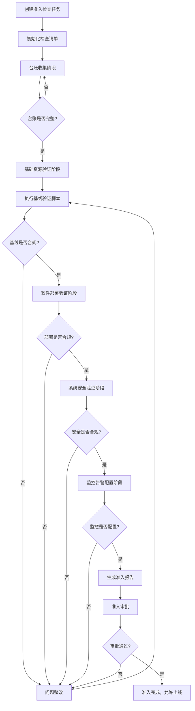
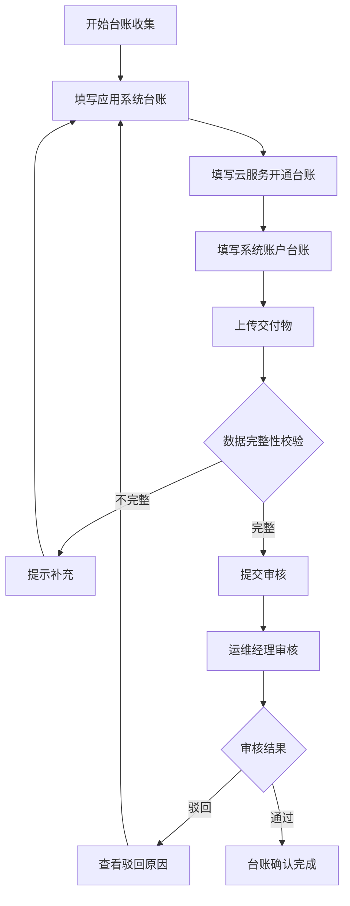
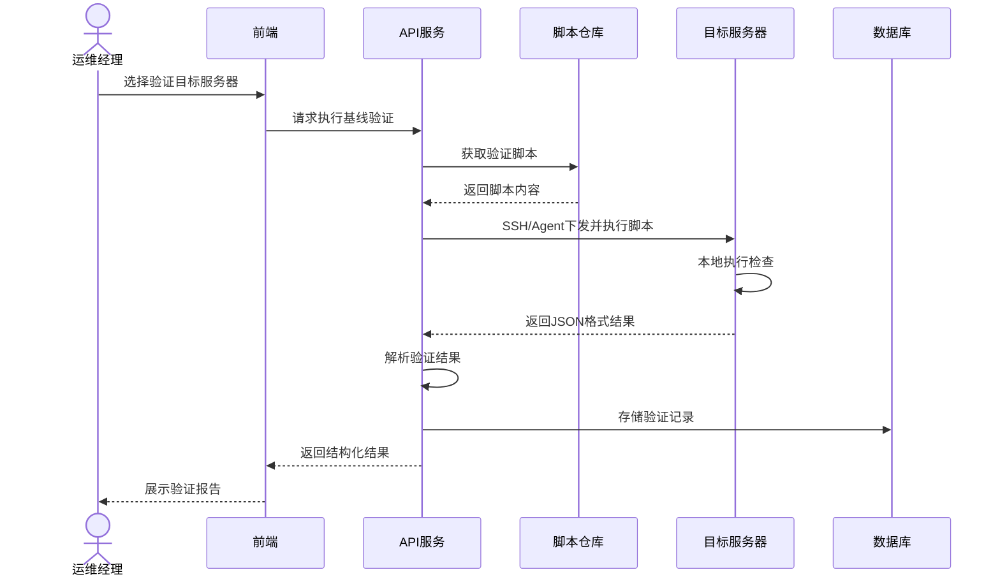
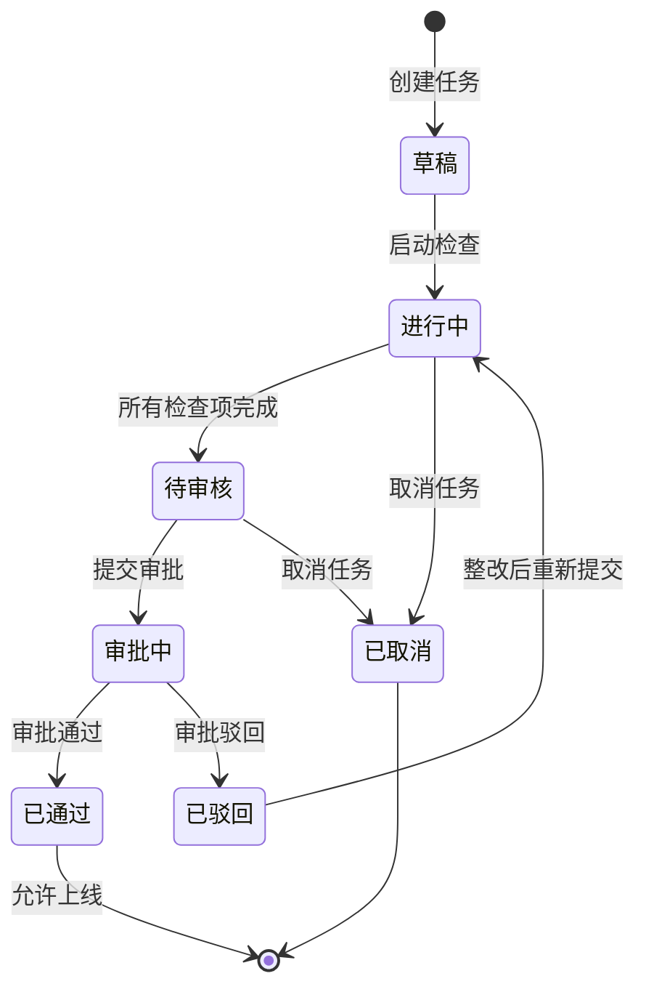
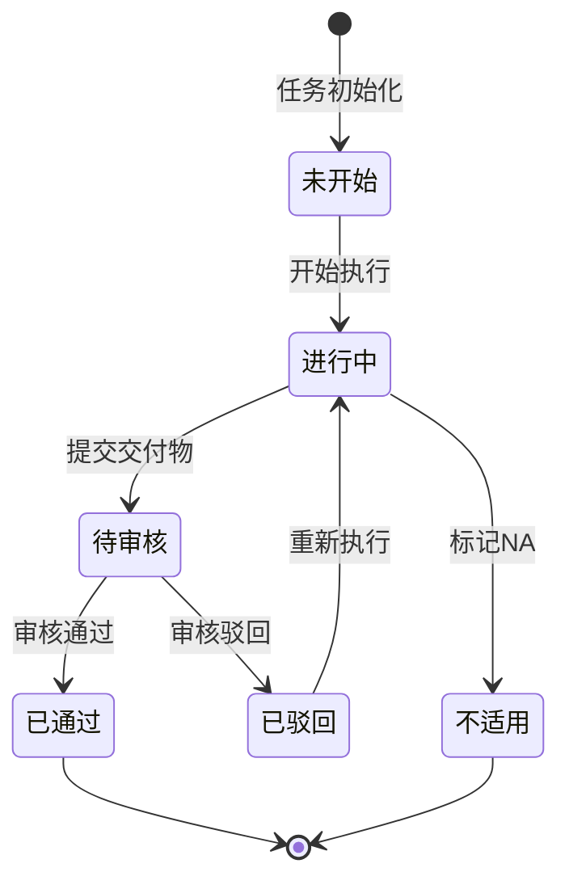
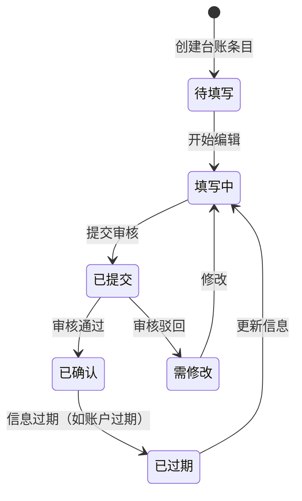
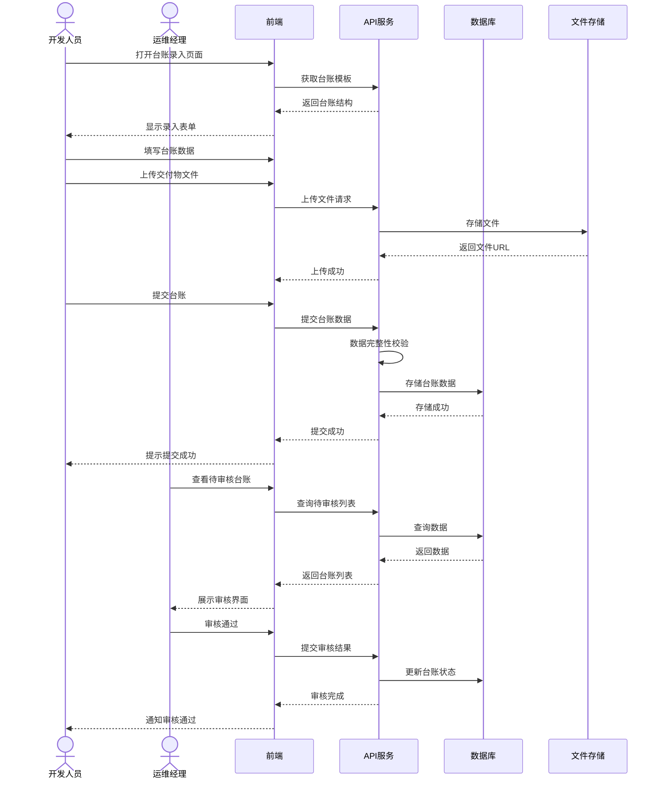
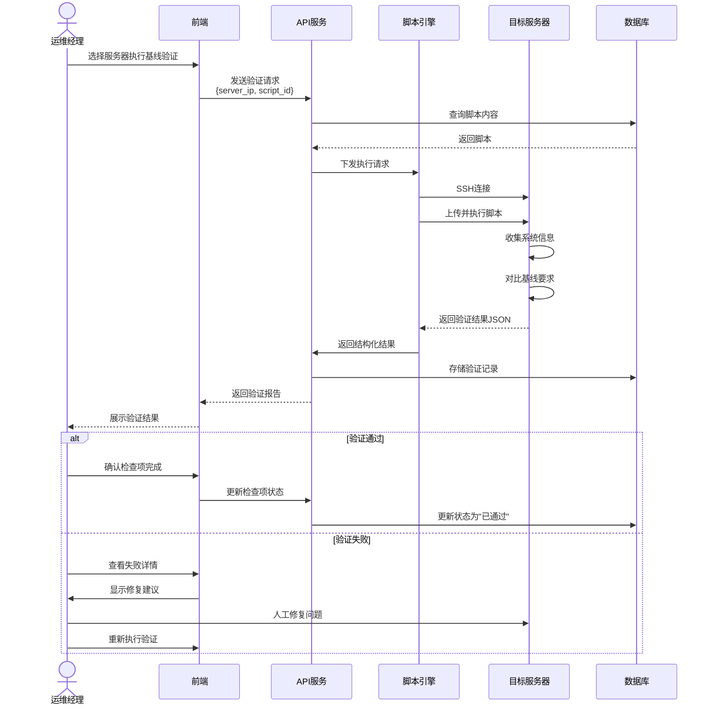
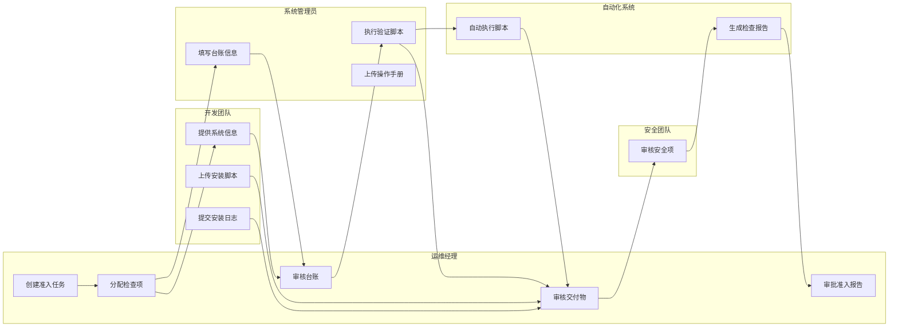

# 仿真运维经理 - 业务流程文档

| 版本 | 日期 | 作者 | 变更说明 |
|-----|------|-----|---------|
| v0.1 | 2024-03-20 | CRT | 初稿，核心业务流程 |

## 1. 核心业务流程

### 1.1 准入检查全流程



**流程说明**:
1. **创建准入检查任务**: 运维经理创建任务，选择系统、版本、上线时间，系统自动加载预设检查模板
2. **初始化检查清单**: 根据模板生成结构化的检查项，分配给相关责任人
3. **台账收集阶段**: 收集应用系统、云服务、账户三类台账信息，上传交付物
4. **基础资源验证阶段**: 通过脚本验证系统基线配置（账户、磁盘、网络、环境）
5. **软件部署验证阶段**: 验证软件安装路径、权限、安装脚本、日志记录
6. **系统安全验证阶段**: 安全检查（待细化）
7. **监控告警配置阶段**: 监控配置检查（待细化）
8. **生成准入报告**: 汇总所有检查结果，生成准入报告
9. **准入审批**: 多级审批流程
10. **准入完成**: 所有检查通过，系统允许上线

### 1.2 台账提交流程



**台账数据流**:
- 系统管理员/开发团队填写台账数据
- 系统执行字段格式校验（IP格式、日期格式等）
- 必填字段完整性检查
- 运维经理审核台账准确性
- 审核通过后标记为"已确认"

### 1.3 基线验证脚本执行流程



**脚本验证数据流**:
1. 运维经理在界面上选择要验证的服务器IP
2. 系统通过SSH或Agent在目标服务器执行脚本
3. 脚本收集系统配置信息，与基线要求对比
4. 返回结构化JSON结果（通过/失败/警告）
5. 前端可视化展示验证结果
6. 验证记录存储到数据库，可追溯

### 1.4 交付物提交流程

```mermaid
flowchart TD
    A[选择检查项] --> B[选择交付物类型]
    B --> C[上传文件]
    C --> D[病毒扫描]
    D --> E{是否安全?}
    E -->|否| F[拒绝上传，提示风险]
    E -->|是| G[存储文件]
    G --> H[生成文件索引]
    H --> I[关联检查项]
    I --> J[标记检查项为<br/>"已提交交付物"]
    J --> K[运维经理审核]
    K --> L{审核结果}
    L -->|驳回| M[查看原因，重新上传]
    M --> B
    L -->|通过| N[标记检查项完成]
```

**交付物类型支持**:
| 检查项 | 交付物类型 | 格式要求 |
|-------|-----------|---------|
| 系统基线 | 操作手册/镜像说明 | Word/PDF |
| 软件部署 | 操作手册/脚本/安装日志 | Word/PDF/SH/LOG |
| 台账收集 | 原始表格 | Excel |

## 2. 状态机

### 2.1 准入检查任务状态流转



**状态说明**:
- **草稿**: 任务创建但未正式启动，可修改配置
- **进行中**: 检查正在进行，各责任人执行检查项
- **待审核**: 所有检查项已完成，等待运维经理审核
- **审批中**: 已提交正式审批流程
- **已通过**: 准入检查完成，系统可上线
- **已驳回**: 存在问题需要整改
- **已取消**: 任务被取消（系统不上线或延期）

### 2.2 检查项状态流转



### 2.3 台账记录状态



## 3. 时序图

### 3.1 台账录入与验证



### 3.2 基线验证执行



## 4. 泳道图

### 4.1 准入检查多角色协作



## 5. 异常处理

| 异常场景 | 触发条件 | 处理方式 | 用户提示 |
|---------|---------|---------|---------|
| 台账数据不完整 | 提交时必填字段缺失 | 阻断提交，高亮缺失字段 | "请完善以下必填项：IP地址、主机名" |
| 文件上传失败 | 网络中断/文件过大 | 支持断点续传/分片上传 | "上传中断，点击继续上传" |
| 脚本执行超时 | 服务器无响应超过5分钟 | 自动终止，记录超时日志 | "脚本执行超时，请检查服务器连接" |
| 脚本执行失败 | 服务器权限不足 | 记录错误输出，提示常见原因 | "执行失败：权限不足，请确认执行账户有sudo权限" |
| 台账信息过期 | 账户有效期到期前7天 | 标记台账状态为"即将过期" | "以下账户将在7天内过期，请更新" |
| 审批驳回 | 交付物不符合要求 | 打回检查项，附带驳回原因 | "操作手册缺少回滚步骤，请补充后重新上传" |
