# 仿真运维经理 - 业务流程文档

| 版本 | 日期 | 作者 | 变更说明 |
|-----|------|-----|---------|
| v0.1 | 2024-03-20 | CRT | 初稿，核心业务流程 |
| v1.1 | 2024-03-24 | CRT | 根据PRD v1.2更新，新增5阶段核心流程、计划制定流程、台账与计划联动机制 |

## 1. 核心业务流程（5阶段）

### 1.1 准入检查全流程

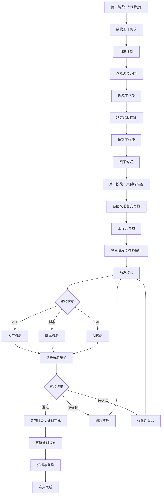
```mermaid
flowchart TD
    A[第一阶段：计划制定] --> A1[接收工作需求]
    A1 --> A2[创建计划]
    A2 --> A3[选择涉及范围]
    A3 --> A4[拆解工作项]
    A4 --> A5[制定验收标准]
    A5 --> A6[排列工作流]
    A6 --> A7[线下沟通]
    A7 --> B
    B[第二阶段：交付物准备] --> B1[各团队准备交付物]
    B1 --> B2[上传交付物]
    B2 --> C
    C[第三阶段：核验执行] --> C1[触发核验]
    C1 --> C2{核验方式}
    C2 -->|人工| C3[人工核验]
    C2 -->|脚本| C4[脚本核验]
    C2 -->|AI| C5[AI核验]
    C3 --> C6[记录核验结论]
    C4 --> C6
    C5 --> C6
    C6 --> C7{核验结果}
    C7 -->|通过| D
    C7 -->|不通过| C8[问题整改]
    C7 -->|待改进| C9[优化后重验]
    C8 --> C1
    C9 --> C1
    D[第四阶段：计划完成] --> D1[更新计划状态]
    D1 --> D2[归档与复盘]
    D2 --> D3[准入完成]
```

**流程说明**:
1. **第一阶段：计划制定**
   - 接收工作需求（线下已审批）
   - 创建计划（填写基本信息、选择分类、上传审批材料）
   - 选择涉及范围（根据计划分类不同，范围选择方式不同）
   - 拆解工作项（系统根据计划分类和范围选择自动生成第一个工作项）
   - 制定验收标准
   - 排列工作流
   - 线下沟通要求

2. **第二阶段：交付物准备**
   - 各团队准备交付物（线下执行）
   - 上传交付物

3. **第三阶段：核验执行**
   - 触发核验
   - 执行核验（人工/脚本/AI三种方式）
   - 记录核验结论（通过/不通过/待改进）

4. **第四阶段：计划完成**
   - 计划状态更新
   - 归档与复盘

### 1.2 台账提交流程

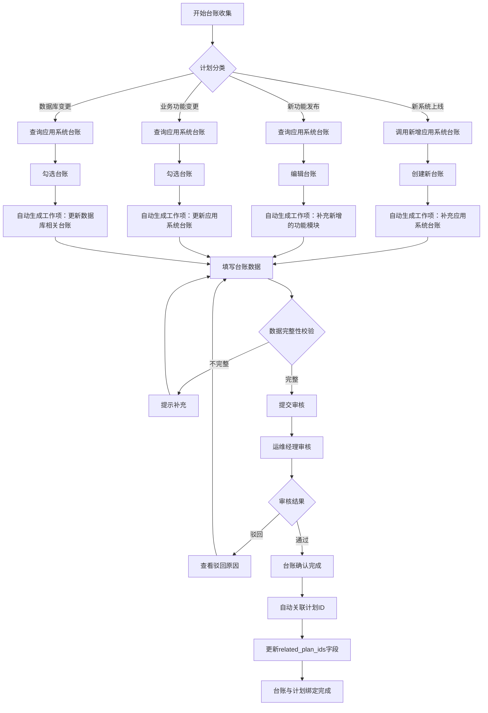
```mermaid
flowchart TD
    A[开始台账收集] --> B{计划分类}
    B -->|新系统上线| C1[调用新增应用系统台账]
    C1 --> C2[创建新台账]
    C2 --> C3[自动生成工作项：补充应用系统台账]
    B -->|新功能发布| D1[查询应用系统台账]
    D1 --> D2[编辑台账]
    D2 --> D3[自动生成工作项：补充新增的功能模块]
    B -->|业务功能变更| E1[查询应用系统台账]
    E1 --> E2[勾选台账]
    E2 --> E3[自动生成工作项：更新应用系统台账]
    B -->|数据库变更| F1[查询应用系统台账]
    F1 --> F2[勾选台账]
    F2 --> F3[自动生成工作项：更新数据库相关台账]
    C3 --> G[填写台账数据]
    D3 --> G
    E3 --> G
    F3 --> G
    G --> H{数据完整性校验}
    H -->|不完整| I[提示补充]
    I --> G
    H -->|完整| J[提交审核]
    J --> K[运维经理审核]
    K --> L{审核结果}
    L -->|驳回| M[查看驳回原因]
    M --> G
    L -->|通过| N[台账确认完成]
    N --> O[自动关联计划ID]
    O --> P[更新related_plan_ids字段]
    P --> Q[台账与计划绑定完成]
```

**台账数据流**:
- 系统管理员/开发团队填写台账数据
- 系统执行字段格式校验（IP格式、日期格式等）
- 必填字段完整性检查
- 运维经理审核台账准确性
- 审核通过后标记为已确认
- **自动关联计划ID到台账的related_plan_ids字段**
- **支持查询台账被哪些计划引用**

### 1.3 基线验证脚本执行流程

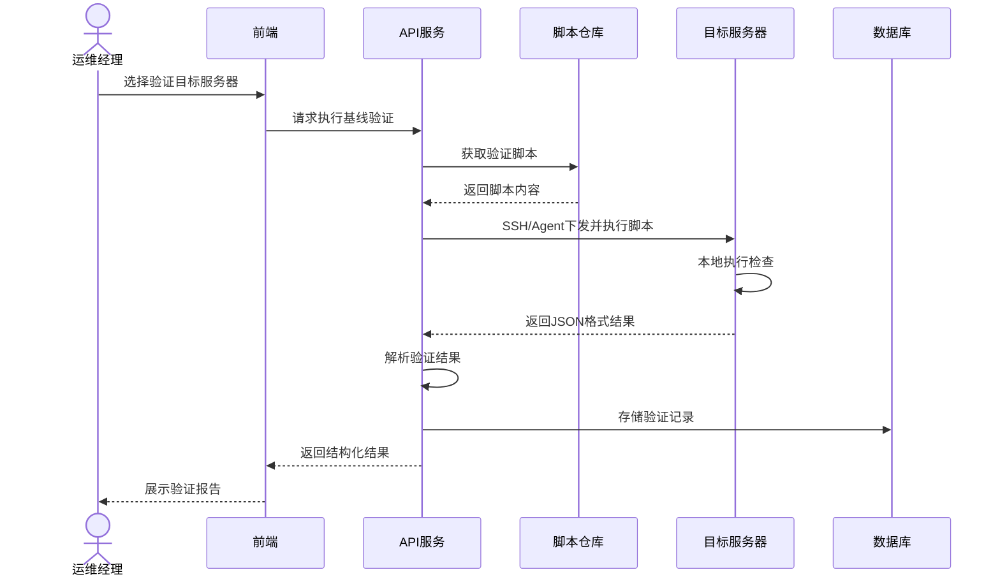
```mermaid
sequenceDiagram
    actor U as 运维经理
    participant F as 前端
    participant A as API服务
    participant S as 脚本仓库
    participant T as 目标服务器
    participant D as 数据库
    U->>F: 选择验证目标服务器
    F->>A: 请求执行基线验证
    A->>S: 获取验证脚本
    S-->>A: 返回脚本内容
    A->>T: SSH/Agent下发并执行脚本
    T->>T: 本地执行检查
    T-->>A: 返回JSON格式结果
    A->>A: 解析验证结果
    A->>D: 存储验证记录
    A-->>F: 返回结构化结果
    F-->>U: 展示验证报告
```

**脚本验证数据流**:
1. 运维经理在界面上选择要验证的服务器IP
2. 系统通过SSH或Agent在目标服务器执行脚本
3. 脚本收集系统配置信息，与基线要求对比
4. 返回结构化JSON结果（通过/失败/警告）
5. 前端可视化展示验证结果
6. 验证记录存储到数据库，可追溯

### 1.4 交付物提交流程

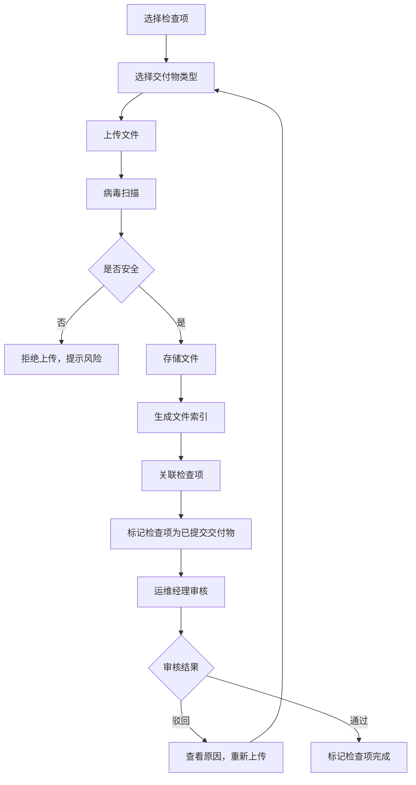
```mermaid
flowchart TD
    A[选择检查项] --> B[选择交付物类型]
    B --> C[上传文件]
    C --> D[病毒扫描]
    D --> E{是否安全}
    E -->|否| F[拒绝上传，提示风险]
    E -->|是| G[存储文件]
    G --> H[生成文件索引]
    H --> I[关联检查项]
    I --> J[标记检查项为已提交交付物]
    J --> K[运维经理审核]
    K --> L{审核结果}
    L -->|驳回| M[查看原因，重新上传]
    M --> B
    L -->|通过| N[标记检查项完成]
```

**交付物类型支持**:
| 检查项 | 交付物类型 | 格式要求 |
|-------|-----------|---------|
| 系统基线 | 操作手册/镜像说明 | Word/PDF |
| 软件部署 | 操作手册/脚本/安装日志 | Word/PDF/SH/LOG |
| 台账收集 | 原始表格 | Excel |

## 2. 计划制定流程

### 2.1 计划创建流程

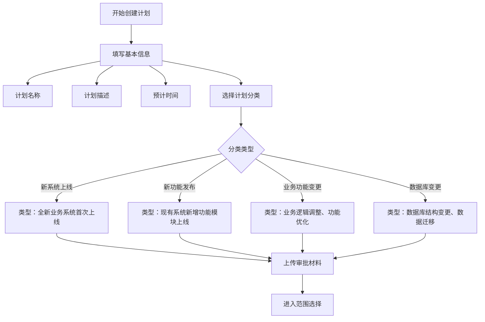
```mermaid
flowchart TD
    A[开始创建计划] --> B[填写基本信息]
    B --> B1[计划名称]
    B --> B2[计划描述]
    B --> B3[预计时间]
    B --> C[选择计划分类]
    C --> C1{分类类型}
    C1 -->|新系统上线| D1[类型：全新业务系统首次上线]
    C1 -->|新功能发布| D2[类型：现有系统新增功能模块上线]
    C1 -->|业务功能变更| D3[类型：业务逻辑调整、功能优化]
    C1 -->|数据库变更| D4[类型：数据库结构变更、数据迁移]
    D1 --> E[上传审批材料]
    D2 --> E
    D3 --> E
    D4 --> E
    E --> F[进入范围选择]
```

### 2.2 范围选择流程（按分类）

| 计划分类 | 说明 | 范围选择调用接口 | 操作类型 | 自动生成工作项 |
|---------|------|-----------------|----------|---------------|
| **新系统上线** | 全新业务系统首次上线 | 台账管理-新增应用系统台账 | 创建新台账 | 补充应用系统台账 |
| **新功能发布** | 现有系统新增功能模块上线 | 台账管理-查询应用系统台账 | 查询+编辑台账 | 补充新增的功能模块 |
| **业务功能变更** | 业务逻辑调整、功能优化 | 台账管理-查询应用系统台账 | 查询+勾选台账 | 更新应用系统台账 |
| **数据库变更** | 数据库结构变更、数据迁移 | 台账管理-查询应用系统台账 | 查询+勾选台账 | 更新数据库相关台账 |

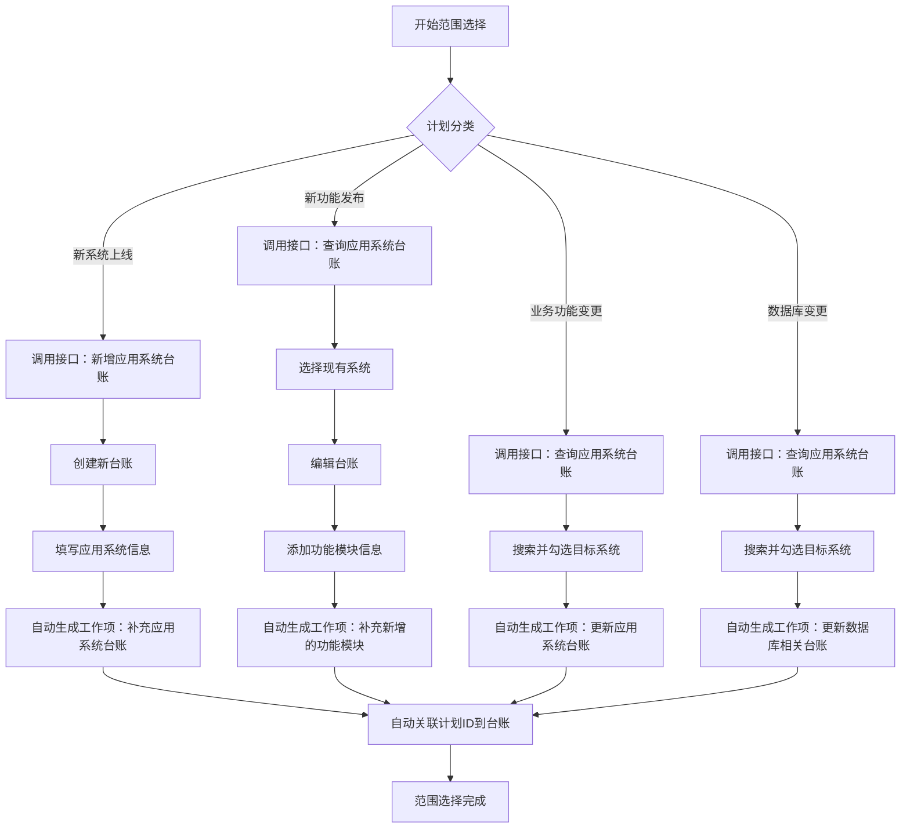
```mermaid
flowchart TD
    A[开始范围选择] --> B{计划分类}
    B -->|新系统上线| C1[调用接口：新增应用系统台账]
    C1 --> C2[创建新台账]
    C2 --> C3[填写应用系统信息]
    C3 --> C4[自动生成工作项：补充应用系统台账]
    B -->|新功能发布| D1[调用接口：查询应用系统台账]
    D1 --> D2[选择现有系统]
    D2 --> D3[编辑台账]
    D3 --> D4[添加功能模块信息]
    D4 --> D5[自动生成工作项：补充新增的功能模块]
    B -->|业务功能变更| E1[调用接口：查询应用系统台账]
    E1 --> E2[搜索并勾选目标系统]
    E2 --> E3[自动生成工作项：更新应用系统台账]
    B -->|数据库变更| F1[调用接口：查询应用系统台账]
    F1 --> F2[搜索并勾选目标系统]
    F2 --> F3[自动生成工作项：更新数据库相关台账]
    C4 --> G[自动关联计划ID到台账]
    D5 --> G
    E3 --> G
    F3 --> G
    G --> H[范围选择完成]
```

### 2.3 工作项自动生成流程

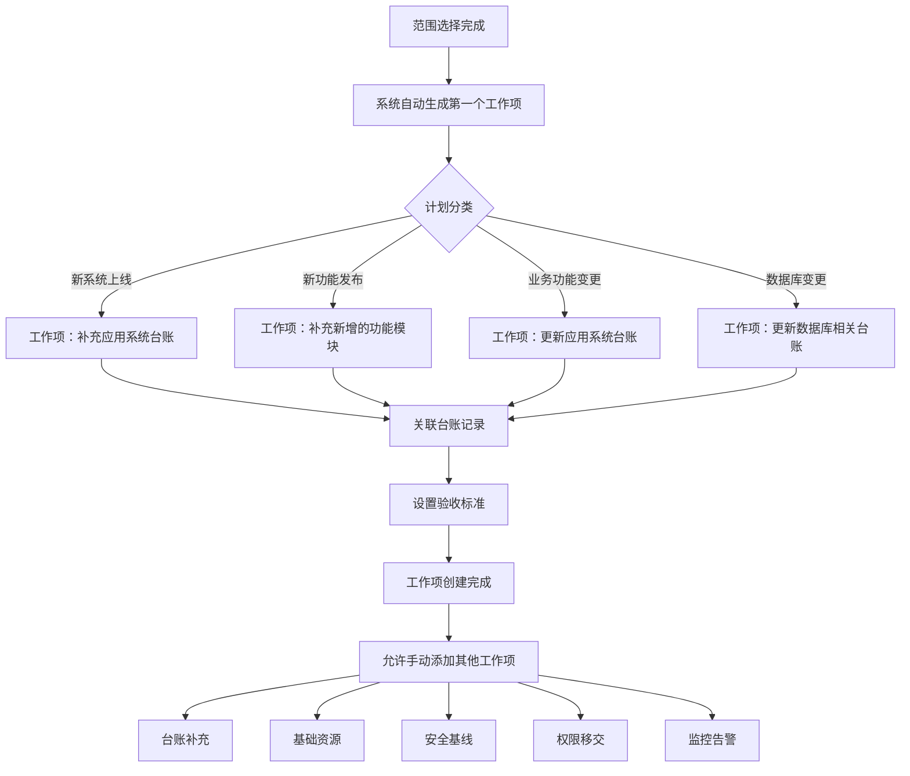
```mermaid
flowchart TD
    A[范围选择完成] --> B[系统自动生成第一个工作项]
    B --> C{计划分类}
    C -->|新系统上线| D1[工作项：补充应用系统台账]
    C -->|新功能发布| D2[工作项：补充新增的功能模块]
    C -->|业务功能变更| D3[工作项：更新应用系统台账]
    C -->|数据库变更| D4[工作项：更新数据库相关台账]
    D1 --> E[关联台账记录]
    D2 --> E
    D3 --> E
    D4 --> E
    E --> F[设置验收标准]
    F --> G[工作项创建完成]
    G --> H[允许手动添加其他工作项]
    H --> I[台账补充]
    H --> J[基础资源]
    H --> K[安全基线]
    H --> L[权限移交]
    H --> M[监控告警]
```

**工作项层级结构**:
- **父工作项（5大类）**：台账补充、基础资源、安全基线、权限移交、监控告警
- **子工作项**：具体的执行任务，关联验收标准和交付物

## 3. 状态机

### 3.1 计划状态流转

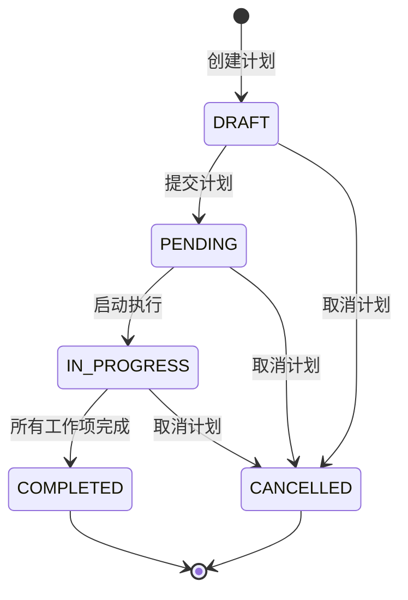
```mermaid
stateDiagram-v2
    [*] --> DRAFT: 创建计划
    DRAFT --> PENDING: 提交计划
    PENDING --> IN_PROGRESS: 启动执行
    IN_PROGRESS --> COMPLETED: 所有工作项完成
    IN_PROGRESS --> CANCELLED: 取消计划
    PENDING --> CANCELLED: 取消计划
    DRAFT --> CANCELLED: 取消计划
    COMPLETED --> [*]
    CANCELLED --> [*]
```

**状态说明**:
- **DRAFT（草稿）**: 计划创建但未提交，可修改配置
- **PENDING（待执行）**: 计划已提交，等待启动执行
- **IN_PROGRESS（进行中）**: 计划正在执行，各团队准备交付物并执行核验
- **COMPLETED（已完成）**: 计划所有工作项完成，准入通过
- **CANCELLED（已取消）**: 计划被取消

### 3.2 检查项状态流转

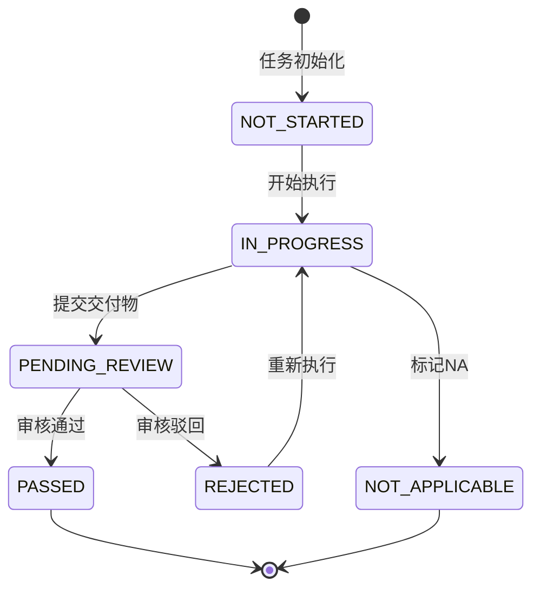
```mermaid
stateDiagram-v2
    [*] --> NOT_STARTED: 任务初始化
    NOT_STARTED --> IN_PROGRESS: 开始执行
    IN_PROGRESS --> PENDING_REVIEW: 提交交付物
    PENDING_REVIEW --> PASSED: 审核通过
    PENDING_REVIEW --> REJECTED: 审核驳回
    REJECTED --> IN_PROGRESS: 重新执行
    PASSED --> [*]
    IN_PROGRESS --> NOT_APPLICABLE: 标记NA
    NOT_APPLICABLE --> [*]
```

### 3.3 台账记录状态

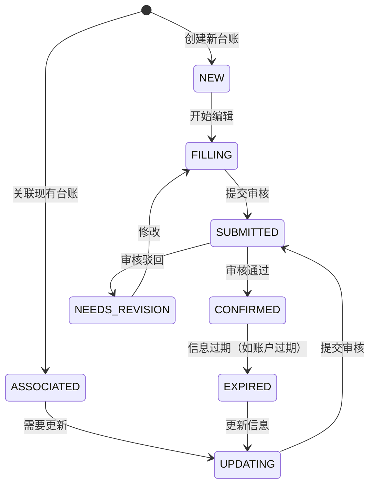
```mermaid
stateDiagram-v2
    [*] --> NEW: 创建新台账
    [*] --> ASSOCIATED: 关联现有台账
    NEW --> FILLING: 开始编辑
    ASSOCIATED --> UPDATING: 需要更新
    FILLING --> SUBMITTED: 提交审核
    UPDATING --> SUBMITTED: 提交审核
    SUBMITTED --> CONFIRMED: 审核通过
    SUBMITTED --> NEEDS_REVISION: 审核驳回
    NEEDS_REVISION --> FILLING: 修改
    CONFIRMED --> EXPIRED: 信息过期（如账户过期）
    EXPIRED --> UPDATING: 更新信息
```

**状态说明**:
- **NEW（新增）**: 新系统上线时创建的新台账
- **ASSOCIATED（已关联）**: 已有台账被计划关联
- **UPDATING（待更新）**: 功能变更或数据库变更时需要更新台账
- **FILLING（填写中）**: 正在编辑台账信息
- **SUBMITTED（已提交）**: 已提交审核
- **CONFIRMED（已确认）**: 审核通过，台账生效
- **NEEDS_REVISION（需修改）**: 审核驳回，需要修改
- **EXPIRED（已过期）**: 信息过期（如账户有效期到期）

### 3.4 核验结论状态

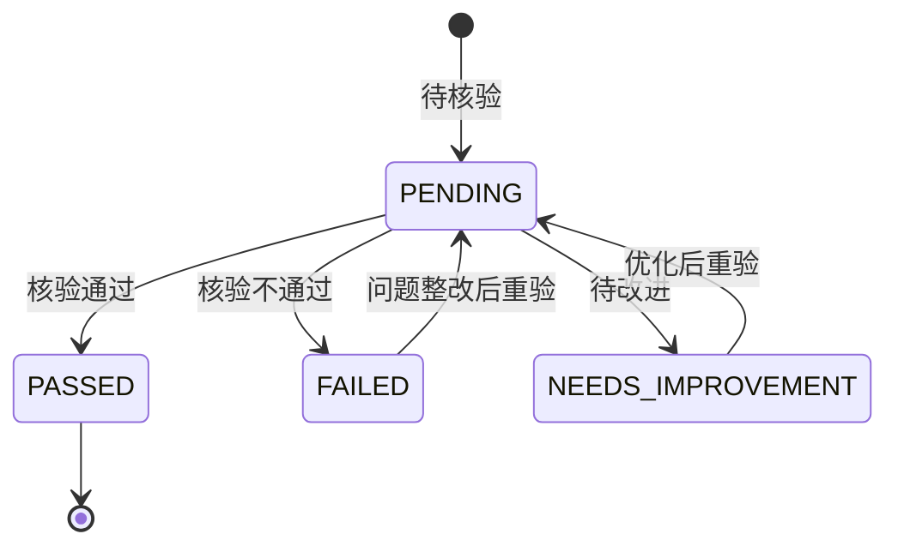
```mermaid
stateDiagram-v2
    [*] --> PENDING: 待核验
    PENDING --> PASSED: 核验通过
    PENDING --> FAILED: 核验不通过
    PENDING --> NEEDS_IMPROVEMENT: 待改进
    FAILED --> PENDING: 问题整改后重验
    NEEDS_IMPROVEMENT --> PENDING: 优化后重验
    PASSED --> [*]
```

**核验结论说明**:
- **PASSED（通过）**: 核验通过，符合准入标准
- **FAILED（不通过）**: 核验不通过，需要整改
- **NEEDS_IMPROVEMENT（待改进）**: 基本符合但仍有优化空间

## 4. 台账与计划联动

### 4.1 关联机制

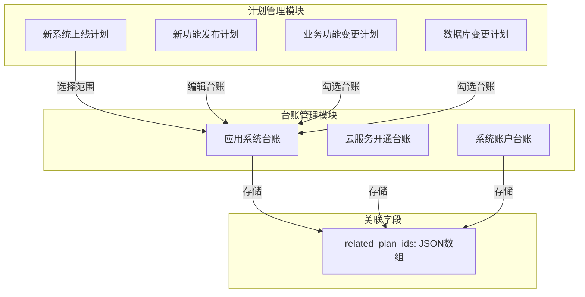
```mermaid
flowchart TD
    subgraph 台账管理模块
        T1[应用系统台账]
        T2[云服务开通台账]
        T3[系统账户台账]
    end
    subgraph 计划管理模块
        P1[新系统上线计划]
        P2[新功能发布计划]
        P3[业务功能变更计划]
        P4[数据库变更计划]
    end
    subgraph 关联字段
        R1[related_plan_ids: JSON数组]
    end
    P1 -->|选择范围| T1
    P2 -->|编辑台账| T1
    P3 -->|勾选台账| T1
    P4 -->|勾选台账| T1
    T1 -->|存储| R1
    T2 -->|存储| R1
    T3 -->|存储| R1
```

### 4.2 related_plan_ids字段说明

- **字段类型**: JSON数组
- **作用**: 记录所有关联该台账的计划ID
- **更新时机**: 
  - 计划创建时选择/编辑台账，自动将计划ID添加到台账的related_plan_ids列表
  - 计划取消或删除时，从related_plan_ids中移除对应计划ID
- **查询能力**: 支持通过台账查询所有关联的计划

### 4.3 台账选择后自动生成工作项逻辑

| 触发条件 | 台账操作 | 自动生成工作项 |
|---------|---------|---------------|
| 新系统上线 | 创建新应用系统台账 | 补充应用系统台账 |
| 新功能发布 | 编辑应用系统台账（添加功能模块） | 补充新增的功能模块 |
| 业务功能变更 | 勾选现有应用系统台账 | 更新应用系统台账 |
| 数据库变更 | 勾选现有应用系统台账 | 更新数据库相关台账 |

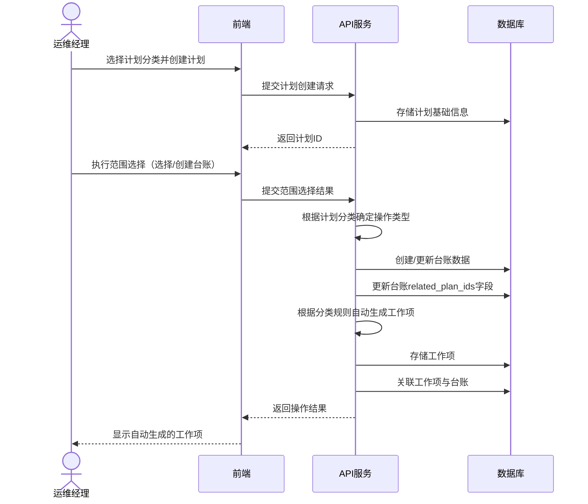
```mermaid
sequenceDiagram
    actor OM as 运维经理
    participant FE as 前端
    participant API as API服务
    participant DB as 数据库
    OM->>FE: 选择计划分类并创建计划
    FE->>API: 提交计划创建请求
    API->>DB: 存储计划基础信息
    API-->>FE: 返回计划ID
    OM->>FE: 执行范围选择（选择/创建台账）
    FE->>API: 提交范围选择结果
    API->>API: 根据计划分类确定操作类型
    API->>DB: 创建/更新台账数据
    API->>DB: 更新台账related_plan_ids字段
    API->>API: 根据分类规则自动生成工作项
    API->>DB: 存储工作项
    API->>DB: 关联工作项与台账
    API-->>FE: 返回操作结果
    FE-->>OM: 显示自动生成的工作项
```

## 5. 时序图

### 5.1 台账录入与验证

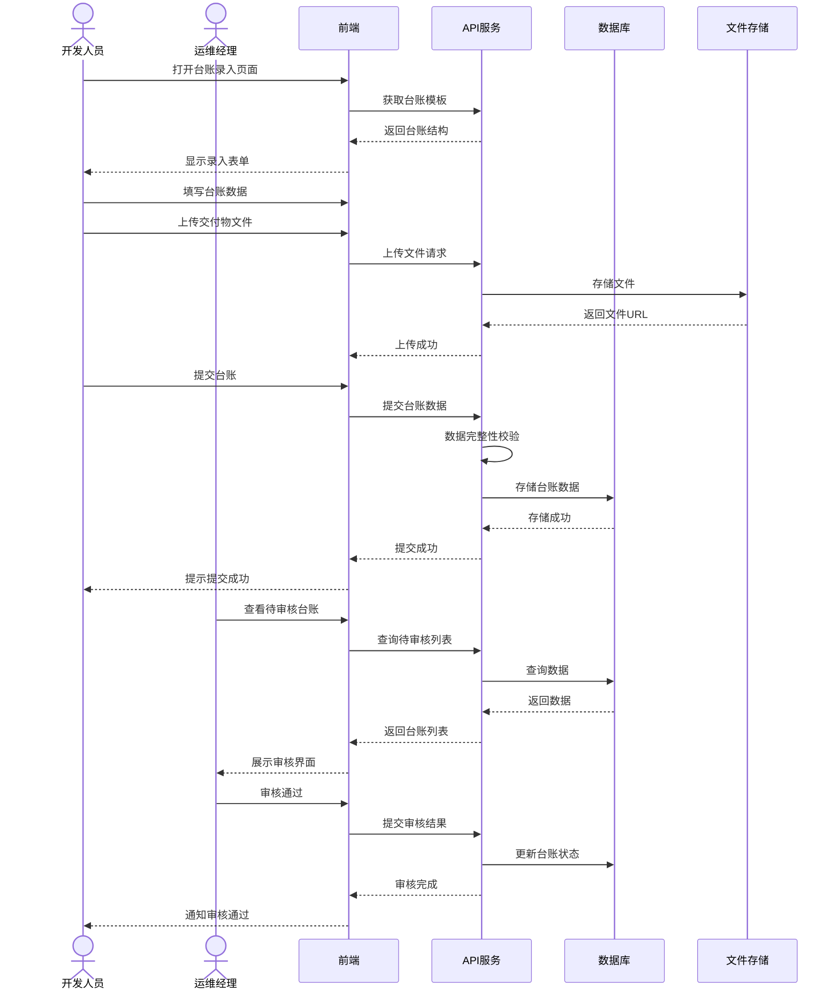
```mermaid
sequenceDiagram
    actor Dev as 开发人员
    actor OM as 运维经理
    participant FE as 前端
    participant API as API服务
    participant DB as 数据库
    participant File as 文件存储
    Dev->>FE: 打开台账录入页面
    FE->>API: 获取台账模板
    API-->>FE: 返回台账结构
    FE-->>Dev: 显示录入表单
    Dev->>FE: 填写台账数据
    Dev->>FE: 上传交付物文件
    FE->>API: 上传文件请求
    API->>File: 存储文件
    File-->>API: 返回文件URL
    API-->>FE: 上传成功
    Dev->>FE: 提交台账
    FE->>API: 提交台账数据
    API->>API: 数据完整性校验
    API->>DB: 存储台账数据
    DB-->>API: 存储成功
    API-->>FE: 提交成功
    FE-->>Dev: 提示提交成功
    OM->>FE: 查看待审核台账
    FE->>API: 查询待审核列表
    API->>DB: 查询数据
    DB-->>API: 返回数据
    API-->>FE: 返回台账列表
    FE-->>OM: 展示审核界面
    OM->>FE: 审核通过
    FE->>API: 提交审核结果
    API->>DB: 更新台账状态
    API-->>FE: 审核完成
    FE-->>Dev: 通知审核通过
```

### 5.2 基线验证执行

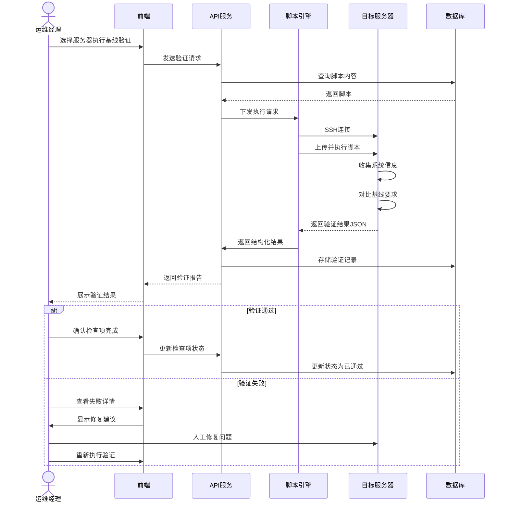
```mermaid
sequenceDiagram
    actor OM as 运维经理
    participant FE as 前端
    participant API as API服务
    participant Script as 脚本引擎
    participant Target as 目标服务器
    participant DB as 数据库
    OM->>FE: 选择服务器执行基线验证
    FE->>API: 发送验证请求
    API->>DB: 查询脚本内容
    DB-->>API: 返回脚本
    API->>Script: 下发执行请求
    Script->>Target: SSH连接
    Script->>Target: 上传并执行脚本
    Target->>Target: 收集系统信息
    Target->>Target: 对比基线要求
    Target-->>Script: 返回验证结果JSON
    Script->>API: 返回结构化结果
    API->>DB: 存储验证记录
    API-->>FE: 返回验证报告
    FE-->>OM: 展示验证结果
    alt 验证通过
        OM->>FE: 确认检查项完成
        FE->>API: 更新检查项状态
        API->>DB: 更新状态为已通过
    else 验证失败
        OM->>FE: 查看失败详情
        FE->>OM: 显示修复建议
        OM->>Target: 人工修复问题
        OM->>FE: 重新执行验证
    end
```

### 5.3 计划制定与台账联动

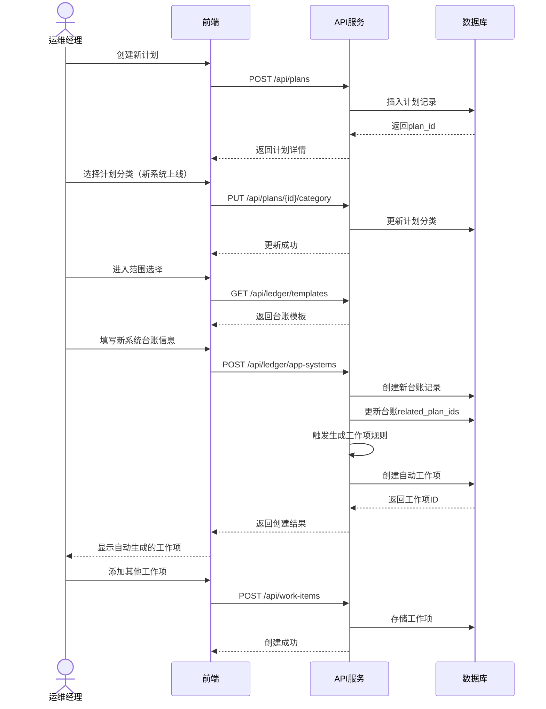
```mermaid
sequenceDiagram
    actor OM as 运维经理
    participant FE as 前端
    participant API as API服务
    participant DB as 数据库
    OM->>FE: 创建新计划
    FE->>API: POST /api/plans
    API->>DB: 插入计划记录
    DB-->>API: 返回plan_id
    API-->>FE: 返回计划详情
    OM->>FE: 选择计划分类（新系统上线）
    FE->>API: PUT /api/plans/{id}/category
    API->>DB: 更新计划分类
    API-->>FE: 更新成功
    OM->>FE: 进入范围选择
    FE->>API: GET /api/ledger/templates
    API-->>FE: 返回台账模板
    OM->>FE: 填写新系统台账信息
    FE->>API: POST /api/ledger/app-systems
    API->>DB: 创建新台账记录
    API->>DB: 更新台账related_plan_ids
    API->>API: 触发生成工作项规则
    API->>DB: 创建自动工作项
    DB-->>API: 返回工作项ID
    API-->>FE: 返回创建结果
    FE-->>OM: 显示自动生成的工作项
    OM->>FE: 添加其他工作项
    FE->>API: POST /api/work-items
    API->>DB: 存储工作项
    API-->>FE: 创建成功
```

## 6. 泳道图

### 6.1 准入检查多角色协作

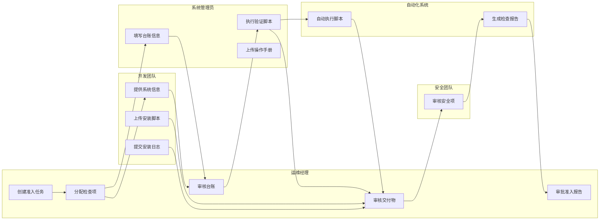
```mermaid
flowchart LR
    subgraph 运维经理
        A1[创建准入任务]
        A2[分配检查项]
        A3[审核台账]
        A4[审核交付物]
        A5[审批准入报告]
    end
    subgraph 系统管理员
        B1[填写台账信息]
        B2[执行验证脚本]
        B3[上传操作手册]
    end
    subgraph 开发团队
        C1[提供系统信息]
        C2[上传安装脚本]
        C3[提交安装日志]
    end
    subgraph 安全团队
        D1[审核安全项]
    end
    subgraph 自动化系统
        E1[自动执行脚本]
        E2[生成检查报告]
    end
    A1 --> A2
    A2 --> B1
    A2 --> C1
    B1 --> A3
    C1 --> A3
    A3 --> B2
    B2 --> E1
    E1 --> A4
    B2 --> A4
    C2 --> A4
    C3 --> A4
    A4 --> D1
    D1 --> E2
    E2 --> A5
```

## 7. 台账管理模块

### 7.1 台账类型

系统包含三类台账，用于记录不同维度的系统信息：

#### 应用系统台账
- 应用名称
- 功能模块（含模块上线时间）
- 主机名
- 应用URL
- 业务/项目负责人及联系方式
- 上线时间

#### 云服务（IAAS+PAAS）开通台账
- **IAAS资源**：计算、网络、存储、备份
- **PAAS软件**：中间件、数据库、缓存、消息队列

#### 系统及软件账号台账
- 系统账户/软件账户
- 权限级别
- 持有人
- 有效期
- 密码修改周期

### 7.2 台账与计划的关联关系

所有台账表均包含 related_plan_ids JSON字段，用于关联计划ID：

```json
{
  "related_plan_ids": ["plan_001", "plan_003", "plan_007"]
}
```

**关联逻辑**：
- 当计划创建时选择/编辑台账，自动将计划ID添加到台账的related_plan_ids列表中
- 支持一个台账被多个计划引用
- 支持通过台账反向查询所有关联的计划

## 8. 异常处理

| 异常场景 | 触发条件 | 处理方式 | 用户提示 |
|---------|---------|---------|---------|
| 台账数据不完整 | 提交时必填字段缺失 | 阻断提交，高亮缺失字段 | 请完善以下必填项：IP地址、主机名 |
| 文件上传失败 | 网络中断/文件过大 | 支持断点续传/分片上传 | 上传中断，点击继续上传 |
| 脚本执行超时 | 服务器无响应超过5分钟 | 自动终止，记录超时日志 | 脚本执行超时，请检查服务器连接 |
| 脚本执行失败 | 服务器权限不足 | 记录错误输出，提示常见原因 | 执行失败：权限不足，请确认执行账户有sudo权限 |
| 台账信息过期 | 账户有效期到期前7天 | 标记台账状态为即将过期 | 以下账户将在7天内过期，请更新 |
| 审批驳回 | 交付物不符合要求 | 打回检查项，附带驳回原因 | 操作手册缺少回滚步骤，请补充后重新上传 |
| 计划分类变更 | 已选择范围后修改分类 | 清空已选范围，重新选择 | 计划分类已变更，请重新选择涉及范围 |
| 台账重复关联 | 同一台账被多次选择 | 自动去重，提示已关联 | 该台账已关联此计划，无需重复选择 |
| 核验结果冲突 | 同一检查项多次核验结果不一致 | 保留最新结果，记录历史 | 该检查项已有核验记录，确认覆盖？ |
